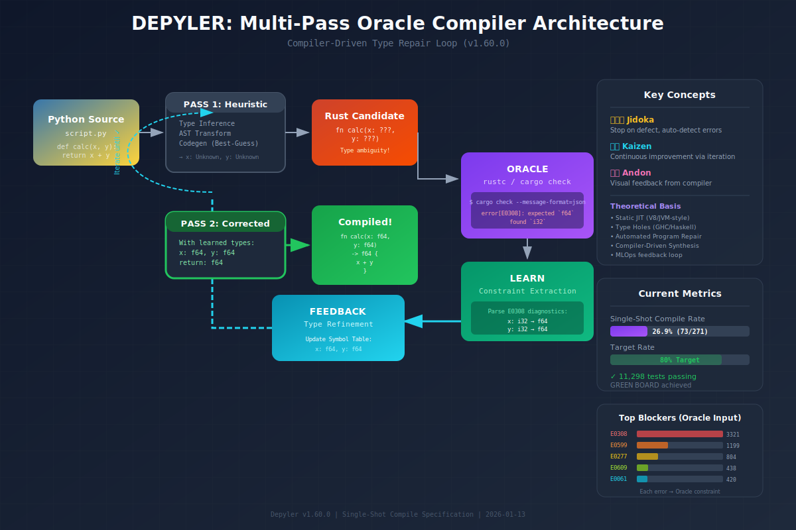

<div align="center">
  

  # depyler

  **A Python-to-Rust transpiler with semantic verification and memory safety analysis.**

  [](https://crates.io/crates/depyler)
  [](https://docs.rs/depyler)
  [](https://github.com/paiml/depyler/actions/workflows/ci.yml)
  [](https://opensource.org/licenses/MIT)
</div>

---

Depyler translates annotated Python code into idiomatic Rust, preserving program semantics while providing compile-time safety guarantees. Part of the [PAIML Stack](https://github.com/paiml).

## Table of Contents

- [Features](#features)
- [Installation](#installation)
- [Quick Start](#quick-start)
- [Usage](#usage)
- [Supported Python Features](#supported-python-features)
- [Stdlib Module Support](#stdlib-module-support)
- [Architecture](#architecture)
- [Documentation](#documentation)
- [Contributing](#contributing)
- [License](#license)

## Features

- **Type-Directed Transpilation** — Uses Python type annotations to generate appropriate Rust types
- **Memory Safety Analysis** — Infers ownership and borrowing patterns automatically
- **Semantic Verification** — Property-based testing to verify behavioral equivalence
- **Single-Command Compilation** — Compile Python to native binaries with `depyler compile`
- **27 Stdlib Modules** — Production-ready support for common Python standard library modules

## Installation

```bash
cargo install depyler
```

### Requirements

- Rust 1.83.0 or later
- Python 3.8+ (for test validation)

## Quick Start

### Compile to Binary

The fastest way to use Depyler:

```bash
# Compile Python to a standalone binary
depyler compile script.py

# Run the compiled binary
./script
```

### Transpile to Rust

```bash
# Transpile a Python file to Rust
depyler transpile example.py

# Transpile with semantic verification
depyler transpile example.py --verify
```

### Example

**Input** (`fibonacci.py`):
```python
def fibonacci(n: int) -> int:
    if n <= 1:
        return n
    return fibonacci(n - 1) + fibonacci(n - 2)
```

**Output** (`fibonacci.rs`):
```rust
fn fibonacci(n: i32) -> i32 {
    if n <= 1 {
        return n;
    }
    fibonacci(n - 1) + fibonacci(n - 2)
}
```

## Usage

### Compilation Options

```bash
# Compile with custom output name
depyler compile script.py -o my_app

# Debug build (faster compilation)
depyler compile script.py --profile debug

# Release build (optimized, default)
depyler compile script.py --profile release
```

### Transpilation Options

```bash
# Show transpilation trace
depyler transpile example.py --trace

# Explain transformation decisions
depyler transpile example.py --explain

# Analyze migration complexity
depyler analyze example.py
```

### Library Usage

```rust
use depyler::{transpile_file, TranspileOptions};

fn main() -> Result<(), Box<dyn std::error::Error>> {
    let options = TranspileOptions::default()
        .with_verification(true);

    let rust_code = transpile_file("example.py", options)?;
    println!("{}", rust_code);

    Ok(())
}
```

## Supported Python Features

| Feature | Status |
|---------|--------|
| Functions with type annotations | Supported |
| Basic types (int, float, str, bool) | Supported |
| Collections (List, Dict, Tuple, Set) | Supported |
| Control flow (if, while, for, match) | Supported |
| Comprehensions (list, dict, set) | Supported |
| Generator expressions | Supported |
| Exception handling (→ Result<T, E>) | Supported |
| Classes and methods | Supported |
| Async/await | Supported |
| Context managers | Supported |

**Not Supported:** Dynamic features (eval, exec), runtime reflection, multiple inheritance, monkey patching.

## Stdlib Module Support

**27 modules validated** with 151 tests passing (100% coverage).

| Category | Modules |
|----------|---------|
| Serialization | json, struct, base64, csv |
| Date/Time | datetime, calendar, time |
| Cryptography | hashlib, secrets |
| Text | textwrap, re, string |
| Math | math, decimal, fractions, statistics |
| File System | os, pathlib, io |
| Data Structures | collections, copy, memoryview, array |
| Functional | itertools, functools |
| Random | random |
| System | sys |

See [validation report](tdd-book/VALIDATION-FINAL-2025-10-26.md) for details.

## Architecture

```
Python AST → HIR → Type Inference → Rust AST → Code Generation
```

| Component | Description |
|-----------|-------------|
| Parser | RustPython AST parser |
| HIR | High-level intermediate representation |
| Type System | Conservative type inference with annotation support |
| Verification | Property-based testing for semantic equivalence |
| Codegen | Rust code generation via syn/quote |

## Documentation

- [API Documentation](https://docs.rs/depyler)
- [MCP Quickstart](docs/MCP_QUICKSTART.md)
- [Agent Mode Guide](AGENT.md)
- [Changelog](CHANGELOG.md)
- [TDD Book](tdd-book/)

## Contributing

Contributions welcome! Please follow the quality standards:

1. Write tests first (TDD)
2. Maintain 80%+ coverage for new code
3. Pass all clippy checks: `cargo clippy -- -D warnings`
4. Format code: `cargo fmt`

See [CONTRIBUTING.md](CONTRIBUTING.md) for details.

## License

Licensed under MIT License. See [LICENSE](LICENSE) for details.
