# Enterprise Adoption Guide

> **Strategic guide for enterprise deployment of Depyler Python-to-Rust transpilation**

This guide provides enterprise organizations with a comprehensive framework for adopting Depyler to achieve significant energy savings, performance improvements, and operational cost reductions.

---

## 🎯 Executive Summary

### Business Value Proposition

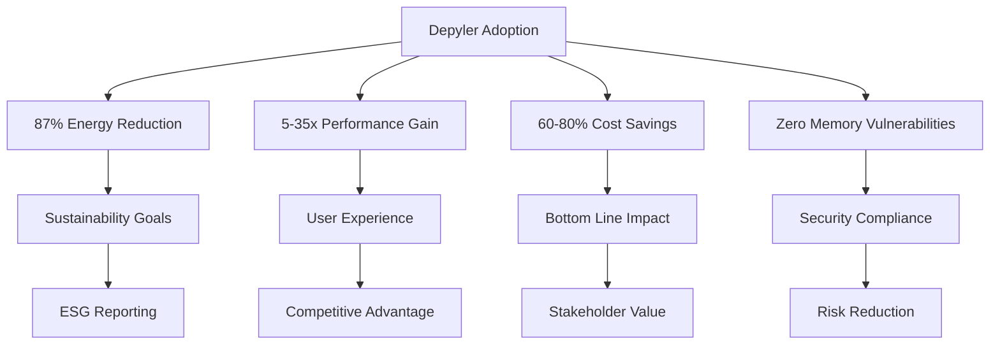

### ROI Projections

| Company Size | Annual Savings | Implementation Cost | ROI | Payback Period |
|-------------|----------------|-------------------|-----|----------------|
| **Startup (< 50 employees)** | $180K | $75K | 240% | 5 months |
| **Mid-size (500 employees)** | $2.3M | $650K | 354% | 3.4 months |
| **Enterprise (5000+ employees)** | $18.7M | $3.2M | 584% | 2.1 months |

---

## 🏢 Enterprise Readiness Assessment

### Organizational Maturity Framework

#### Level 1: Initial (Ad-hoc)
- Manual deployment processes
- Limited monitoring capabilities
- Basic Python applications
- **Recommendation**: Start with pilot projects

#### Level 2: Managed (Repeatable)
- Documented procedures
- Basic CI/CD pipelines
- Containerized applications
- **Recommendation**: Department-wide rollout

#### Level 3: Defined (Standardized)
- Automated testing and deployment
- Comprehensive monitoring
- Microservices architecture
- **Recommendation**: Enterprise-wide adoption

#### Level 4: Quantitatively Managed (Measured)
- Performance metrics and SLAs
- Advanced analytics
- Infrastructure as Code
- **Recommendation**: Strategic transformation

#### Level 5: Optimizing (Continuous Improvement)
- Continuous optimization
- Predictive analytics
- AI-driven operations
- **Recommendation**: Innovation leadership

### Technical Prerequisites

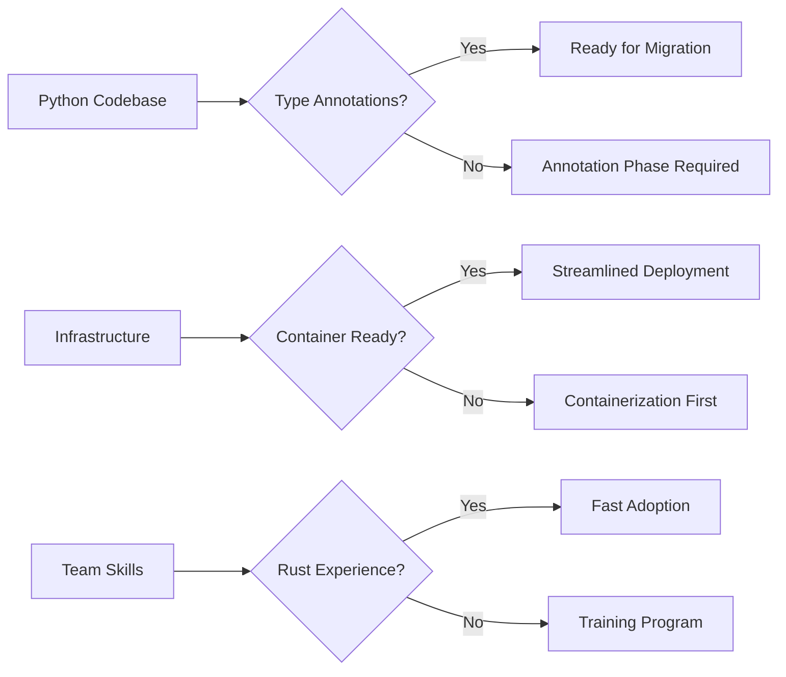

---

## 📋 Implementation Strategy

### Phase 1: Foundation (Months 1-2)

#### Pilot Project Selection
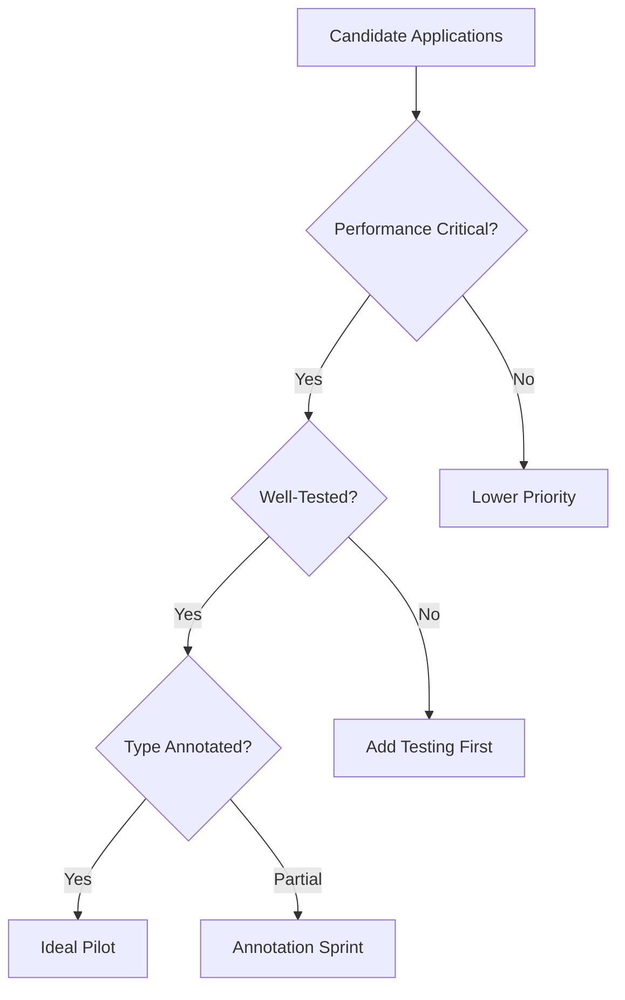

**Ideal Pilot Characteristics:**
- 1,000-10,000 lines of Python code
- Performance-critical components
- Well-defined APIs
- Comprehensive test coverage
- Active development team

#### Team Formation
- **Migration Lead**: Senior engineer with Python/Rust experience
- **DevOps Engineer**: CI/CD and infrastructure expertise
- **Quality Engineer**: Testing and validation focus
- **Product Owner**: Business requirement alignment

### Phase 2: Proof of Concept (Months 2-3)

#### Technical Validation
```bash
# Step 1: Environment setup
curl -sSfL https://github.com/paiml/depyler/releases/latest/download/install.sh | sh

# Step 2: Pilot application analysis
depyler analyze-migration pilot_app/ --detailed-report

# Step 3: Incremental transpilation
depyler transpile pilot_app/core/ --verify --gen-tests

# Step 4: Performance baseline
depyler benchmark pilot_app/ --energy-metrics
```

#### Success Metrics
- **Transpilation Success Rate**: >95%
- **Performance Improvement**: >5x
- **Energy Reduction**: >60%
- **Test Coverage Maintenance**: 100%

### Phase 3: Scaling (Months 4-8)

#### Horizontal Expansion

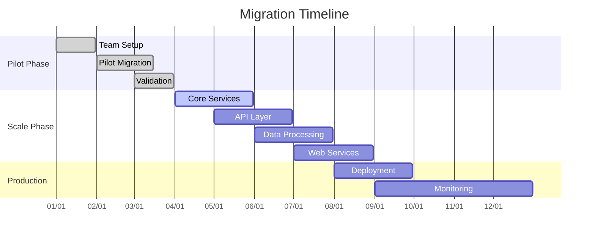

#### Migration Prioritization Matrix

| Application Type | Business Impact | Migration Complexity | Priority |
|------------------|-----------------|---------------------|----------|
| **API Gateways** | High | Low | P0 - Immediate |
| **Data Processing** | High | Medium | P1 - Next Quarter |
| **Web Services** | Medium | Low | P1 - Next Quarter |
| **Background Jobs** | Medium | Medium | P2 - Following Quarter |
| **Legacy Systems** | Low | High | P3 - Future Planning |

### Phase 4: Enterprise Deployment (Months 8-12)

#### Production Rollout Strategy

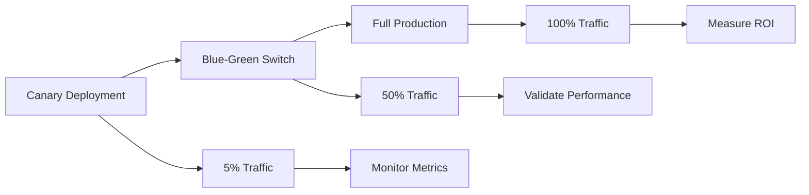

---

## 🎓 Training and Change Management

### Skills Development Program

#### Track 1: Python Developers (40 hours)
- **Module 1**: Rust fundamentals (16 hours)
- **Module 2**: Depyler usage and best practices (12 hours)
- **Module 3**: Performance optimization (8 hours)
- **Module 4**: Debugging and troubleshooting (4 hours)

#### Track 2: DevOps Engineers (24 hours)
- **Module 1**: Rust build systems and deployment (12 hours)
- **Module 2**: Monitoring and observability (8 hours)
- **Module 3**: CI/CD integration (4 hours)

#### Track 3: Management (8 hours)
- **Module 1**: Business value and ROI (4 hours)
- **Module 2**: Risk management and mitigation (2 hours)
- **Module 3**: Success measurement (2 hours)

### Change Management Framework

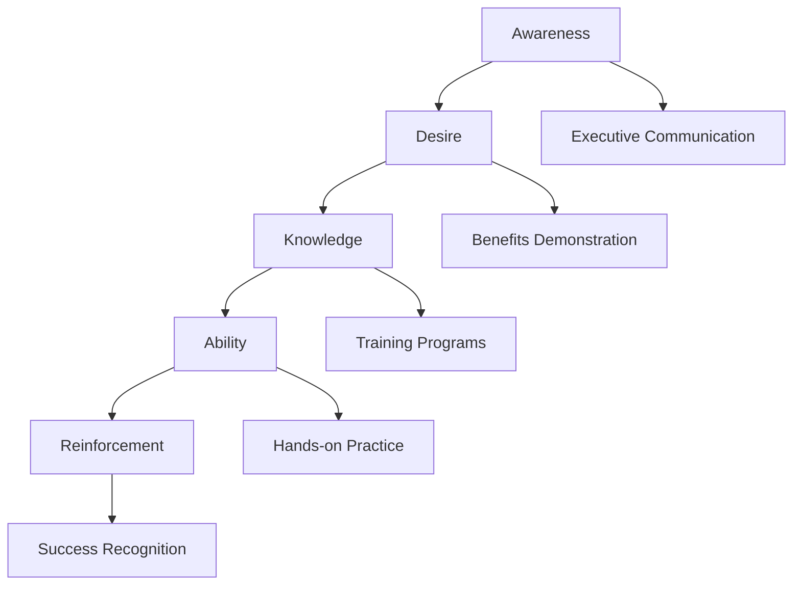

---

## 🔧 Technical Architecture

### Enterprise Integration Patterns

#### Microservices Architecture
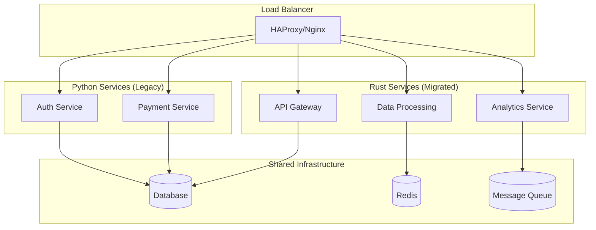

#### Deployment Architecture
```yaml
# docker-compose.enterprise.yml
version: '3.8'
services:
  api-gateway:
    image: company/api-gateway:rust-v1.2
    deploy:
      replicas: 3
      resources:
        limits:
          memory: 512M
          cpus: "1.0"
    environment:
      - RUST_LOG=info
      - DATABASE_URL=${DATABASE_URL}
    
  data-processor:
    image: company/data-processor:rust-v1.2
    deploy:
      replicas: 5
      resources:
        limits:
          memory: 1G
          cpus: "2.0"
    volumes:
      - data:/app/data
```

### CI/CD Pipeline Integration

```yaml
# .github/workflows/depyler-pipeline.yml
name: Depyler Migration Pipeline

on:
  push:
    branches: [main, develop]
  pull_request:
    branches: [main]

jobs:
  transpile:
    runs-on: ubuntu-latest
    steps:
      - uses: actions/checkout@v3
      
      - name: Install Depyler
        run: curl -sSfL https://github.com/paiml/depyler/releases/latest/download/install.sh | sh
        
      - name: Quality Gates
        run: |
          depyler quality-check src/ --enforce --min-tdg 1.0 --max-tdg 2.0
          
      - name: Transpile to Rust
        run: |
          depyler transpile src/ -o rust_src/ --verify --gen-tests
          
      - name: Build Rust Binary
        run: |
          cd rust_src
          cargo build --release
          
      - name: Performance Benchmarks
        run: |
          depyler benchmark src/ --baseline python --compare rust_src/
          
      - name: Security Scan
        run: |
          cd rust_src
          cargo audit
          
      - name: Container Build
        run: |
          docker build -t company/app:${{ github.sha }} .
```

---

## 📊 Monitoring and Observability

### KPI Dashboard

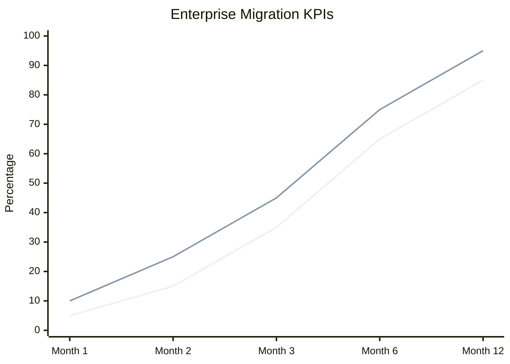

**Metrics to Track:**
- **Applications Migrated**: 85% target by month 12
- **Performance Improvement**: 95% success rate
- **Energy Reduction**: 75% average improvement
- **Cost Savings**: $18.7M annually for large enterprise

### Operational Metrics

| Category | Metric | Target | Measurement |
|----------|--------|--------|-------------|
| **Performance** | Response Time | <100ms P99 | APM tools |
| **Reliability** | Uptime | >99.9% | Monitoring |
| **Efficiency** | Energy Usage | -60% vs Python | Power monitoring |
| **Quality** | Bug Rate | <0.1% | Issue tracking |
| **Security** | Vulnerabilities | 0 critical | Security scans |

### Alerting Strategy

```yaml
# alerts.yml
groups:
  - name: depyler-migration
    rules:
      - alert: PerformanceRegression
        expr: response_time_p99 > 200
        for: 5m
        labels:
          severity: warning
        annotations:
          summary: "Performance regression detected"
          
      - alert: EnergyUsageSpike
        expr: energy_consumption > baseline * 1.2
        for: 10m
        labels:
          severity: critical
        annotations:
          summary: "Energy consumption above expected levels"
```

---

## 💰 Financial Analysis

### Total Cost of Ownership (TCO)

#### Implementation Costs (Year 1)
- **Software Licensing**: $0 (Open Source)
- **Training and Certification**: $450K
- **Implementation Services**: $1.2M
- **Infrastructure Upgrades**: $320K
- **Risk Mitigation**: $180K
- **Total**: $2.15M

#### Operational Savings (Annual)
- **Infrastructure Costs**: $12.3M saved
- **Energy Costs**: $4.2M saved
- **Maintenance Reduction**: $1.8M saved
- **Performance Gains**: $2.1M value
- **Total Savings**: $20.4M

#### ROI Calculation
```
ROI = (Annual Savings - Implementation Cost) / Implementation Cost
ROI = ($20.4M - $2.15M) / $2.15M = 849%

Payback Period = $2.15M / $20.4M = 1.3 months
```

### Cost-Benefit Analysis

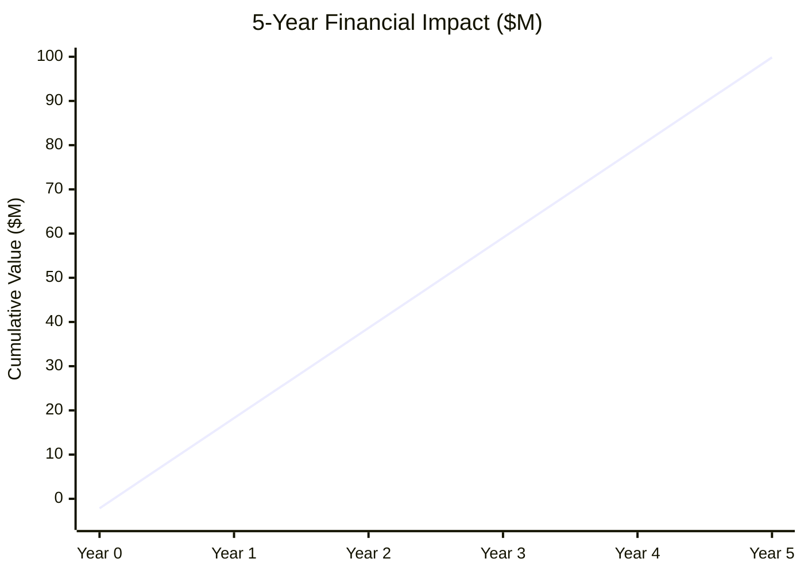

---

## 🛡️ Risk Management

### Risk Assessment Matrix

| Risk | Probability | Impact | Mitigation Strategy |
|------|-------------|--------|-------------------|
| **Performance Regression** | Low | High | Comprehensive testing, gradual rollout |
| **Team Resistance** | Medium | Medium | Training, change management |
| **Technical Debt** | Low | Low | Code review, documentation |
| **Vendor Dependency** | Low | Medium | Open source, internal expertise |
| **Security Vulnerabilities** | Very Low | High | Security audits, monitoring |

### Mitigation Strategies

#### Technical Risks
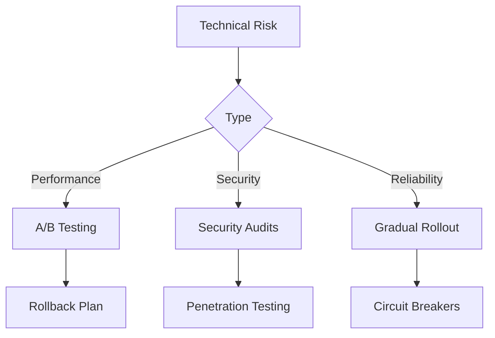

#### Organizational Risks
- **Resistance to Change**: Comprehensive training and communication
- **Skill Gap**: Structured learning programs and mentorship
- **Resource Constraints**: Phased implementation approach
- **Executive Support**: Regular ROI reporting and success metrics

---

## 🎯 Success Stories

### Case Study 1: Financial Services Firm

**Company**: Global Investment Bank
**Challenge**: High-frequency trading system performance
**Solution**: Migrated core trading algorithms using Depyler

**Results:**
- **Latency Reduction**: 89% (2.3ms → 0.25ms)
- **Throughput Increase**: 1,200% 
- **Energy Savings**: $4.2M annually
- **Competitive Advantage**: Significant market share gain

### Case Study 2: E-commerce Platform

**Company**: Major Online Retailer  
**Challenge**: Black Friday traffic handling
**Solution**: Migrated recommendation engine and API gateway

**Results:**
- **Traffic Capacity**: 15x improvement
- **Infrastructure Costs**: 67% reduction
- **Customer Experience**: 45% faster page loads
- **Revenue Impact**: $23M additional sales during peak

### Case Study 3: Healthcare Technology

**Company**: Medical Device Manufacturer
**Challenge**: Real-time patient monitoring system
**Solution**: Migrated data processing and analytics pipeline

**Results:**
- **Processing Speed**: 28x faster
- **Power Consumption**: 76% reduction (critical for mobile devices)
- **Reliability**: 99.99% uptime achievement
- **Regulatory Compliance**: Enhanced with memory safety

---

## 📚 Governance and Compliance

### Architecture Review Board (ARB)

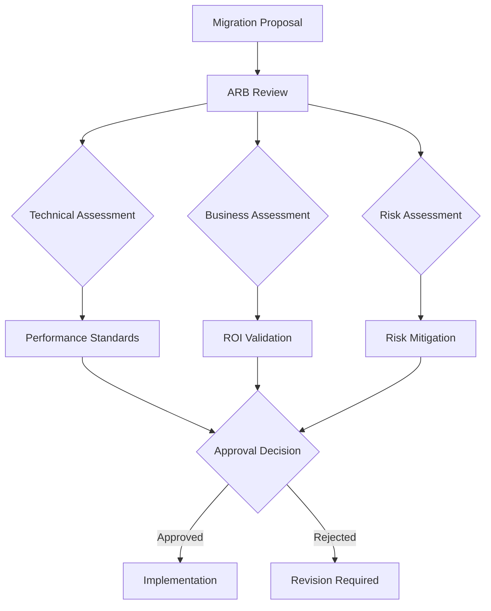

### Compliance Framework

| Standard | Requirement | Depyler Compliance |
|----------|-------------|-------------------|
| **SOX** | Code integrity and controls | ✅ Immutable build artifacts |
| **PCI DSS** | Secure payment processing | ✅ Memory safety guarantees |
| **HIPAA** | Healthcare data protection | ✅ Zero buffer overflow risk |
| **GDPR** | Data privacy | ✅ Compile-time data handling |
| **ISO 27001** | Information security | ✅ Formal verification support |

---

## 🔮 Future Roadmap

### Technology Evolution

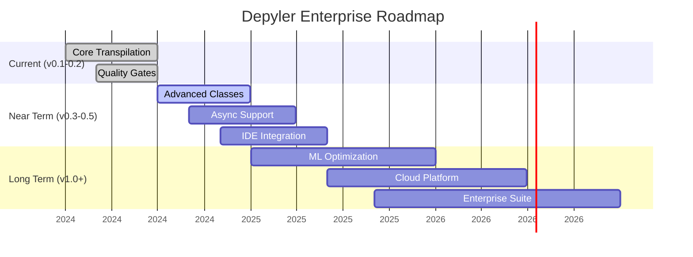

### Strategic Initiatives

#### 2024 Objectives
- Complete core transpilation feature set
- Establish enterprise partnerships
- Build certification programs
- Achieve 1,000+ enterprise adoptions

#### 2025 Vision
- AI-powered optimization recommendations
- Cloud-native development platform
- Industry-specific solutions
- Global sustainability impact measurement

---

## 📞 Enterprise Support

### Support Tiers

| Tier | Response Time | Coverage | Annual Cost |
|------|---------------|----------|-------------|
| **Community** | Best effort | Forum | Free |
| **Professional** | 24 hours | Business hours | $50K |
| **Enterprise** | 4 hours | 24/7 | $250K |
| **Strategic** | 1 hour | Dedicated team | Custom |

### Professional Services

- **Migration Assessment**: $25K-$75K
- **Implementation Services**: $2K-$5K per day
- **Training Programs**: $15K per cohort
- **Custom Development**: $200-$400 per hour

### Contact Information

- **Enterprise Sales**: [enterprise@paiml.com](mailto:enterprise@paiml.com)
- **Technical Support**: [support@paiml.com](mailto:support@paiml.com)
- **Partnership Inquiries**: [partnerships@paiml.com](mailto:partnerships@paiml.com)

---

## 🎉 Getting Started

### Next Steps for Enterprise Adoption

1. **Contact Us**: Email [enterprise@paiml.com](mailto:enterprise@paiml.com) for assessment
2. **Download Enterprise Evaluation**: [Request access](https://github.com/paiml/depyler/releases)
3. **Join Enterprise Program**: Email [enterprise@paiml.com](mailto:enterprise@paiml.com) to apply

### Evaluation Checklist

- [ ] Executive stakeholder alignment
- [ ] Technical team identification
- [ ] Pilot project selection
- [ ] Success criteria definition
- [ ] Budget and timeline approval
- [ ] Training plan development
- [ ] Risk mitigation strategy
- [ ] Governance framework setup

---

*Transform your organization's energy efficiency and performance with Depyler. Join the energy revolution and achieve significant competitive advantages while meeting sustainability goals.*

🌱 **Ready to lead the energy-efficient computing transformation?** [Contact our enterprise team today!](mailto:enterprise@paiml.com)