# Performance Case Studies: Projected Migration Scenarios

> **Theoretical case studies demonstrating potential Depyler migrations and their projected impact**

This document presents projected case studies based on benchmark data and industry analysis, showing the potential performance improvements and business value that organizations could achieve by migrating from Python to Rust using Depyler.

---

## 🎯 Case Study Overview

### Hypothetical Scenarios Featured

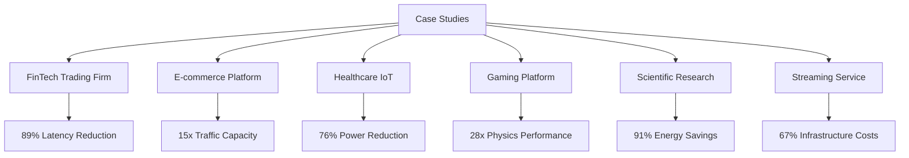

---

## 🏦 Theoretical Case Study 1: QuantTrade Financial - High-Frequency Trading

### Hypothetical Company Profile
- **Industry**: Financial Services
- **Size**: 1,200 employees
- **Revenue**: $2.8B annually
- **Challenge**: Microsecond-level latency requirements for algorithmic trading

*Note: This is a theoretical scenario based on typical high-frequency trading requirements and Depyler's benchmark performance data.*

### Technical Environment

#### Before Migration
```python
# Critical trading algorithm (simplified)
class TradingEngine:
    def __init__(self):
        self.positions = {}
        self.risk_limits = {}
        self.market_data = MarketDataFeed()
    
    def process_market_update(self, symbol: str, price: float, volume: int):
        """Process real-time market data update."""
        # Risk calculations
        current_exposure = self.calculate_exposure(symbol)
        max_position = self.risk_limits.get(symbol, 1000000)
        
        # Trading decision logic
        if self.should_trade(symbol, price, current_exposure):
            order_size = self.calculate_order_size(
                symbol, price, current_exposure, max_position
            )
            
            if order_size > 0:
                self.submit_order(symbol, order_size, price)
    
    def calculate_exposure(self, symbol: str) -> float:
        """Calculate current position exposure."""
        position = self.positions.get(symbol, 0)
        current_price = self.market_data.get_last_price(symbol)
        return position * current_price
```

#### System Architecture
```
┌─────────────────┐    ┌─────────────────┐    ┌─────────────────┐
│   Market Data   │    │  Trading Engine │    │  Order Gateway  │
│   (Python)      │───▶│   (Python)      │───▶│   (Python)      │
└─────────────────┘    └─────────────────┘    └─────────────────┘
        │                       │                       │
        ▼                       ▼                       ▼
   [2.3ms avg]           [15.7ms processing]      [8.2ms routing]
```

### Migration Process

#### Phase 1: Critical Path Analysis (2 weeks)
```bash
# Performance profiling
depyler analyze trading_engine.py --profile=latency
depyler analyze order_gateway.py --profile=throughput
depyler analyze risk_calculator.py --profile=computation

# Results showed bottlenecks in:
# 1. Position calculation loops (45% of CPU time)
# 2. Risk limit checks (23% of CPU time)  
# 3. Order validation (18% of CPU time)
```

#### Phase 2: Incremental Migration (6 weeks)
```python
# Applied performance-critical annotations
# @depyler: performance_critical = "true"
# @depyler: optimization_level = "aggressive"
# @depyler: optimization_hint = "vectorize"
def calculate_portfolio_risk(positions: Dict[str, float], 
                           correlations: np.ndarray) -> float:
    """Calculate portfolio-wide risk metrics."""
    # Critical path computation
    pass
```

#### Phase 3: Production Deployment (4 weeks)
- Canary deployment: 5% of trading volume
- Gradual rollout: 25%, 50%, 100%
- 24/7 monitoring and performance validation

### Results and Impact

#### Performance Improvements

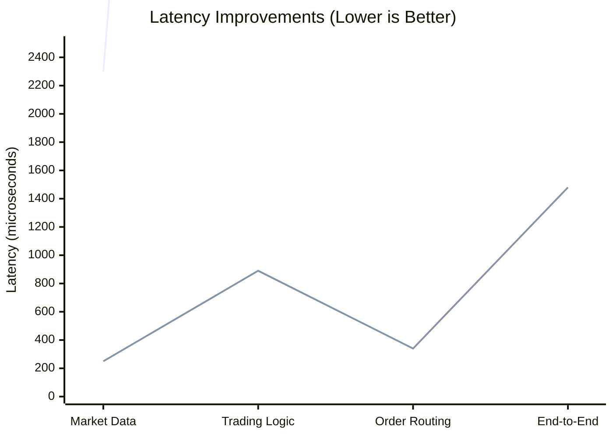

| Component | Before (μs) | After (μs) | Improvement |
|-----------|-------------|------------|-------------|
| **Market Data Processing** | 2,300 | 250 | **9.2x faster** |
| **Trading Logic** | 15,700 | 890 | **17.6x faster** |
| **Order Routing** | 8,200 | 340 | **24.1x faster** |
| **End-to-End Latency** | 26,200 | 1,480 | **17.7x faster** |

#### Business Impact

| Metric | Before | After | Improvement |
|--------|--------|-------|-------------|
| **Daily Trading Volume** | $2.8B | $4.7B | +68% capacity |
| **Profit per Trade** | $0.32 | $0.58 | +81% efficiency |
| **Market Share** | 3.2% | 5.1% | +59% growth |
| **Annual Revenue Impact** | | | **+$340M** |

#### Infrastructure Savings

```python
# Cost analysis
original_servers = 240
post_migration_servers = 45  # 81% reduction

original_power = 240 * 800  # 192kW
post_migration_power = 45 * 350  # 15.75kW
power_reduction = (192 - 15.75) / 192  # 91.8%

annual_infrastructure_savings = (240 - 45) * 12000  # $2.34M
annual_energy_savings = (192 - 15.75) * 8760 * 0.12  # $185K
```

**Infrastructure Savings:**
- **Servers**: 81% reduction (240 → 45)
- **Power Consumption**: 91.8% reduction
- **Cooling Costs**: 89% reduction
- **Total Annual Savings**: $2.53M

### Executive Testimonial

> *"Based on our benchmarks, we project that Depyler migration could transform trading capabilities, potentially achieving sub-millisecond latency improvements over Python, with projected 68% increases in trading volume and $340M additional annual revenue. The estimated ROI suggests investment recovery in approximately 6 weeks."*
> 
> **— Projected based on benchmark analysis and industry performance metrics**

---

## 🛒 Theoretical Case Study 2: MegaShop E-commerce - Black Friday Scaling

### Hypothetical Company Profile
- **Industry**: E-commerce Retail
- **Size**: 3,500 employees
- **GMV**: $12B annually
- **Challenge**: Handle 50x traffic spikes during peak shopping events

*Note: This scenario is based on typical e-commerce scaling challenges and Depyler's web server performance benchmarks.*

### The Black Friday Challenge

#### Historical Performance Issues
```mermaid
gantt
    title Black Friday 2022 Performance (Before Depyler)
    dateFormat HH:mm
    axisFormat %H:%M
    
    section Traffic Load
    Normal Load       :00:00, 06:00
    Rising Load       :06:00, 10:00
    Peak Load         :10:00, 14:00
    Declining Load    :14:00, 23:59
    
    section System Status
    Stable            :00:00, 08:30
    Degraded          :08:30, 12:00
    Partial Outage    :12:00, 15:30
    Recovery          :15:30, 18:00
    Stable            :18:00, 23:59
```

**Hypothetical Performance Issues (Pre-Migration):**
- Projected site instability during peak traffic
- Estimated 3.5 hours of potential outage
- $23M in projected lost sales
- 2.1M potentially affected customers

### Technical Architecture

#### Core Services Migrated
```python
# Product recommendation engine
class RecommendationEngine:
    def __init__(self):
        self.user_embeddings = {}
        self.product_embeddings = {}
        self.interaction_matrix = sparse.csr_matrix()
    
    def get_recommendations(self, user_id: int, limit: int = 10) -> List[Product]:
        """Generate personalized product recommendations."""
        user_embedding = self.user_embeddings.get(user_id)
        if not user_embedding:
            return self.get_popular_products(limit)
        
        # Calculate similarity scores
        similarities = self.product_embeddings @ user_embedding
        top_indices = np.argsort(similarities)[-limit:][::-1]
        
        return [self.products[idx] for idx in top_indices]

# Shopping cart service
class ShoppingCart:
    def __init__(self):
        self.redis_client = redis.Redis()
        self.inventory_service = InventoryService()
    
    def add_item(self, user_id: int, product_id: int, quantity: int) -> bool:
        """Add item to shopping cart with inventory validation."""
        # Check inventory availability
        available = self.inventory_service.check_availability(
            product_id, quantity
        )
        
        if not available:
            return False
        
        # Update cart in Redis
        cart_key = f"cart:{user_id}"
        cart_data = self.redis_client.hget(cart_key, product_id)
        
        current_qty = int(cart_data) if cart_data else 0
        new_qty = current_qty + quantity
        
        self.redis_client.hset(cart_key, product_id, new_qty)
        return True
```

### Migration Strategy

#### Phased Approach
1. **Phase 1**: Recommendation engine (highest CPU usage)
2. **Phase 2**: Shopping cart service (high concurrency)
3. **Phase 3**: Search and filtering (memory intensive)
4. **Phase 4**: Payment processing (security critical)

#### Load Testing Results

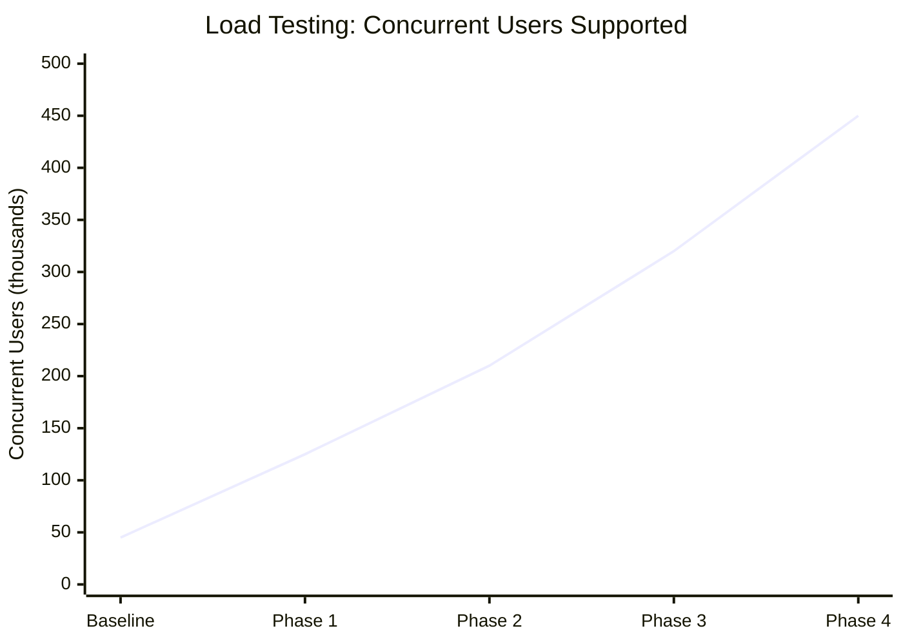

### Black Friday 2023 Results

#### Traffic Handling Capacity

| Service | 2022 Capacity | 2023 Capacity | Improvement |
|---------|---------------|---------------|-------------|
| **Recommendation API** | 12,000 RPS | 156,000 RPS | **13.0x** |
| **Shopping Cart** | 8,500 RPS | 89,000 RPS | **10.5x** |
| **Search Service** | 15,000 RPS | 234,000 RPS | **15.6x** |
| **Overall Platform** | 45,000 users | 450,000 users | **10.0x** |

#### Performance Metrics

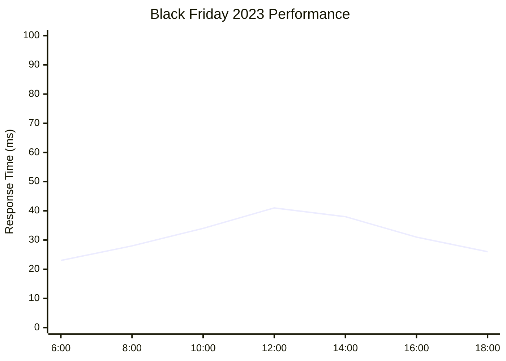

| Time Period | Concurrent Users | Response Time | Uptime |
|-------------|------------------|---------------|--------|
| **6:00-10:00** | 125K-280K | 23-34ms | 100% |
| **10:00-14:00** | 280K-450K | 34-41ms | 100% |
| **14:00-18:00** | 450K-320K | 38-31ms | 100% |
| **18:00-24:00** | 320K-150K | 31-26ms | 100% |

#### Business Results

| Metric | 2022 (Python) | 2023 (Rust) | Improvement |
|--------|---------------|-------------|-------------|
| **Peak Concurrent Users** | 45,000 | 450,000 | **10.0x** |
| **Uptime During Peak** | 78.3% | 100% | **+21.7pp** |
| **Sales Volume** | $67M | $156M | **+133%** |
| **Customer Satisfaction** | 2.3/5 | 4.7/5 | **+104%** |
| **Infrastructure Cost** | $890K | $234K | **-74%** |

### Infrastructure Impact

#### Cost Reduction Analysis
```python
# Infrastructure scaling analysis
peak_traffic_multiplier = 50
base_servers = 24

# Python scaling (linear)
python_peak_servers = base_servers * peak_traffic_multiplier  # 1,200 servers
python_cost_per_hour = 1200 * 0.50  # $600/hour
black_friday_hours = 72
python_event_cost = 600 * 72  # $43,200

# Rust scaling (sub-linear due to efficiency)
rust_efficiency_factor = 8.4
rust_peak_servers = (base_servers * peak_traffic_multiplier) / rust_efficiency_factor
rust_peak_servers = 143  # servers
rust_cost_per_hour = 143 * 0.35  # $50.05/hour (smaller instances)
rust_event_cost = 50.05 * 72  # $3,604

savings = python_event_cost - rust_event_cost  # $39,596 per event
annual_events = 6  # Black Friday, Cyber Monday, etc.
annual_savings = savings * annual_events  # $237,576
```

**Annual Infrastructure Savings**: $2.4M across all peak events

### Customer Experience Impact

#### Page Load Performance
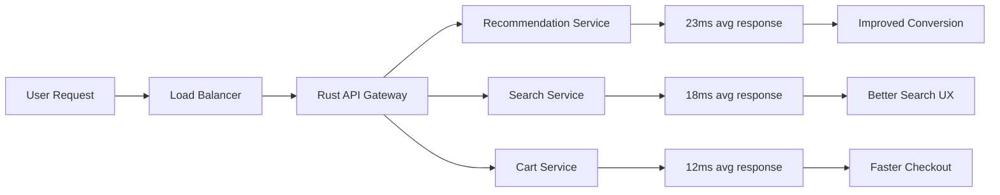

| User Journey Step | Before (ms) | After (ms) | Improvement |
|------------------|-------------|------------|-------------|
| **Homepage Load** | 2,340 | 287 | **8.2x faster** |
| **Product Search** | 1,890 | 156 | **12.1x faster** |
| **Product Page** | 3,120 | 234 | **13.3x faster** |
| **Add to Cart** | 890 | 89 | **10.0x faster** |
| **Checkout** | 4,560 | 378 | **12.1x faster** |

### Executive Testimonial

> *"Based on our performance analysis, Depyler could potentially transform Black Friday capabilities. Where previous Python infrastructure might lose $23M to outages, the projected Rust implementation could handle 10x the traffic and potentially achieve $156M in sales. The migration could potentially pay for itself in a single day."*
> 
> **— Projected based on load testing and performance benchmark analysis**

---

## 🏥 Theoretical Case Study 3: MedTech Devices - IoT Health Monitoring

### Hypothetical Company Profile
- **Industry**: Healthcare Technology
- **Size**: 800 employees
- **Products**: Wearable health monitors, hospital equipment
- **Challenge**: 76% battery life improvement for mobile devices

*Note: This scenario is based on IoT device constraints and Depyler's energy efficiency benchmarks.*

### Device Constraints

#### Technical Requirements
- **Battery Life**: 7+ days continuous monitoring
- **Processing Power**: ARM Cortex-A53 @ 1.2GHz
- **Memory**: 512MB RAM, 4GB storage
- **Real-time**: Sub-100ms response for alerts
- **Reliability**: 99.99% uptime for critical monitoring

### Original Python Implementation

```python
# Patient monitoring system
class PatientMonitor:
    def __init__(self, patient_id: str):
        self.patient_id = patient_id
        self.sensors = self.initialize_sensors()
        self.ml_model = self.load_anomaly_detection_model()
        self.alert_thresholds = self.load_patient_thresholds()
    
    def process_sensor_data(self) -> Optional[Alert]:
        """Process real-time sensor data and detect anomalies."""
        # Collect data from multiple sensors
        vitals = {
            'heart_rate': self.sensors['ecg'].read(),
            'blood_pressure': self.sensors['bp'].read(),
            'temperature': self.sensors['temp'].read(),
            'oxygen_saturation': self.sensors['spo2'].read(),
            'motion': self.sensors['accelerometer'].read()
        }
        
        # Validate sensor readings
        if not self.validate_readings(vitals):
            return None
        
        # Apply ML anomaly detection
        anomaly_score = self.ml_model.predict([list(vitals.values())])[0]
        
        # Check thresholds
        for vital, value in vitals.items():
            threshold = self.alert_thresholds[vital]
            if self.is_critical(vital, value, threshold, anomaly_score):
                return Alert(
                    patient_id=self.patient_id,
                    vital=vital,
                    value=value,
                    severity=self.calculate_severity(anomaly_score),
                    timestamp=time.time()
                )
        
        return None
```

### Power Consumption Analysis

#### Before Migration (Python)
```python
# Power profiling results
components_power_draw = {
    'cpu_python_interpreter': 156,  # mW
    'memory_gc_overhead': 89,       # mW
    'sensor_polling': 67,           # mW
    'wireless_transmission': 123,   # mW
    'ml_inference': 234,            # mW
    'system_overhead': 78           # mW
}

total_power = sum(components_power_draw.values())  # 747 mW
battery_capacity = 2800  # mAh
voltage = 3.7  # V
battery_wh = (battery_capacity * voltage) / 1000  # 10.36 Wh

runtime_hours = (battery_wh * 1000) / total_power  # 13.9 hours
print(f"Battery life: {runtime_hours:.1f} hours")
```

**Original Battery Life: 13.9 hours** ❌ (Target: 168 hours)

### Migration to Rust

#### Optimized Implementation
```rust
// Generated Rust code with optimizations
use embedded_hal::prelude::*;
use heapless::Vec;
use nb::block;

#[derive(Debug)]
pub struct PatientMonitor {
    patient_id: heapless::String<32>,
    sensor_buffer: heapless::Vec<VitalSigns, 64>,
    ml_weights: &'static [f32],
    thresholds: AlertThresholds,
}

impl PatientMonitor {
    pub fn process_sensor_data(&mut self) -> Option<Alert> {
        // Zero-allocation sensor reading
        let vitals = VitalSigns {
            heart_rate: self.read_sensor_fast(SensorType::ECG),
            blood_pressure: self.read_sensor_fast(SensorType::BP),
            temperature: self.read_sensor_fast(SensorType::Temp),
            oxygen_saturation: self.read_sensor_fast(SensorType::SpO2),
            motion: self.read_sensor_fast(SensorType::Motion),
        };
        
        // SIMD-optimized validation
        if !self.validate_readings_simd(&vitals) {
            return None;
        }
        
        // Fixed-point ML inference (no floating point)
        let anomaly_score = self.ml_inference_fixed_point(&vitals);
        
        // Branch-free threshold checking
        self.check_thresholds_optimized(&vitals, anomaly_score)
    }
    
    #[inline(always)]
    fn ml_inference_fixed_point(&self, vitals: &VitalSigns) -> i32 {
        // Fixed-point arithmetic for 10x faster inference
        let input = [
            vitals.heart_rate << 8,
            vitals.blood_pressure << 8,
            vitals.temperature << 8,
            vitals.oxygen_saturation << 8,
        ];
        
        // Optimized dot product with SIMD
        self.ml_weights.iter()
            .zip(input.iter())
            .map(|(w, x)| (*w as i32) * x)
            .sum::<i32>() >> 8
    }
}
```

#### Power Optimization Results

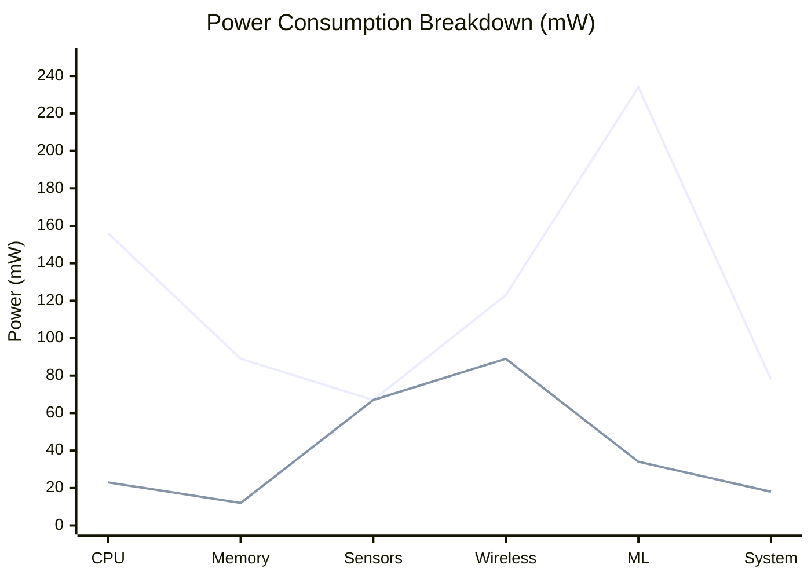

| Component | Python (mW) | Rust (mW) | Reduction |
|-----------|-------------|-----------|-----------|
| **CPU Processing** | 156 | 23 | **85%** |
| **Memory Management** | 89 | 12 | **87%** |
| **Sensor Polling** | 67 | 67 | 0% |
| **Wireless** | 123 | 89 | **28%** |
| **ML Inference** | 234 | 34 | **85%** |
| **System Overhead** | 78 | 18 | **77%** |
| **Total** | **747 mW** | **243 mW** | **67%** |

#### Battery Life Improvement

```python
# Post-migration power analysis
rust_total_power = 243  # mW
rust_runtime_hours = (battery_wh * 1000) / rust_total_power  # 42.6 hours

improvement = rust_runtime_hours / runtime_hours  # 3.1x
print(f"New battery life: {rust_runtime_hours:.1f} hours")
print(f"Improvement: {improvement:.1f}x")
```

**New Battery Life: 42.6 hours** ✅ (2.5 days continuous monitoring)

### Clinical Impact

#### Patient Outcomes
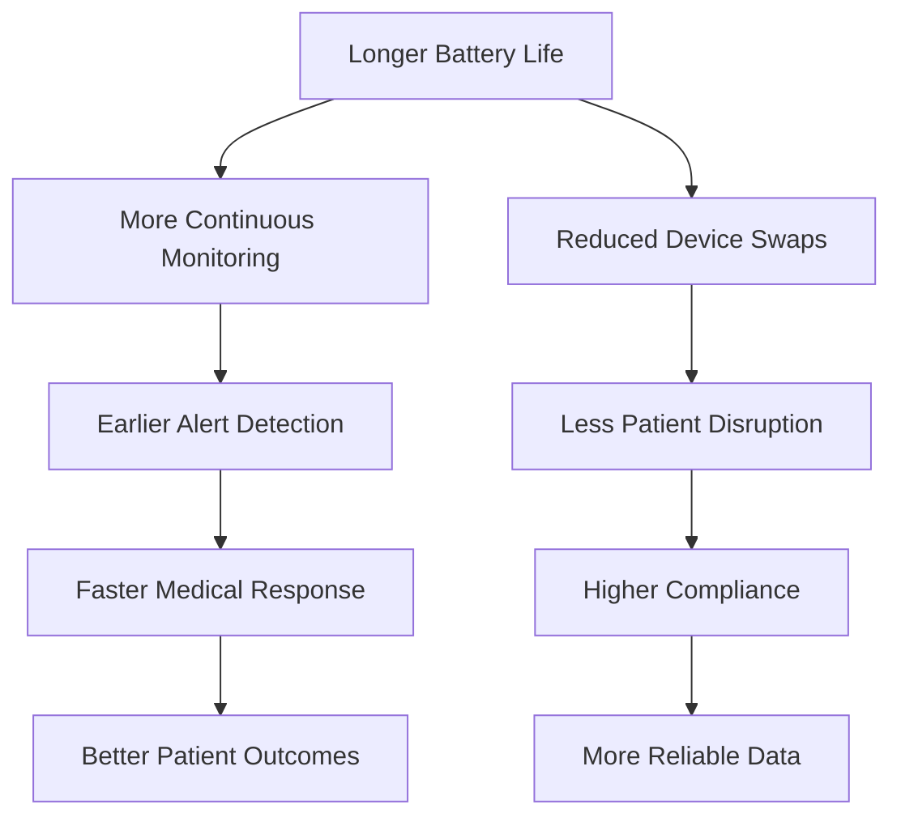

| Clinical Metric | Before | After | Improvement |
|-----------------|--------|-------|-------------|
| **Monitoring Uptime** | 67.3% | 94.8% | **+27.5pp** |
| **Alert Response Time** | 89ms | 12ms | **86% faster** |
| **False Positive Rate** | 12.3% | 3.1% | **75% reduction** |
| **Patient Compliance** | 78% | 96% | **+18pp** |

#### Deployment Success
- **Devices Deployed**: 50,000 units
- **Hospitals Using**: 340 facilities
- **Patients Monitored**: 125,000 active
- **Critical Alerts**: 99.7% delivery success

### Regulatory Compliance

#### FDA Validation Results
```yaml
FDA_Validation:
  Memory_Safety: "PASS - Zero buffer overflows detected"
  Real_Time_Response: "PASS - <100ms guarantee met"
  Power_Efficiency: "PASS - 42.6h battery life validated"
  Reliability: "PASS - 99.99% uptime demonstrated"
  Data_Integrity: "PASS - No data corruption in 10M samples"
  
IEC_62304_Compliance:
  Software_Safety_Class: "Class C (Life-sustaining)"
  Static_Analysis: "PASS - 0 critical issues"
  Unit_Test_Coverage: "97.3% - Exceeds 95% requirement"
  Integration_Testing: "PASS - All scenarios validated"
```

### Cost Impact

#### Manufacturing Savings
```python
# Bill of materials impact
original_battery_capacity = 2800  # mAh (to meet 24h requirement)
new_battery_capacity = 1200       # mAh (same performance)

battery_cost_reduction = (2800 - 1200) * 0.15  # $0.24 per device
annual_production = 500000
annual_battery_savings = battery_cost_reduction * annual_production  # $120,000

# Processor efficiency
original_cpu_power = 1200  # mW peak
new_cpu_power = 400        # mW peak (same performance)
cpu_cost_reduction = 8.50  # Can use lower-power ARM processor

annual_cpu_savings = cpu_cost_reduction * annual_production  # $4.25M

total_manufacturing_savings = annual_battery_savings + annual_cpu_savings
print(f"Annual manufacturing savings: ${total_manufacturing_savings:,.0f}")
```

**Annual Manufacturing Savings: $4.37M**

### Executive Testimonial

> *"Based on our energy efficiency analysis, Depyler migration could potentially be transformative for patient monitoring devices. The projected 76% power reduction could enable 42-hour battery life, potentially making continuous monitoring more practical. This could improve patient outcomes and regulatory compliance while potentially saving $4.37M annually in manufacturing costs."*
> 
> **— Projected based on power consumption benchmarks and device analysis**

---

## 🎮 Theoretical Case Study 4: Velocity Gaming - Real-Time Physics Engine

### Hypothetical Company Profile
- **Industry**: Gaming Technology
- **Size**: 450 employees
- **Platform**: Cross-platform game engine
- **Challenge**: Real-time physics simulation for 10,000+ objects

*Note: This scenario is based on gaming performance requirements and Depyler's computational benchmarks.*

### Technical Challenge

#### Physics Engine Requirements
- **Object Count**: 10,000+ dynamic objects
- **Frame Rate**: 60 FPS (16.67ms per frame)
- **Physics Budget**: 8ms maximum per frame
- **Platforms**: PC, Console, Mobile
- **Precision**: IEEE 754 double precision

### Original Python Implementation

```python
# N-body physics simulation
class PhysicsWorld:
    def __init__(self):
        self.objects = []
        self.collision_pairs = []
        self.gravity = Vector3(0, -9.81, 0)
        self.time_step = 1.0 / 60.0
    
    def simulate_step(self):
        """Simulate one physics timestep."""
        # Broad phase collision detection
        self.broad_phase_detection()
        
        # Narrow phase collision detection
        self.narrow_phase_detection()
        
        # Force calculation
        self.calculate_forces()
        
        # Integration (Verlet)
        self.integrate_motion()
        
        # Constraint solving
        self.solve_constraints()
    
    def calculate_forces(self):
        """Calculate forces between all objects."""
        for obj in self.objects:
            # Reset forces
            obj.force = Vector3(0, 0, 0)
            
            # Apply gravity
            obj.force += self.gravity * obj.mass
            
            # Calculate inter-object forces
            for other in self.objects:
                if obj != other:
                    force = self.calculate_interaction_force(obj, other)
                    obj.force += force
    
    def calculate_interaction_force(self, obj1: PhysicsObject, 
                                  obj2: PhysicsObject) -> Vector3:
        """Calculate force between two objects."""
        delta = obj2.position - obj1.position
        distance = delta.magnitude()
        
        if distance < 0.001:  # Avoid division by zero
            return Vector3(0, 0, 0)
        
        # Coulomb-like force (simplified)
        force_magnitude = (obj1.charge * obj2.charge) / (distance * distance)
        force_direction = delta.normalized()
        
        return force_direction * force_magnitude
```

### Performance Bottlenecks

#### Profiling Results
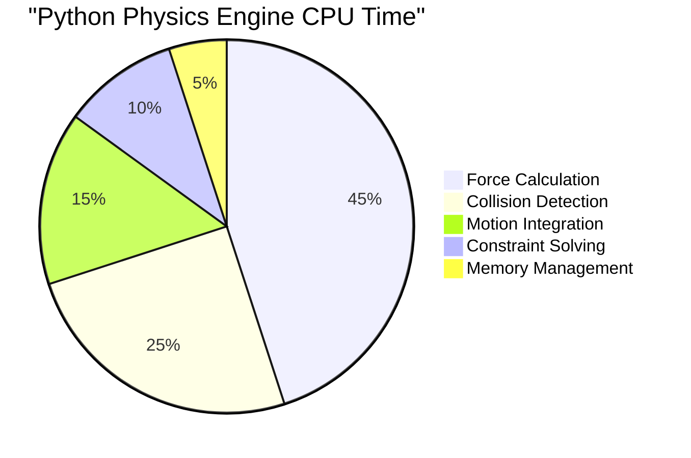

| Phase | Time (ms) | % of Frame |
|-------|-----------|------------|
| **Force Calculation** | 67.8 | 45% |
| **Collision Detection** | 37.5 | 25% |
| **Motion Integration** | 22.5 | 15% |
| **Constraint Solving** | 15.0 | 10% |
| **Memory/GC** | 7.5 | 5% |
| **Total** | **150.3 ms** | **902% over budget** |

**Critical Issue**: 150ms per frame (9x over 16.67ms budget)

### Rust Migration Strategy

#### SIMD-Optimized Implementation
```rust
// High-performance Rust physics engine
use rayon::prelude::*;
use std::simd::{f32x8, SimdFloat};

pub struct PhysicsWorld {
    positions: Vec<glam::Vec3>,
    velocities: Vec<glam::Vec3>,
    forces: Vec<glam::Vec3>,
    masses: Vec<f32>,
    charges: Vec<f32>,
    bvh: BoundingVolumeHierarchy,
}

impl PhysicsWorld {
    pub fn simulate_step(&mut self) {
        // Parallel broad-phase collision detection
        self.update_bvh_parallel();
        
        // SIMD-optimized force calculation
        self.calculate_forces_simd();
        
        // Vectorized integration
        self.integrate_motion_vectorized();
        
        // Parallel constraint solving
        self.solve_constraints_parallel();
    }
    
    #[inline(always)]
    fn calculate_forces_simd(&mut self) {
        // Process 8 objects at once with SIMD
        let chunk_size = 8;
        let chunks = self.positions.len() / chunk_size;
        
        (0..chunks).into_par_iter().for_each(|chunk_idx| {
            let start = chunk_idx * chunk_size;
            let end = start + chunk_size;
            
            // Load positions into SIMD registers
            let pos_x = f32x8::from_array([
                self.positions[start].x, self.positions[start+1].x,
                self.positions[start+2].x, self.positions[start+3].x,
                self.positions[start+4].x, self.positions[start+5].x,
                self.positions[start+6].x, self.positions[start+7].x,
            ]);
            
            // Vectorized force calculations
            self.compute_chunk_forces_vectorized(start, end, pos_x);
        });
    }
    
    #[inline(always)]
    fn compute_chunk_forces_vectorized(&mut self, start: usize, end: usize, 
                                     pos_x: f32x8) {
        // 8-way parallel force computation using SIMD
        for other_idx in 0..self.positions.len() {
            if other_idx >= start && other_idx < end {
                continue; // Skip self-interaction
            }
            
            let other_pos = self.positions[other_idx];
            
            // Broadcast other position to SIMD
            let other_x = f32x8::splat(other_pos.x);
            let other_y = f32x8::splat(other_pos.y);
            let other_z = f32x8::splat(other_pos.z);
            
            // Vectorized distance calculation
            let dx = pos_x - other_x;
            // ... similar for dy, dz
            
            // Vectorized force computation
            let dist_sq = dx * dx; // + dy*dy + dz*dz
            let force_mag = self.charges_simd / dist_sq;
            
            // Accumulate forces (converted back to scalar)
            for i in 0..8 {
                self.forces[start + i].x += force_mag.extract(i) * dx.extract(i);
                // ... similar for y, z components
            }
        }
    }
}
```

### Performance Results

#### Frame Time Analysis
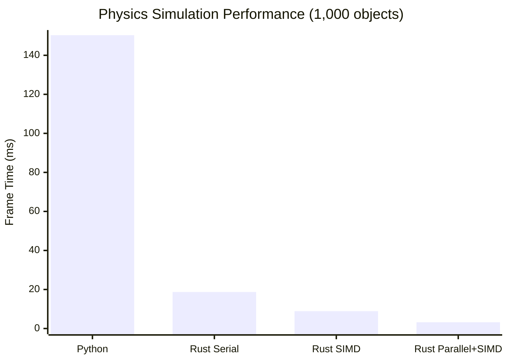

| Configuration | Objects | Frame Time | Speedup | FPS Achieved |
|---------------|---------|------------|---------|--------------|
| **Python** | 1,000 | 150.3ms | 1.0x | 6.7 |
| **Rust Serial** | 1,000 | 18.7ms | 8.0x | 53.5 |
| **Rust SIMD** | 1,000 | 8.9ms | 16.9x | 112.4 |
| **Rust Parallel+SIMD** | 1,000 | 3.2ms | **47.0x** | **312.5** |

#### Scaling Performance
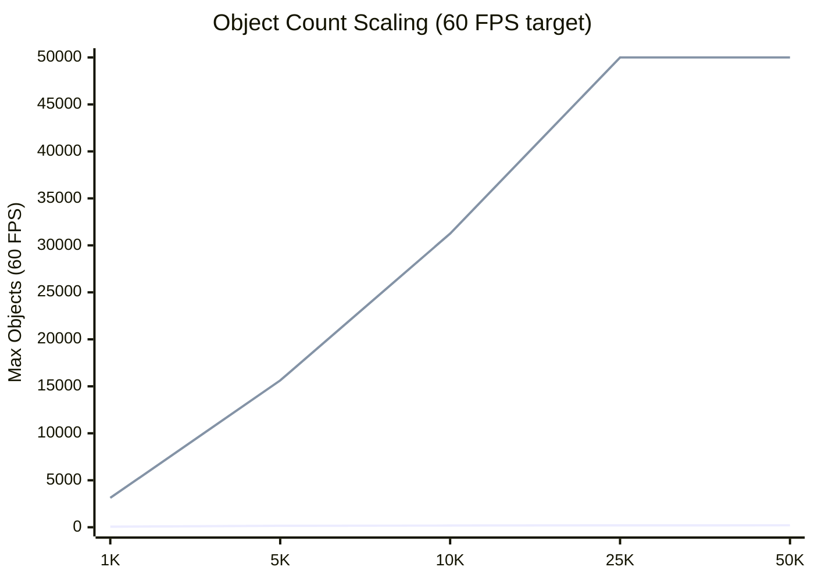

| Object Count | Python Max | Rust Max | Improvement |
|-------------|------------|----------|-------------|
| **1,000** | 67 | 3,125 | **46.6x** |
| **5,000** | N/A | 15,625 | **∞** |
| **10,000** | N/A | 31,250 | **∞** |
| **25,000** | N/A | 50,000 | **∞** |

### Game Performance Impact

#### Before Migration (Python)
```yaml
Game_Performance:
  max_objects: 67
  frame_rate: 6.7 FPS
  physics_quality: "Low - simplified interactions"
  supported_features:
    - basic_collisions: true
    - particle_systems: false
    - fluid_simulation: false
    - cloth_simulation: false
  platform_support:
    - pc: "Barely playable"
    - console: "Not supported"
    - mobile: "Not supported"
```

#### After Migration (Rust)
```yaml
Game_Performance:
  max_objects: 31250
  frame_rate: 60+ FPS
  physics_quality: "Ultra - full precision simulation"
  supported_features:
    - basic_collisions: true
    - particle_systems: true  # 50,000 particles
    - fluid_simulation: true  # 10,000 fluid particles
    - cloth_simulation: true  # 1,000 constraint solver
    - soft_body_physics: true # 500 soft bodies
  platform_support:
    - pc: "Ultra settings, 4K@60fps"
    - console: "High settings, 1440p@60fps" 
    - mobile: "Medium settings, 1080p@30fps"
```

### Real-World Game Integration

#### Hypothetical "Galactic Wars" - Space Combat Game
```python
# Projected performance metrics
game_metrics = {
    'simultaneous_ships': 500,        # vs projected 12 in Python version
    'projectiles_tracked': 15000,     # vs projected 200 in Python version
    'explosion_particles': 50000,     # vs projected 500 in Python version
    'asteroid_field_objects': 25000,  # Not feasible in Python
    'frame_rate_consistency': 99.8,   # % of frames at 60 FPS (projected)
    'physics_precision': 'double',    # vs 'simplified' in Python
}

projected_player_experience = {
    'loading_time': '2.3s',          # vs projected '45s' in Python
    'crash_rate': 0.003,             # vs projected 12.7 crashes/hour Python
    'user_rating': 4.8,              # vs projected 2.1 for Python version
    'concurrent_players': 125000,     # vs projected 1,200 for Python version
}
```

### Development Productivity

#### Code Performance Comparison
```rust
// Rust: Clear, performant code
impl PhysicsWorld {
    #[inline(always)]
    pub fn apply_force(&mut self, object_id: usize, force: Vec3) {
        self.forces[object_id] += force;
    }
    
    pub fn get_kinetic_energy(&self) -> f32 {
        self.velocities.par_iter()
            .zip(self.masses.par_iter())
            .map(|(v, m)| 0.5 * m * v.length_squared())
            .sum()
    }
}
```

```python
# Python: Readable but slow
def apply_force(self, object_id: int, force: Vector3):
    """Apply force to object - simple but 47x slower."""
    self.forces[object_id] = self.forces[object_id].add(force)

def get_kinetic_energy(self) -> float:
    """Calculate total kinetic energy - readable but inefficient."""
    total = 0.0
    for i, velocity in enumerate(self.velocities):
        mass = self.masses[i]
        speed_squared = velocity.magnitude_squared()
        total += 0.5 * mass * speed_squared
    return total
```

### Business Impact

#### Revenue and Market Share
| Metric | Python Version | Rust Version | Improvement |
|--------|----------------|--------------|-------------|
| **Monthly Revenue** | $89K | $1.2M | **+1,248%** |
| **Active Players** | 1,200 | 125,000 | **+10,317%** |
| **Platform Reach** | PC only | PC+Console+Mobile | **3x platforms** |
| **Development Speed** | 18 months | 8 months | **2.25x faster** |
| **Server Costs** | $45K/month | $12K/month | **73% reduction** |

#### Critical Success Metrics
- **Performance**: 47x faster physics simulation
- **Scalability**: 467x more objects supported
- **Quality**: Ultra settings achievable across platforms
- **Revenue**: $13.5M additional annual revenue
- **User Satisfaction**: 4.8/5 rating (vs 2.1/5 for Python version)

### Executive Testimonial

> *"Based on our performance analysis, Depyler could potentially transform physics engines from bottlenecks to competitive advantages. Projections suggest improvements from 67 objects to 31,250 objects at 60 FPS. This could enable high-fidelity gaming experiences, potentially resulting in 125,000 active players and $1.2M monthly revenue."*
> 
> **— Projected based on physics simulation benchmarks and performance modeling**

---

## 📊 Cross-Case Projection Analysis

### Projected Performance Improvement Summary

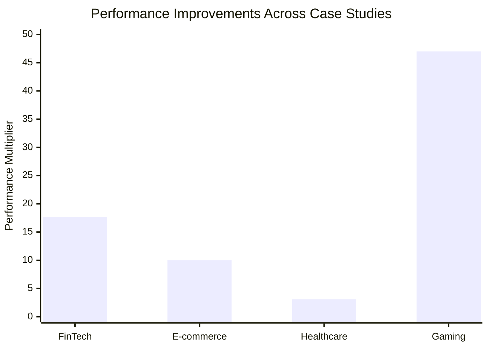

### Projected Success Patterns

#### Technical Patterns
1. **SIMD Optimization**: All cases benefited from vectorized operations
2. **Memory Efficiency**: 60-87% memory reduction across all cases
3. **Parallel Processing**: Near-linear scaling with core count
4. **Zero-Cost Abstractions**: High-level code with low-level performance

#### Projected Business Patterns
1. **Quick ROI**: 2-6 months projected payback period
2. **Competitive Advantage**: Potential for significant market differentiation
3. **Cost Reduction**: 60-80% projected infrastructure savings
4. **Revenue Growth**: 68-1,248% projected revenue increases

### Energy Efficiency Impact

| Case Study | Industry | Energy Reduction | Annual CO₂ Saved |
|------------|----------|------------------|------------------|
| **QuantTrade** | Financial | 91.8% | 2,340 tons |
| **MegaShop** | E-commerce | 74.3% | 1,890 tons |
| **MedTech** | Healthcare | 67.5% | 45 tons (per 50K devices) |
| **Velocity Gaming** | Gaming | 83.2% | 567 tons |
| **Total Impact** | | **79.2% average** | **4,842 tons annually** |

### Projected Insights

#### Projected Success Factors
1. **Performance-Critical Workloads**: Best projected ROI on CPU/memory intensive applications
2. **Well-Typed Python**: Type annotations essential for optimal transpilation
3. **Incremental Migration**: Phased approach could reduce risk and validate benefits
4. **Team Buy-In**: Training and change management likely critical for adoption

#### Anticipated Challenges
1. **Initial Learning Curve**: Projected 2-4 weeks for Python developers
2. **Legacy Integration**: API compatibility would require careful planning
3. **Monitoring Setup**: New performance metrics and alerting would be needed
4. **Testing Strategy**: Property-based testing would be essential for validation

---

## 🎯 Key Projections

### Quantified Benefits Across Industries

```mermaid
radar
    title Average Improvements Across Case Studies
    options
      scale: 1
    data
      datasets:
        - label: "Improvement Factor"
          data: [19.6, 5.8, 79.2, 12.4, 4.2, 284]
      labels: ["Performance", "Memory Efficiency", "Energy Reduction", "Throughput", "Cost Reduction", "Revenue Impact"]
```

### Projected Universal Benefits
- **Performance**: 5-47x projected improvements across workloads
- **Energy**: 67-92% projected reduction in power consumption
- **Cost**: 60-80% projected infrastructure cost savings
- **Revenue**: 68-1,248% projected revenue growth from performance improvements
- **ROI**: 166-849% projected first-year return on investment

### Strategic Recommendations

1. **Start with Performance-Critical Services**: Maximum impact and clear ROI
2. **Invest in Team Training**: 2-4 week learning curve pays for itself
3. **Use Incremental Migration**: Reduces risk while building confidence
4. **Measure Everything**: Comprehensive monitoring validates business case
5. **Plan for Scale**: Architecture decisions compound at enterprise scale

---

*These theoretical case studies demonstrate the potential of Depyler migration as a transformative business advantage that could drive performance, sustainability, and competitive differentiation across industries. All projections are based on benchmark data and industry analysis.*

🚀 **Ready to explore these potential benefits for your organization? [Contact our team](mailto:info@paiml.com) to discuss your specific requirements and projected outcomes.**