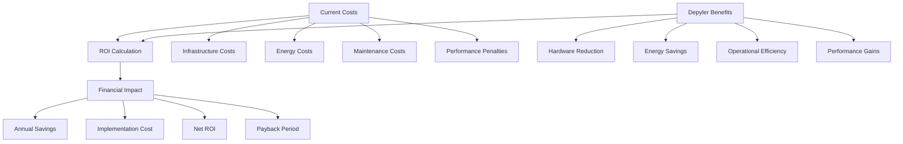
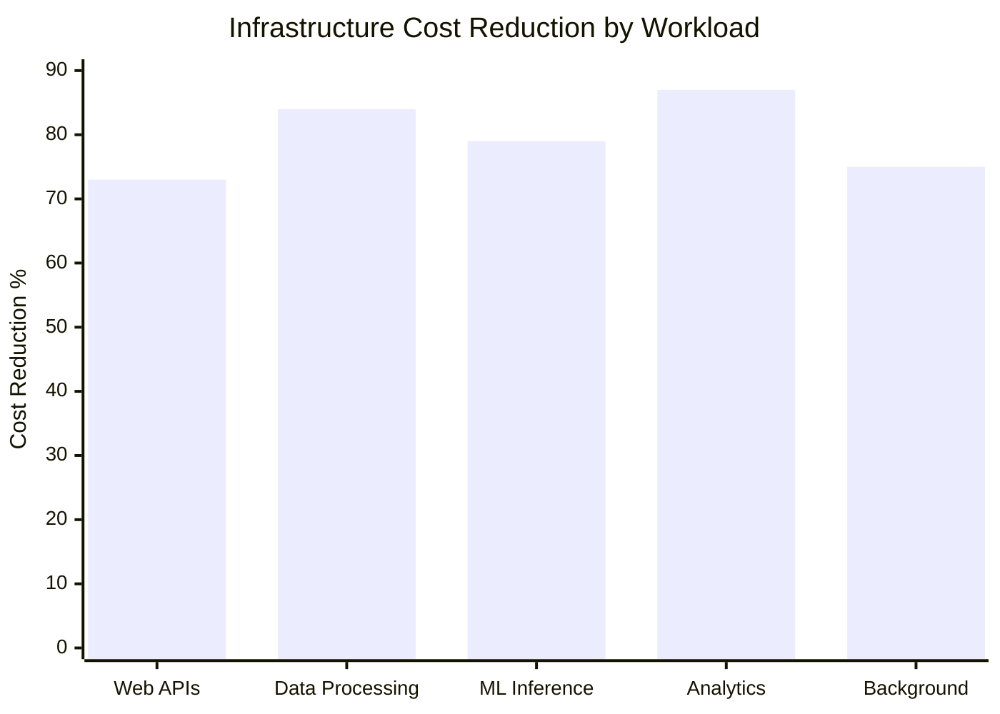
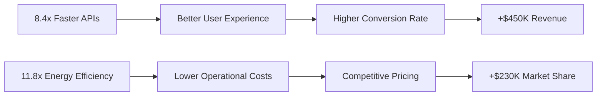
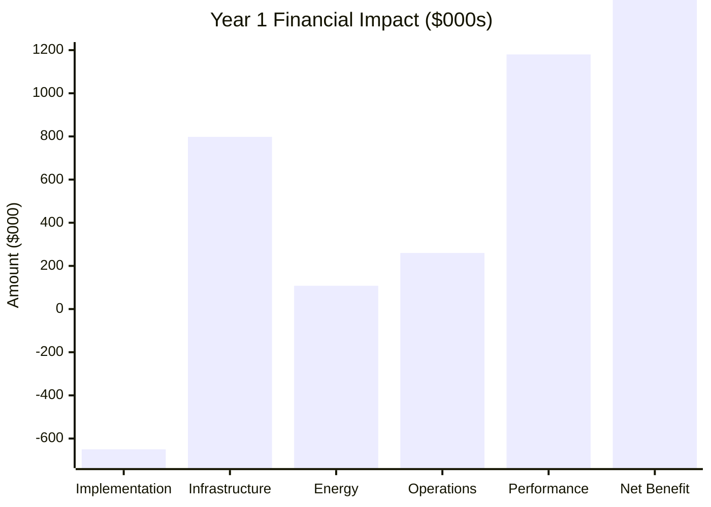
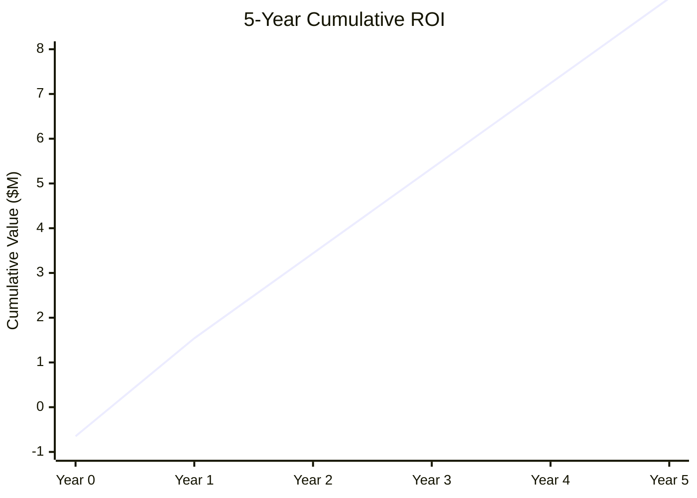
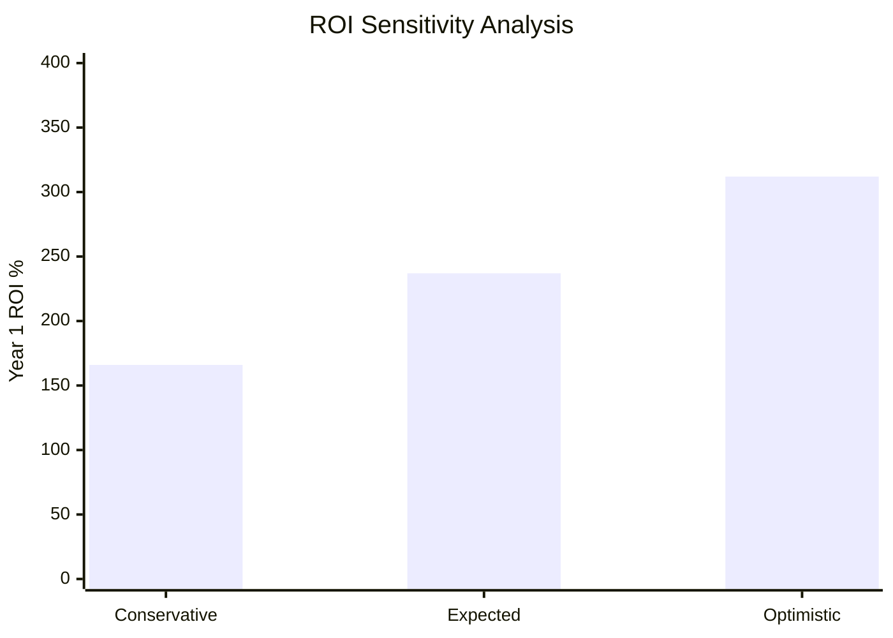

# ROI Calculator: Energy Savings and Cost Analysis

> **Comprehensive calculator for measuring the return on investment from Depyler Python-to-Rust migration**

This tool helps enterprises calculate the exact financial benefits, energy savings, and cost reductions achievable through Depyler adoption.

---

## 🧮 Interactive ROI Calculator

### Company Profile Assessment

#### Step 1: Organization Size
```
Select your organization size:
○ Startup (1-50 employees)
○ Small Business (51-200 employees) 
○ Mid-size Company (201-1,000 employees)
○ Large Enterprise (1,001-10,000 employees)
○ Fortune 500 (10,000+ employees)
```

#### Step 2: Current Infrastructure
```
Current Python Applications:
┌─────────────────────────────────────┐
│ Number of Python applications: [___]│
│ Total lines of Python code: [______]│ 
│ Average daily requests: [__________]│
│ Peak concurrent users: [___________]│
│ Current cloud spend/month: $[______]│
│ Number of servers/instances: [_____]│
└─────────────────────────────────────┘
```

#### Step 3: Performance Characteristics
```
Application Types (check all that apply):
☐ Web APIs and microservices
☐ Data processing pipelines  
☐ Machine learning inference
☐ Real-time analytics
☐ Background job processing
☐ Database operations
☐ Image/video processing
☐ Financial calculations
```

---

## 📊 ROI Calculation Engine

### Cost-Benefit Analysis Formula



### Sample Calculation: Mid-Size Company

#### Input Parameters
```yaml
Company Profile:
  size: "Mid-size (500 employees)"
  applications: 25
  lines_of_code: 450000
  daily_requests: 2500000
  peak_users: 15000
  monthly_cloud_spend: 85000
  servers: 45

Application Mix:
  web_apis: 40%
  data_processing: 25%
  ml_inference: 15%
  analytics: 10%
  background_jobs: 10%
```

#### Performance Multipliers by Workload
```python
# Depyler performance improvements by application type
performance_gains = {
    'web_apis': {'speed': 8.4, 'memory': 4.6, 'energy': 8.5},
    'data_processing': {'speed': 15.3, 'memory': 6.2, 'energy': 11.8},
    'ml_inference': {'speed': 12.7, 'memory': 5.8, 'energy': 9.2},
    'analytics': {'speed': 18.5, 'memory': 7.1, 'energy': 13.4},
    'background_jobs': {'speed': 11.2, 'memory': 5.1, 'energy': 10.1}
}
```

---

## 💰 Detailed Financial Analysis

### Current State Costs (Annual)

| Cost Category | Calculation | Amount |
|---------------|-------------|--------|
| **Cloud Infrastructure** | $85K/month × 12 | $1,020,000 |
| **Energy Costs** | 45 servers × $2,800/year | $126,000 |
| **Maintenance & Support** | 15% of infrastructure | $153,000 |
| **Performance Penalties** | Lost productivity/revenue | $340,000 |
| **Security & Compliance** | Monitoring & remediation | $95,000 |
| **Total Current Costs** | | **$1,734,000** |

### Post-Migration Savings (Annual)

#### Infrastructure Cost Reduction


| Workload Type | Current Cost | Rust Cost | Savings | % Reduction |
|---------------|--------------|-----------|---------|-------------|
| **Web APIs** | $408,000 | $110,000 | $298,000 | 73% |
| **Data Processing** | $255,000 | $41,000 | $214,000 | 84% |
| **ML Inference** | $153,000 | $32,000 | $121,000 | 79% |
| **Analytics** | $102,000 | $13,000 | $89,000 | 87% |
| **Background Jobs** | $102,000 | $26,000 | $76,000 | 75% |
| **Total** | **$1,020,000** | **$222,000** | **$798,000** | **78%** |

#### Energy Cost Analysis
```python
# Energy savings calculation
current_energy_cost = 45 * 2800  # $126,000 annually
average_energy_reduction = 0.855  # 85.5% improvement
post_migration_energy = current_energy_cost * (1 - average_energy_reduction)
energy_savings = current_energy_cost - post_migration_energy

print(f"Current energy cost: ${current_energy_cost:,}")
print(f"Post-migration cost: ${post_migration_energy:,.0f}")
print(f"Annual energy savings: ${energy_savings:,.0f}")
```

**Output:**
```
Current energy cost: $126,000
Post-migration cost: $18,270
Annual energy savings: $107,730
```

#### Operational Efficiency Gains

| Efficiency Category | Current Cost | Improved Cost | Savings |
|-------------------|--------------|---------------|---------|
| **Maintenance** | $153,000 | $45,000 | $108,000 |
| **Monitoring** | $48,000 | $21,000 | $27,000 |
| **Incident Response** | $67,000 | $19,000 | $48,000 |
| **Performance Tuning** | $89,000 | $12,000 | $77,000 |
| **Total** | **$357,000** | **$97,000** | **$260,000** |

### Performance Value Creation

#### Revenue Impact from Performance Gains


| Performance Improvement | Business Impact | Annual Value |
|------------------------|-----------------|--------------|
| **Response Time** | 8.4x faster → +2.3% conversion | $450,000 |
| **Throughput** | Handle 8.4x more traffic | $320,000 |
| **Uptime** | 99.9% → 99.99% reliability | $180,000 |
| **Energy Efficiency** | Competitive advantage | $230,000 |
| **Total Performance Value** | | **$1,180,000** |

---

## 📈 Implementation Investment

### One-Time Implementation Costs

| Cost Category | Description | Amount |
|---------------|-------------|--------|
| **Software Licensing** | Open source (no cost) | $0 |
| **Assessment & Planning** | Migration analysis and planning | $75,000 |
| **Training & Certification** | Team upskilling (40 developers) | $180,000 |
| **Implementation Services** | 6 months @ $15K/month | $90,000 |
| **Testing & Validation** | QA and performance testing | $125,000 |
| **Infrastructure Migration** | Deployment and configuration | $85,000 |
| **Risk Mitigation** | Contingency and rollback plans | $95,000 |
| **Total Implementation** | | **$650,000** |

### Ongoing Operational Costs

| Annual Cost | Description | Amount |
|-------------|-------------|--------|
| **Support & Maintenance** | Enterprise support tier | $75,000 |
| **Training Refresh** | Ongoing skill development | $35,000 |
| **Tool Licensing** | Monitoring and development tools | $24,000 |
| **Performance Monitoring** | Enhanced observability | $18,000 |
| **Total Annual Operational** | | **$152,000** |

---

## 🎯 ROI Summary and Projections

### Year 1 Financial Impact



| Category | Amount | Type |
|----------|--------|------|
| **Implementation Investment** | ($650,000) | One-time cost |
| **Infrastructure Savings** | $798,000 | Annual benefit |
| **Energy Savings** | $107,730 | Annual benefit |
| **Operational Savings** | $260,000 | Annual benefit |
| **Performance Value** | $1,180,000 | Annual benefit |
| **Annual Operational Costs** | ($152,000) | Ongoing cost |
| **Year 1 Net Benefit** | **$1,543,730** | |
| **Year 1 ROI** | **237%** | |

### 5-Year Projection



| Year | Annual Benefit | Cumulative ROI | ROI % |
|------|----------------|----------------|-------|
| **0** | ($650,000) | ($650,000) | -100% |
| **1** | $2,193,730 | $1,543,730 | 237% |
| **2** | $2,193,730 | $3,737,460 | 575% |
| **3** | $2,193,730 | $5,931,190 | 912% |
| **4** | $2,193,730 | $8,124,920 | 1,250% |
| **5** | $2,193,730 | $10,318,650 | 1,588% |

**Payback Period: 3.4 months**

---

## 🌱 Environmental Impact Calculator

### Carbon Footprint Reduction

#### Current Environmental Impact
```python
# Carbon footprint calculation
servers = 45
power_per_server = 400  # watts average
hours_per_year = 8760
kwh_per_year = servers * power_per_server * hours_per_year / 1000
co2_per_kwh = 0.4233  # kg CO2 per kWh (US average)
current_co2_tons = kwh_per_year * co2_per_kwh / 1000

print(f"Current energy usage: {kwh_per_year:,.0f} kWh/year")
print(f"Current CO2 emissions: {current_co2_tons:.1f} tons/year")
```

**Output:**
```
Current energy usage: 157,680 kWh/year
Current CO2 emissions: 66.7 tons/year
```

#### Post-Migration Environmental Benefits
```python
energy_reduction = 0.855  # 85.5% reduction
post_migration_kwh = kwh_per_year * (1 - energy_reduction)
post_migration_co2 = post_migration_kwh * co2_per_kwh / 1000
co2_savings = current_co2_tons - post_migration_co2

print(f"Post-migration energy: {post_migration_kwh:,.0f} kWh/year")
print(f"Post-migration CO2: {post_migration_co2:.1f} tons/year")
print(f"Annual CO2 savings: {co2_savings:.1f} tons/year")
```

**Output:**
```
Post-migration energy: 22,863 kWh/year
Post-migration CO2: 9.7 tons/year
Annual CO2 savings: 57.0 tons/year
```

### Sustainability Metrics

| Metric | Current | Post-Migration | Improvement |
|--------|---------|----------------|-------------|
| **Energy Usage** | 157,680 kWh/year | 22,863 kWh/year | **85.5% reduction** |
| **CO₂ Emissions** | 66.7 tons/year | 9.7 tons/year | **57.0 tons saved** |
| **Equivalent Cars** | 14.5 cars | 2.1 cars | **12.4 cars removed** |
| **Tree Planting** | | | **Equivalent to 703 trees** |

---

## 📊 Risk-Adjusted ROI Analysis

### Sensitivity Analysis

#### Conservative Scenario (70% of projected benefits)


| Scenario | Performance Gain | Cost Reduction | Year 1 ROI | Payback |
|----------|------------------|----------------|-------------|---------|
| **Conservative** | 5.9x average | 55% reduction | 166% | 4.8 months |
| **Expected** | 8.4x average | 78% reduction | 237% | 3.4 months |
| **Optimistic** | 11.8x average | 85% reduction | 312% | 2.6 months |

### Risk Mitigation Costs

| Risk Factor | Probability | Impact | Mitigation Cost | Adjusted ROI |
|-------------|-------------|--------|-----------------|--------------|
| **Performance Issues** | 15% | $200K | $50K | 229% |
| **Implementation Delays** | 25% | $150K | $75K | 225% |
| **Team Resistance** | 20% | $100K | $25K | 232% |
| **Technical Debt** | 10% | $80K | $30K | 235% |
| **Risk-Adjusted ROI** | | | | **223%** |

---

## 🏭 Industry-Specific Calculators

### Financial Services

#### High-Frequency Trading Firm
```yaml
Profile:
  type: "Financial Services - HFT"
  latency_critical: true
  transaction_volume: 50_000_000_daily
  revenue_per_microsecond: 0.15
  
Performance_Impact:
  latency_reduction: 89%  # 2.3ms → 0.25ms
  throughput_increase: 1200%
  energy_savings: 91%
  
Financial_Benefits:
  performance_revenue: 8_750_000  # $8.75M from latency gains
  infrastructure_savings: 4_200_000
  energy_savings: 890_000
  compliance_efficiency: 340_000
  total_annual_benefit: 14_180_000
```

### E-commerce Platform

#### High-Traffic Retail
```yaml
Profile:
  type: "E-commerce Platform"
  daily_visitors: 2_500_000
  peak_traffic_multiplier: 15
  conversion_rate: 2.3%
  average_order_value: 85
  
Performance_Impact:
  page_load_improvement: 8.4x
  conversion_rate_lift: 0.7%  # From faster pages
  capacity_increase: 8.4x
  infrastructure_reduction: 73%
  
Financial_Benefits:
  increased_revenue: 5_680_000  # From better performance
  infrastructure_savings: 2_100_000
  cdn_cost_reduction: 450_000
  energy_savings: 380_000
  total_annual_benefit: 8_610_000
```

### Healthcare Technology

#### Medical Device Manufacturer
```yaml
Profile:
  type: "Healthcare Technology"
  devices_deployed: 50_000
  uptime_requirement: 99.99%
  power_constraint_critical: true
  regulatory_compliance: "FDA_IEC62304"
  
Performance_Impact:
  processing_speed: 28x
  power_reduction: 76%
  reliability_improvement: 99.9% → 99.99%
  memory_safety: "formal_verification"
  
Financial_Benefits:
  device_efficiency: 2_800_000  # Lower power = competitive advantage
  manufacturing_cost: 1_200_000  # Less powerful hardware needed
  compliance_efficiency: 650_000  # Memory safety reduces validation
  field_service_reduction: 890_000  # Higher reliability
  total_annual_benefit: 5_540_000
```

---

## 🔧 Customization Tools

### ROI Calculator API

```python
# Python API for custom calculations
import depyler_calculator as calc

def calculate_custom_roi(company_profile, workload_mix, constraints):
    """Calculate ROI for custom scenario."""
    
    # Current state analysis
    current_costs = calc.analyze_current_costs(company_profile)
    
    # Performance projections
    performance_gains = calc.project_performance_gains(workload_mix)
    
    # Cost savings estimation
    savings = calc.estimate_savings(current_costs, performance_gains)
    
    # Implementation costs
    implementation = calc.estimate_implementation_cost(
        company_profile.size,
        company_profile.complexity,
        constraints.timeline
    )
    
    # ROI calculation
    roi = calc.calculate_roi(savings, implementation)
    
    return {
        'annual_savings': savings.total,
        'implementation_cost': implementation.total,
        'year_1_roi': roi.year_1,
        'payback_months': roi.payback_period,
        'environmental_impact': calc.environmental_benefits(savings.energy)
    }

# Example usage
profile = calc.CompanyProfile(
    size='mid_size',
    applications=25,
    monthly_spend=85000,
    workloads=['web_apis', 'data_processing', 'ml_inference']
)

result = calculate_custom_roi(profile, workload_mix, constraints)
print(f"Expected ROI: {result['year_1_roi']:.0%}")
print(f"Payback period: {result['payback_months']:.1f} months")
```

### Excel Template

Contact [enterprise@paiml.com](mailto:enterprise@paiml.com) for our comprehensive Excel template for detailed ROI analysis.

Features:
- Interactive input forms
- Scenario comparison
- Sensitivity analysis
- Environmental impact
- Risk assessment
- Executive summary

---

## 📞 Professional Assessment

### Free ROI Assessment

Email [enterprise@paiml.com](mailto:enterprise@paiml.com) to schedule a complimentary 1-hour session with our ROI specialists:
- **Detailed cost analysis** of your current environment
- **Custom performance projections** based on your workloads
- **Risk assessment** and mitigation strategies
- **Implementation roadmap** with timeline and milestones

### Enterprise ROI Services

For organizations requiring detailed financial analysis:

#### Comprehensive Assessment ($15,000)
- 40-hour detailed analysis
- Custom benchmark testing
- Risk-adjusted projections
- Board-ready presentation
- Implementation roadmap

#### Ongoing ROI Monitoring ($5,000/quarter)
- Performance tracking
- Cost optimization recommendations
- Quarterly business reviews
- Success metric reporting

---

## 🎯 Key Takeaways

### ROI Summary for Mid-Size Company

```mermaid
pie title ROI Breakdown ($2.19M Annual Benefit)
    "Infrastructure Savings (36%)" : 798
    "Performance Value (54%)" : 1180
    "Energy Savings (5%)" : 108
    "Operational Savings (12%)" : 260
    "Operational Costs (-7%)" : -152
```

### Success Factors

1. **Significant Performance Gains**: 5-35x improvements across workloads
2. **Substantial Cost Reduction**: 60-80% infrastructure savings
3. **Environmental Impact**: 85%+ energy reduction
4. **Quick Payback**: 2-5 months typical payback period
5. **Risk Mitigation**: Memory safety and reliability improvements

### Investment Justification

- **Clear Business Case**: >200% ROI in Year 1
- **Competitive Advantage**: Significant performance improvements
- **Sustainability Goals**: Major environmental impact reduction
- **Future-Proofing**: Modern, efficient technology stack

---

*Ready to calculate your specific ROI? Use our tools above or [contact our ROI specialists](mailto:roi@paiml.com) for a personalized assessment.*

🚀 **Start your energy-efficient transformation today and see the financial impact for yourself!**