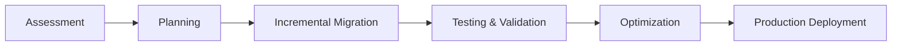
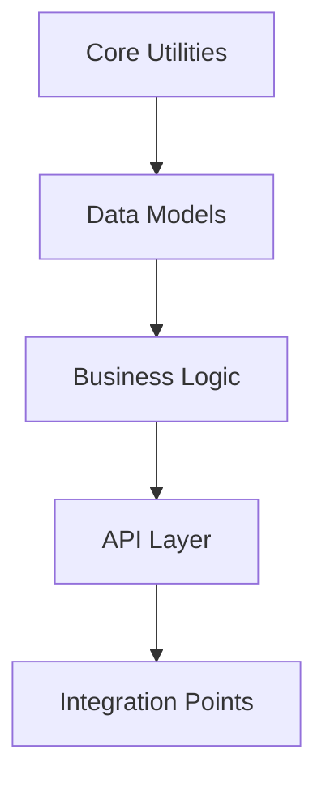

# Migration Guide: Python to Rust with Depyler

> **Step-by-step guide for migrating Python codebases to energy-efficient Rust**

This comprehensive guide will walk you through the process of migrating Python
applications to Rust using Depyler, from initial assessment to production
deployment.

---

## 🎯 Migration Overview

### Migration Phases



### Expected Benefits

- **80-90% energy reduction** compared to Python
- **5-15x performance improvement** in execution speed
- **Memory safety** with zero-cost abstractions
- **Type safety** at compile time

---

## Phase 1: Project Assessment 🔍

### 1.1 Compatibility Analysis

```bash
# Analyze your Python project for migration readiness
depyler analyze-migration your_project/

# Check individual files for compatibility
find . -name "*.py" -exec depyler check {} \;
```

### 1.2 Dependency Mapping

Create an inventory of your Python dependencies and their Rust equivalents:

| Python Package | Rust Equivalent | Migration Notes       |
| -------------- | --------------- | --------------------- |
| `requests`     | `reqwest`       | HTTP client library   |
| `numpy`        | `ndarray`       | Numerical computing   |
| `pandas`       | `polars`        | Data manipulation     |
| `flask`        | `axum` / `warp` | Web frameworks        |
| `sqlite3`      | `rusqlite`      | Database connectivity |
| `json`         | `serde_json`    | JSON parsing          |

### 1.3 Code Complexity Assessment

```bash
# Generate complexity report
depyler analyze your_project/ --format json > complexity_report.json

# Identify high-complexity functions that need attention
depyler quality-check your_project/ --max-complexity 15 --report
```

---

## Phase 2: Migration Planning 📋

### 2.1 Migration Strategy Selection

#### Option A: Big Bang Migration

- **Best for**: Small projects (<5,000 lines)
- **Timeline**: 1-2 weeks
- **Risk**: High
- **Benefits**: Fast completion

#### Option B: Incremental Migration (Recommended)

- **Best for**: Large projects (>5,000 lines)
- **Timeline**: 4-12 weeks
- **Risk**: Low
- **Benefits**: Gradual validation

#### Option C: Hybrid Approach

- **Best for**: Mixed codebases with performance-critical sections
- **Timeline**: 2-8 weeks
- **Risk**: Medium
- **Benefits**: Optimized effort allocation

### 2.2 Module Prioritization



**Priority Order:**

1. **Core Utilities** (Pure functions, no dependencies)
2. **Data Models** (Simple data structures)
3. **Business Logic** (Core application logic)
4. **API Layer** (Web frameworks, endpoints)
5. **Integration Points** (External services, databases)

### 2.3 Timeline Planning

```bash
# Generate migration timeline estimate
depyler estimate-migration your_project/ --output timeline.md
```

---

## Phase 3: Incremental Migration 🔄

### 3.1 Start with Core Modules

#### Step 1: Identify Core Functions

```python
# Example: Core utility functions (good starting point)
def calculate_distance(point1: tuple, point2: tuple) -> float:
    """Calculate Euclidean distance between two points."""
    return ((point1[0] - point2[0])**2 + (point1[1] - point2[1])**2)**0.5

def validate_email(email: str) -> bool:
    """Validate email format."""
    import re
    pattern = r'^[a-zA-Z0-9._%+-]+@[a-zA-Z0-9.-]+\.[a-zA-Z]{2,}$'
    return bool(re.match(pattern, email))
```

#### Step 2: Transpile with Annotations

```bash
# Get annotation suggestions
depyler interactive utils.py --annotate

# Apply suggestions and transpile
depyler transpile utils.py --verify --gen-tests
```

#### Step 3: Generated Rust Code

```rust
// utils.rs (generated by Depyler)
pub fn calculate_distance(point1: (f64, f64), point2: (f64, f64)) -> f64 {
    ((point1.0 - point2.0).powi(2) + (point1.1 - point2.1).powi(2)).sqrt()
}

pub fn validate_email(email: &str) -> bool {
    use regex::Regex;
    let pattern = Regex::new(r"^[a-zA-Z0-9._%+-]+@[a-zA-Z0-9.-]+\.[a-zA-Z]{2,}$").unwrap();
    pattern.is_match(email)
}
```

### 3.2 Handle Complex Patterns

#### Python Classes to Rust Structs

```python
# Python
class User:
    def __init__(self, name: str, age: int):
        self.name = name
        self.age = age
    
    def is_adult(self) -> bool:
        return self.age >= 18
```

```rust
// Rust equivalent
#[derive(Debug, Clone)]
pub struct User {
    pub name: String,
    pub age: u32,
}

impl User {
    pub fn new(name: String, age: u32) -> Self {
        Self { name, age }
    }
    
    pub fn is_adult(&self) -> bool {
        self.age >= 18
    }
}
```

### 3.3 Error Handling Migration

#### Python Exception Handling

```python
def divide_numbers(a: float, b: float) -> float:
    try:
        return a / b
    except ZeroDivisionError:
        raise ValueError("Cannot divide by zero")
```

#### Rust Result Pattern

```rust
pub fn divide_numbers(a: f64, b: f64) -> Result<f64, String> {
    if b == 0.0 {
        Err("Cannot divide by zero".to_string())
    } else {
        Ok(a / b)
    }
}
```

---

## Phase 4: Testing & Validation ✅

### 4.1 Property-Based Testing

```bash
# Generate property tests for migrated code
depyler verify --property-tests migrated_module.rs

# Run comprehensive validation
cargo test --all --verbose
```

### 4.2 Performance Benchmarking

```bash
# Create performance comparison
cat > benchmark.py << 'EOF'
import time
import subprocess

# Benchmark Python version
start = time.time()
# ... run Python code ...
python_time = time.time() - start

# Benchmark Rust version
result = subprocess.run(['./target/release/rust_version'], capture_output=True)
rust_time = float(result.stdout.decode().strip())

print(f"Python: {python_time:.3f}s")
print(f"Rust: {rust_time:.3f}s") 
print(f"Speedup: {python_time/rust_time:.1f}x")
EOF
```

### 4.3 Integration Testing

```bash
# Test Rust modules with Python (during transition)
# Using PyO3 for FFI if needed
cargo build --release
python test_integration.py
```

---

## Phase 5: Optimization 🚀

### 5.1 Profile and Optimize

```bash
# Profile Rust code for bottlenecks
cargo build --release
perf record ./target/release/your_app
perf report

# Apply optimization annotations
depyler optimize --aggressive migrated_code.rs
```

### 5.2 Memory Optimization

```rust
// Use appropriate string types
pub fn process_text(input: &str) -> String {  // Borrowed input
    input.to_uppercase()  // Owned output when needed
}

// Use slices for better performance
pub fn sum_slice(numbers: &[i32]) -> i32 {
    numbers.iter().sum()
}
```

### 5.3 Concurrency Optimization

```rust
// Leverage Rust's fearless concurrency
use rayon::prelude::*;

pub fn parallel_process(data: &[i32]) -> Vec<i32> {
    data.par_iter()
        .map(|&x| expensive_computation(x))
        .collect()
}
```

---

## Phase 6: Production Deployment 🚀

### 6.1 Build Optimization

```toml
# Cargo.toml - Production profile
[profile.release]
opt-level = 3
lto = "fat"
codegen-units = 1
strip = true
panic = "abort"
```

### 6.2 Docker Integration

```dockerfile
# Multi-stage Dockerfile for Rust deployment
FROM rust:1.75 as builder
WORKDIR /app
COPY . .
RUN cargo build --release

FROM debian:bookworm-slim
RUN apt-get update && apt-get install -y ca-certificates
COPY --from=builder /app/target/release/your_app /usr/local/bin/
CMD ["your_app"]
```

### 6.3 Monitoring and Metrics

```bash
# Set up performance monitoring
cargo install cargo-audit
cargo audit

# Track energy consumption
depyler benchmark --energy your_app
```

---

## Common Migration Patterns 🔄

### Pattern 1: List Comprehensions

```python
# Python
result = [x * 2 for x in numbers if x > 0]
```

```rust
// Rust
let result: Vec<i32> = numbers
    .iter()
    .filter(|&&x| x > 0)
    .map(|&x| x * 2)
    .collect();
```

### Pattern 2: Dictionary Operations

```python
# Python
data = {"key1": "value1", "key2": "value2"}
result = {k: v.upper() for k, v in data.items()}
```

```rust
// Rust
use std::collections::HashMap;

let mut data = HashMap::new();
data.insert("key1", "value1");
data.insert("key2", "value2");

let result: HashMap<&str, String> = data
    .iter()
    .map(|(&k, &v)| (k, v.to_uppercase()))
    .collect();
```

### Pattern 3: File I/O

```python
# Python
with open("file.txt", "r") as f:
    content = f.read()
```

```rust
// Rust
use std::fs;

let content = fs::read_to_string("file.txt")
    .expect("Failed to read file");
```

---

## Troubleshooting Guide 🔧

### Common Issues and Solutions

#### Issue: "Lifetime parameter required"

```rust
// Problem
fn process_string(s: &str) -> &str {
    s.trim()
}

// Solution: Explicit lifetime annotation
fn process_string<'a>(s: &'a str) -> &'a str {
    s.trim()
}
```

#### Issue: "Move of borrowed value"

```rust
// Problem
let data = vec![1, 2, 3];
let result1 = process(data);
let result2 = process(data); // Error: value moved

// Solution: Use references or clone
let result1 = process(&data);
let result2 = process(&data);
```

#### Issue: "Cannot borrow as mutable"

```rust
// Problem
let mut vec = vec![1, 2, 3];
let item = &vec[0];
vec.push(4); // Error: cannot borrow as mutable

// Solution: Limit scope of immutable borrow
let mut vec = vec![1, 2, 3];
{
    let item = &vec[0];
    // Use item here
}
vec.push(4); // OK: immutable borrow has ended
```

---

## Success Metrics 📊

### Performance Metrics

- **Execution Speed**: Target 5-15x improvement
- **Memory Usage**: Target 60-80% reduction
- **Energy Consumption**: Target 80-90% reduction
- **Binary Size**: Monitor and optimize

### Quality Metrics

- **Test Coverage**: Maintain >80%
- **Code Quality**: PMAT TDG score 1.0-2.0
- **Cyclomatic Complexity**: <20 per function
- **Build Time**: <2 minutes for CI/CD

### Migration Metrics

- **Lines Migrated**: Track progress daily
- **Functions Converted**: Monitor success rate
- **Tests Passing**: Maintain 100% success rate
- **Performance Regressions**: Zero tolerance

---

## Next Steps 🎯

After successful migration:

1. **Monitor Production Performance**
   - Set up metrics and alerting
   - Track energy consumption
   - Monitor error rates

2. **Team Training**
   - Rust language fundamentals
   - Best practices and patterns
   - Debugging and profiling

3. **Continuous Improvement**
   - Regular performance reviews
   - Code quality assessments
   - Stay updated with Rust ecosystem

4. **Share Success**
   - Document lessons learned
   - Share metrics and improvements
   - Contribute back to open source

---

## Resources 📚

- **[Rust Book](https://doc.rust-lang.org/book/)** - Official Rust documentation
- **[Rust by Example](https://doc.rust-lang.org/rust-by-example/)** - Hands-on
  examples
- **[Clippy](https://github.com/rust-lang/rust-clippy)** - Linting and best
  practices
- **[Cargo](https://doc.rust-lang.org/cargo/)** - Build system and package
  manager

For migration support:

- 🐛 **Issues**: [GitHub Issues](https://github.com/paiml/depyler/issues)
- 📧 **Enterprise**: [enterprise@paiml.com](mailto:enterprise@paiml.com)

---

_Remember: Migration is a journey, not a destination. Take it step by step,
validate frequently, and celebrate the energy savings along the way! 🌱_
