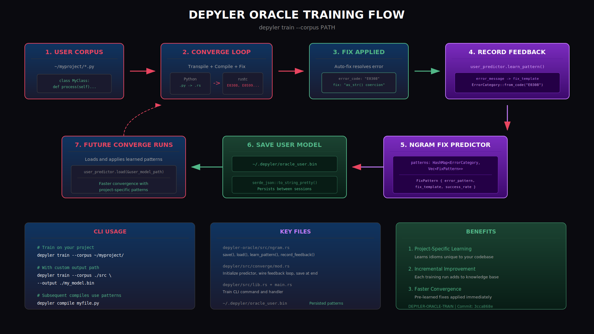

# Oracle Training Architecture

> DEPYLER-ORACLE-TRAIN: User corpus training for project-specific error→fix patterns

## Overview

The `depyler train --corpus PATH` command implements a feedback loop that learns project-specific error→fix patterns for faster future convergence.



## Panel Breakdown

### 1. USER CORPUS (red border)
- **Input**: User's Python files (`~/myproject/*.py`)
- Starting point for training run

### 2. CONVERGE LOOP (red border)
- Transpiles `.py` → `.rs`
- Runs `rustc`, captures errors (E0308, E0599, etc.)
- Core compile-test-fix cycle

### 3. FIX APPLIED (green border)
- Auto-fix resolves specific error codes
- Example: E0308 → `as_str()` coercion

### 4. RECORD FEEDBACK (purple/oracle gradient)
- `user_predictor.learn_pattern()` called
- Maps `error_message` → `fix_template`
- Categorizes by `ErrorCategory::from_code()`

### 5. NGRAM FIX PREDICTOR (purple)
- Data structure: `HashMap<ErrorCategory, Vec<FixPattern>>`
- Each `FixPattern` tracks: `error_pattern`, `fix_template`, `success_rate`

### 6. SAVE USER MODEL (green/success gradient)
- Persists to `~/.depyler/oracle_user.bin`
- Serialized via `serde_json`
- Survives between sessions

### 7. FUTURE CONVERGE RUNS (red border, dashed loop back to #2)
- Loads saved model on startup
- Applies learned patterns immediately
- Result: Faster convergence on project-specific idioms

## CLI Usage

```bash
# Train on a corpus
depyler train --corpus ./my_python_project

# Specify custom output path
depyler train --corpus ./src --output ./models/custom.bin

# Set target success rate and max iterations
depyler train --corpus ./src --target-rate 90 --max-iterations 20
```

## Key Files

| File | Purpose |
|------|---------|
| `crates/depyler-oracle/src/ngram.rs` | NgramFixPredictor with save/load |
| `crates/depyler/src/converge/mod.rs` | Feedback loop wiring |
| `~/.depyler/oracle_user.bin` | User model persistence |

## Example: Training on Test Corpus

```bash
# Run the oracle training example
cargo run --example oracle_user_training -p depyler-oracle

# Or use the CLI directly
cargo run -p depyler -- train --corpus /tmp/test_corpus
```

## How It Works

```
┌─────────────────┐
│  User Corpus    │
│  (*.py files)   │
└────────┬────────┘
         │
         ▼
┌─────────────────┐
│  Converge Loop  │◄──────────────┐
│  py → rs → rustc│               │
└────────┬────────┘               │
         │                        │
         ▼ (error)                │
┌─────────────────┐               │
│  Apply Fix      │               │
│  E0308 → as_str │               │
└────────┬────────┘               │
         │                        │
         ▼                        │
┌─────────────────┐               │
│ Record Feedback │               │
│ learn_pattern() │               │
└────────┬────────┘               │
         │                        │
         ▼                        │
┌─────────────────┐               │
│ NgramPredictor  │───────────────┘
│ HashMap<Cat,Fix>│    (next iteration)
└────────┬────────┘
         │
         ▼
┌─────────────────┐
│  Save Model     │
│ ~/.depyler/*.bin│
└─────────────────┘
```

## Benefits

- **Project-specific learning**: Patterns tuned to your codebase
- **Incremental improvement**: Each run enriches the oracle
- **Faster convergence**: Known patterns applied immediately
- **Local knowledge**: No one-size-fits-all assumptions

## Kaizen Philosophy

Each training run enriches the oracle's knowledge, reducing future fix iterations. Patterns are project-local, avoiding one-size-fits-all assumptions. This is a kaizen-style system: continuous, incremental improvement.
