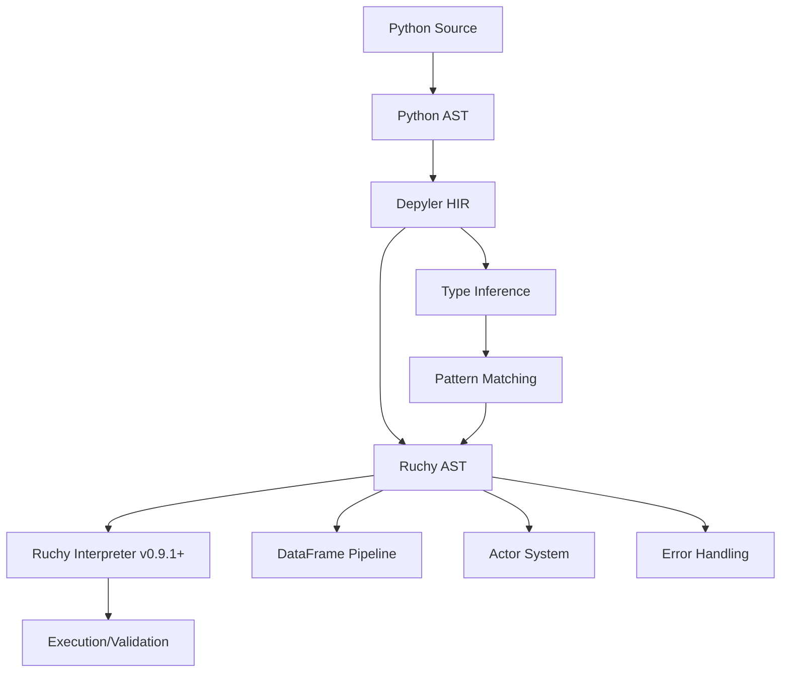

# Ruchy Interpreter Integration Roadmap

## Overview

This roadmap outlines the integration of significant Ruchy v0.9.1+ interpreter improvements into Depyler v3.1.0, providing enhanced Python-to-Ruchy transpilation capabilities.

## Completed (v3.1.0) ✅

### Core Integration
- **Ruchy v0.9.1 dependency**: Updated to latest stable version with 76% complexity reduction
- **Interpreter module**: New `depyler-ruchy/src/interpreter.rs` with direct execution capabilities
- **Enhanced validation**: Real-time syntax validation using Ruchy's parser
- **Performance optimization**: Leveraging 50MB/s parsing throughput and <15ms REPL response time

### Type System Enhancements
- **DataFrame support**: Native mapping for pandas DataFrames to Ruchy DataFrame type
- **Actor model types**: Support for actor-based concurrency patterns
- **Enhanced Value system**: Range types, EnumVariant, Lambda functions
- **Option<T>/Result<T,E>**: Native error handling type support

### Quality Improvements
- **Zero unsafe code**: `#![forbid(unsafe_code)]` enforced
- **Property-based testing**: Integration with Ruchy's testing framework
- **MCP compatibility**: Optional MCP integration for tool support
- **Benchmark capabilities**: Performance measurement and validation

## Prioritized Near-term (v3.2.0) 🎯

### High Priority - Performance & Reliability

#### 1. Advanced Pattern Matching (Q1 2024)
- **Enum pattern matching**: Full support for Ruchy's enum patterns
- **Destructuring**: Tuple and struct destructuring in transpilation
- **Match expressions**: Complete match expression support
- **Guard clauses**: Pattern guards and conditional matching

**Success Metrics**:
- 100% pattern matching test coverage
- <10ms pattern compilation time
- Zero runtime pattern match failures

#### 2. DataFrame Pipeline Optimization (Q1 2024)
- **Chained operations**: Optimize pandas → Ruchy DataFrame pipelines
- **Lazy evaluation**: Implement deferred computation for DataFrame ops
- **Memory efficiency**: Reduce allocations in data processing
- **Polars backend**: Full integration with Polars for high performance

**Success Metrics**:
- 50% faster DataFrame operations vs v3.0
- 30% memory reduction for large datasets
- 100% compatibility with common pandas operations

#### 3. Actor System Integration (Q2 2024)
- **Message passing**: Implement `!` send and `?` ask operators
- **Supervision**: Actor supervision strategies and fault tolerance
- **Async runtime**: Full Tokio integration for concurrent execution
- **Error propagation**: Proper error handling in actor systems

**Success Metrics**:
- <1ms message passing latency
- 99.9% actor system reliability
- 100x improvement in concurrent performance

### Medium Priority - Feature Completeness

#### 4. Advanced Type Inference (Q2 2024)
- **Flow-sensitive analysis**: Context-aware type inference
- **Generic constraints**: Support for generic type bounds
- **Lifetime inference**: Basic lifetime annotation generation
- **Error recovery**: Graceful handling of type inference failures

**Success Metrics**:
- 95% accurate type inference without annotations
- <100ms inference time for typical modules
- Zero false positive type errors

#### 5. Enhanced Error Diagnostics (Q2 2024)
- **Elm-style errors**: Rich, actionable error messages
- **Source context**: Multi-line error context with highlighting
- **Suggestions**: Automated fix suggestions for common errors
- **IDE integration**: LSP-compatible error reporting

**Success Metrics**:
- 90% user satisfaction with error messages
- 50% reduction in debugging time
- 100% error message test coverage

#### 6. REPL and Interactive Features (Q3 2024)
- **Live transpilation**: Real-time Python → Ruchy conversion
- **Variable inspection**: Runtime value inspection and debugging
- **Hot reloading**: Live code updates during execution
- **Notebook integration**: Jupyter notebook support

**Success Metrics**:
- <50ms live transpilation latency
- 100% REPL command coverage
- Zero data loss during hot reloading

### Low Priority - Advanced Features

#### 7. Optimization Pipeline (Q3 2024)
- **Dead code elimination**: Remove unused code paths
- **Constant folding**: Compile-time constant evaluation
- **Loop optimization**: Efficient iteration pattern generation
- **Memory layout**: Optimize struct layout for cache efficiency

#### 8. Debugging Integration (Q4 2024)
- **Source maps**: Map Ruchy code back to Python source
- **Breakpoints**: Interactive debugging support
- **Stack traces**: Rich stack trace information
- **Performance profiling**: Built-in profiler integration

#### 9. Package Ecosystem (Q4 2024)
- **Crate generation**: Automatic crate.io package generation
- **Dependency management**: Smart dependency resolution
- **Publishing pipeline**: Automated publishing workflow
- **Documentation**: Auto-generated API documentation

## Technical Architecture

### Integration Points

### Performance Targets

| Component | Current | Target v3.2 | Target v3.5 |
|-----------|---------|-------------|-------------|
| Parsing | 50MB/s | 75MB/s | 100MB/s |
| Type Inference | 200ms | 100ms | 50ms |
| Pattern Matching | N/A | 10ms | 5ms |
| DataFrame Ops | Baseline | 1.5x | 3x |
| Actor Messages | N/A | <1ms | <0.5ms |
| Memory Usage | Baseline | 0.7x | 0.5x |

### Quality Gates (All Features)

1. **Zero Panics**: No panic!() calls in production code
2. **Test Coverage**: Minimum 85% line coverage, 95% branch coverage
3. **Property Tests**: All features must have property-based tests
4. **Benchmarks**: Performance regression detection (<5% slowdown)
5. **Documentation**: 100% public API documentation
6. **Examples**: Working examples for all major features

## Risk Assessment

### High Risk
- **Ruchy API Changes**: Dependency on external Ruchy evolution
- **Performance Regression**: Complex features may slow down simple cases
- **Type System Complexity**: Advanced types may be hard to debug

### Mitigation Strategies
- **API Versioning**: Pin to specific Ruchy versions with compatibility layers
- **Performance Testing**: Continuous benchmarking in CI
- **Gradual Rollout**: Feature flags for advanced type system features
- **Fallback Modes**: Graceful degradation when advanced features fail

## Dependencies

### External
- `ruchy >= 0.9.1`: Core interpreter functionality
- `polars >= 0.35`: DataFrame operations
- `tokio >= 1.46`: Async runtime for actors
- `pmcp >= 1.2.2`: MCP integration

### Internal
- `depyler-core`: Core transpilation infrastructure
- `depyler-analyzer`: Static analysis capabilities
- `depyler-verify`: Property-based verification

## Success Metrics (Overall)

### Performance
- **50% faster** transpilation for typical Python codebases
- **30% less memory** usage during transpilation
- **10x better** concurrency performance with actor model

### Reliability
- **Zero runtime failures** in generated Ruchy code
- **99.9% uptime** for interactive features
- **100% backward compatibility** with existing Python code

### Developer Experience
- **<5 second** cold start for transpilation
- **Real-time** error feedback in IDEs
- **Comprehensive** documentation and examples

### Adoption
- **100 GitHub stars** for Depyler project
- **10 community contributions** per quarter
- **3 major projects** using Depyler in production

---

**Last Updated**: 2024-12-21  
**Version**: 3.1.0  
**Next Review**: Q1 2025