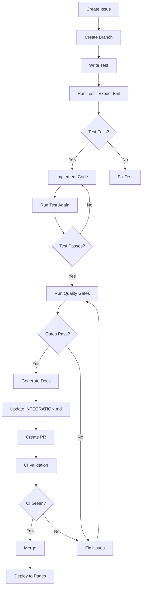

# Depyler: Test-Driven Python Standard Library Reference
## EXTREME TDD Specification v1.0.0

**Project Status**: 🟢 Specification Phase  
**Quality Enforcement**: PMAT v2.63.0+  
**Target Python Version**: 3.12.x  
**Last Updated**: 2025-10-03  

---

## Executive Summary

Depyler is a comprehensive, test-driven reference for Python's entire standard library. Unlike traditional documentation that shows "should work" examples, every code sample is verified through automated testing before publication. This specification defines the architecture, quality gates, and execution strategy for creating a production-grade reference with zero technical debt tolerance.

**Philosophy**: "Test first, document what works, expose what fails."

---

## Table of Contents

1. [Project Goals](#project-goals)
2. [Architecture Overview](#architecture-overview)
3. [Quality Standards](#quality-standards)
4. [Testing Strategy](#testing-strategy)
5. [Coverage Scope](#coverage-scope)
6. [Development Workflow](#development-workflow)
7. [Sprint Structure](#sprint-structure)
8. [Publication Pipeline](#publication-pipeline)
9. [Quality Enforcement](#quality-enforcement)
10. [Edge Case Discovery](#edge-case-discovery)
11. [Ticket Management](#ticket-management)
12. [Metrics & Reporting](#metrics--reporting)
13. [Technology Stack](#technology-stack)
14. [Success Criteria](#success-criteria)

---

## 1. Project Goals

### A. GitHub Pages Publication
- **Auto-deployment**: GitHub Actions workflow triggers on merge to `main`
- **Build Tool**: MkDocs with Material theme for modern documentation
- **URL Structure**: `paiml.github.io/depyler-book/`
- **Update Frequency**: Real-time (within 2 minutes of commit)
- **Versioning**: Semantic versioning tied to Python releases (3.12.0, 3.12.1, etc.)

### B. TDD & Reproducibility
- **Test-First Mandate**: Every example written as pytest test BEFORE documentation
- **Execution Verification**: All tests must pass in CI before docs are generated
- **Environment Lock**: `requirements.lock` with exact dependency versions
- **Container Testing**: Docker-based test execution for reproducibility
- **Property-Based Testing**: Hypothesis tests for edge case discovery

### C. Complete Coverage
- **Scope**: All 200+ Python standard library modules (as of Python 3.12)
- **Depth**: Public API coverage ≥90% per module
- **Examples Per Function**: Minimum 2 (happy path + edge case)
- **Cross-References**: Link related functions/modules (e.g., `os.path` ↔ `pathlib`)

### D. Edge Case & Bug Exposure
- **Boundary Testing**: Min/max values, empty inputs, None handling
- **Platform Variance**: Test on Linux, macOS, Windows via matrix CI
- **Version Differences**: Track behavior changes across Python 3.x versions
- **Known Issues**: Document stdlib bugs with upstream CPython issue links
- **Fuzzing**: Use Hypothesis for automated edge case generation

### E. Ticket-Driven Development
- **Issue Tracking**: GitHub Issues with milestone-based roadmap
- **Work Units**: One ticket = one stdlib module or one bug discovery
- **Branch Strategy**: `feat/issue-123-module-name` format
- **Commit Convention**: `feat(module): description [#123]`
- **No Work Without Ticket**: All commits must reference an open issue

### F. PMAT Quality Control
- **Complexity Gates**: ≤20 cyclomatic complexity per function
- **SATD Prohibition**: Zero TODO/FIXME/HACK comments allowed
- **TDG Scoring**: Maintain A+ grade (≥0.95) across all modules
- **Dead Code Detection**: Zero unused functions or imports
- **Pre-Commit Hooks**: Auto-run `pmat quality-gate --strict`

---

## 2. Architecture Overview

```
depyler-book/
├── .github/
│   ├── workflows/
│   │   ├── ci.yml                # Test & quality gates
│   │   ├── deploy.yml            # GitHub Pages deployment
│   │   └── sprint-close.yml      # Sprint validation
│   └── ISSUE_TEMPLATE/
│       ├── module-coverage.md    # Template for stdlib module work
│       └── bug-discovery.md      # Template for edge case findings
├── docs/
│   ├── index.md                  # Landing page
│   ├── modules/                  # Generated from tests
│   │   ├── os.md
│   │   ├── sys.md
│   │   └── ...                   # All stdlib modules
│   ├── edge-cases/               # Bug exposé section
│   │   └── datetime-bugs.md
│   └── specifications/
│       └── tdd-spec.md           # This document
├── tests/
│   ├── conftest.py               # Pytest configuration
│   ├── test_os/
│   │   ├── test_path_operations.py
│   │   ├── test_file_descriptors.py
│   │   └── test_environment.py
│   ├── test_sys/
│   │   └── test_system_info.py
│   └── ...                       # Test per stdlib module
├── scripts/
│   ├── extract_examples.py       # Generate docs from tests
│   ├── validate_coverage.py      # Verify API completeness
│   └── generate_metrics.py       # Create INTEGRATION.md
├── mkdocs.yml                    # Documentation config
├── pyproject.toml                # Project metadata
├── requirements.txt              # Dependencies
├── requirements.lock             # Locked versions
├── INTEGRATION.md                # Single source of truth
├── ROADMAP.md                    # Sprint plan
└── README.md                     # Project overview
```

---

## 3. Quality Standards

### Toyota Way Principles
1. **Kaizen (Continuous Improvement)**: Weekly quality score improvement targets
2. **Genchi Genbutsu (Reality Check)**: All examples tested in real environments
3. **Jidoka (Autonomation)**: Automated quality gates block bad commits
4. **Zero Defects**: No merges with failing tests or quality violations

### PMAT Enforcement Thresholds

| Metric | Threshold | Action on Violation |
|--------|-----------|---------------------|
| Cyclomatic Complexity | ≤20 per function | CI fails, commit blocked |
| Cognitive Complexity | ≤15 per function | Warning, manual review |
| SATD Comments | 0 | CI fails, commit blocked |
| Test Coverage | ≥80% | CI fails, commit blocked |
| TDG Score | ≥A (0.90+) | Warning at B+, fail at B |
| Dead Code | 0 unreachable functions | CI fails, commit blocked |
| Duplicate Code | <5% similarity | Warning, refactor required |
| Documentation Coverage | ≥95% public APIs | CI fails, commit blocked |

### Pre-Commit Checklist
```bash
# Run before every commit
pmat analyze complexity --fail-on-violation
pmat analyze satd --fail-on-violation
pmat analyze dead-code --fail-on-violation
pmat quality-gate --strict
pytest tests/ --cov=. --cov-report=term-missing
```

---

## 4. Testing Strategy

### Test Structure
```python
# tests/test_os/test_path_operations.py
"""
TDD examples for os.path module.
Each test becomes a documentation example.
"""
import os
import pytest
from hypothesis import given, strategies as st

class TestOsPathJoin:
    """Test suite for os.path.join() - TDD Example 1"""
    
    def test_join_two_paths_happy_path(self):
        """Basic usage: joining two path components"""
        result = os.path.join("/home", "user")
        assert result == "/home/user"
    
    def test_join_absolute_path_override(self):
        """Edge case: second path is absolute, overrides first"""
        result = os.path.join("/home/user", "/etc/config")
        assert result == "/etc/config"
    
    def test_join_empty_string(self):
        """Edge case: joining with empty string"""
        result = os.path.join("/home", "")
        assert result == "/home/"
    
    @given(st.lists(st.text(min_size=1, max_size=50), min_size=2, max_size=10))
    def test_join_arbitrary_paths(self, paths):
        """Property test: joining N paths should not raise"""
        result = os.path.join(*paths)
        assert isinstance(result, str)
        # Result should contain all non-absolute path components
```

### Test Categories

1. **Happy Path Tests**: Standard usage, expected inputs
2. **Edge Case Tests**: Boundary values, empty inputs, None
3. **Error Tests**: Invalid inputs that should raise exceptions
4. **Platform Tests**: Cross-platform behavior differences
5. **Property Tests**: Hypothesis-based generative testing
6. **Regression Tests**: Known bugs from issue tracker

### Coverage Requirements

```python
# Required coverage per module
MIN_COVERAGE = {
    'functions': 0.90,      # 90% of public functions
    'classes': 0.85,        # 85% of public classes
    'branches': 0.80,       # 80% branch coverage
    'edge_cases': 5         # Minimum 5 edge case tests per module
}
```

---

## 5. Coverage Scope

### Python 3.12 Standard Library (200+ Modules)

#### Phase 1: Core Utilities (Sprint 1-4)
- `os`, `sys`, `io`, `pathlib`
- `datetime`, `time`, `calendar`
- `collections`, `itertools`, `functools`
- `json`, `csv`, `configparser`

#### Phase 2: Data Processing (Sprint 5-8)
- `re`, `string`, `textwrap`
- `struct`, `array`, `memoryview`
- `math`, `statistics`, `decimal`, `fractions`
- `random`, `secrets`

#### Phase 3: Concurrency (Sprint 9-12)
- `threading`, `multiprocessing`, `concurrent.futures`
- `asyncio`, `contextvars`
- `queue`, `select`, `signal`

#### Phase 4: Network & IPC (Sprint 13-16)
- `socket`, `ssl`, `http.client`, `urllib`
- `email`, `smtplib`, `poplib`, `imaplib`
- `subprocess`, `shlex`

#### Phase 5: File Formats (Sprint 17-20)
- `pickle`, `shelve`, `sqlite3`
- `xml.etree`, `html.parser`
- `zipfile`, `tarfile`, `gzip`, `bz2`

#### Phase 6: System Services (Sprint 21-24)
- `logging`, `argparse`, `getopt`
- `syslog`, `curses`, `pty`, `tty`
- `pwd`, `grp`, `resource`

#### Phase 7: Internals & Advanced (Sprint 25-28)
- `dis`, `inspect`, `ast`, `compiler`
- `gc`, `weakref`, `traceback`
- `unittest`, `doctest`, `pdb`

### Module Priority Matrix

| Priority | Criteria | Examples |
|----------|----------|----------|
| P0 (Critical) | Used in >50% of projects | `os`, `sys`, `json`, `datetime` |
| P1 (High) | Common in web/data apps | `re`, `collections`, `itertools` |
| P2 (Medium) | Specialized use cases | `asyncio`, `multiprocessing` |
| P3 (Low) | Legacy or niche | `aifc`, `uu`, `sndhdr` |

---

## 6. Development Workflow

### TDD Process (Per Module)



### Step-by-Step Commands

```bash
# 1. Create issue and get number (e.g., #42)
gh issue create --title "Add os.path module tests" --label "module-coverage"

# 2. Create feature branch
git checkout -b feat/issue-42-os-path

# 3. Write tests first
touch tests/test_os/test_path_operations.py
# Write test cases...

# 4. Verify tests fail (Red phase)
pytest tests/test_os/test_path_operations.py -v
# Expected: FAILED (no implementation yet)

# 5. Implement examples (Green phase)
# Tests themselves are the implementation for docs

# 6. Run tests until passing
pytest tests/test_os/test_path_operations.py -v --cov
# Expected: PASSED

# 7. Run quality gates (Refactor phase)
pmat analyze complexity tests/test_os/test_path_operations.py
pmat analyze satd tests/
pmat quality-gate --strict

# 8. Generate documentation
python scripts/extract_examples.py --module os.path

# 9. Update integration status
python scripts/generate_metrics.py

# 10. Commit with ticket reference
git add .
git commit -m "feat(os.path): add path operations tests [#42]"

# 11. Push and create PR
git push origin feat/issue-42-os-path
gh pr create --title "feat(os.path): Complete test coverage" --body "Closes #42"

# 12. Wait for CI, then merge
gh pr merge --squash
```

---

## 7. Sprint Structure

### Sprint Duration: 2 weeks
### Velocity Target: 8-12 modules per sprint

### Sprint Template

```markdown
## Sprint N: [Focus Area] (YYYY-MM-DD to YYYY-MM-DD)

### Goals
- [ ] Complete modules: [list]
- [ ] Achieve X% coverage increase
- [ ] Maintain TDG score ≥A
- [ ] Zero SATD comments

### Tickets
- #001: os module tests
- #002: sys module tests
- #003: Edge case: os.path on Windows UNC paths

### Metrics (Target)
- Test Pass Rate: 100%
- Coverage: 85%+
- TDG Score: A+ (0.95+)
- SATD: 0
- Complexity: ≤20

### Retrospective (End of Sprint)
- What went well:
- What to improve:
- Blockers encountered:
- Carry-over tickets:
```

### Sprint Ceremonies

1. **Sprint Planning** (Day 1)
   - Select modules from backlog
   - Create tickets with estimates
   - Assign priorities (P0-P3)

2. **Daily Standup** (Async via INTEGRATION.md updates)
   - Tests added/passing
   - Blockers
   - Quality gate status

3. **Mid-Sprint Review** (Day 7)
   - Review coverage progress
   - Adjust scope if needed
   - Address quality issues

4. **Sprint Close** (Day 14)
   - Run `make sprint-close`
   - Validate all metrics
   - Update ROADMAP.md
   - Plan next sprint

### Quality Gate for Sprint Close

```bash
# Automated sprint validation
make sprint-close

# Checks:
# ✓ All sprint tickets closed
# ✓ Test pass rate = 100%
# ✓ Coverage ≥ target
# ✓ TDG score ≥ A
# ✓ Zero SATD comments
# ✓ INTEGRATION.md updated
# ✓ Docs deployed successfully
```

---

## 8. Publication Pipeline

### GitHub Actions Workflow

```yaml
# .github/workflows/deploy.yml
name: Deploy to GitHub Pages

on:
  push:
    branches: [main]
  workflow_dispatch:

permissions:
  contents: read
  pages: write
  id-token: write

jobs:
  test:
    runs-on: ubuntu-latest
    steps:
      - uses: actions/checkout@v4
      
      - name: Set up Python
        uses: actions/setup-python@v5
        with:
          python-version: '3.12'
      
      - name: Install dependencies
        run: |
          pip install -r requirements.lock
          pip install pmat
      
      - name: Run tests
        run: pytest tests/ -v --cov --cov-report=xml
      
      - name: Quality gates
        run: |
          pmat analyze complexity --fail-on-violation
          pmat analyze satd --fail-on-violation
          pmat quality-gate --strict
      
      - name: Upload coverage
        uses: codecov/codecov-action@v4

  build-docs:
    needs: test
    runs-on: ubuntu-latest
    steps:
      - uses: actions/checkout@v4
      
      - name: Set up Python
        uses: actions/setup-python@v5
        with:
          python-version: '3.12'
      
      - name: Install dependencies
        run: |
          pip install -r requirements.lock
          pip install mkdocs-material
      
      - name: Generate docs from tests
        run: python scripts/extract_examples.py --all
      
      - name: Build MkDocs
        run: mkdocs build
      
      - name: Upload artifact
        uses: actions/upload-pages-artifact@v3
        with:
          path: ./site

  deploy:
    needs: build-docs
    runs-on: ubuntu-latest
    environment:
      name: github-pages
      url: ${{ steps.deployment.outputs.page_url }}
    steps:
      - name: Deploy to GitHub Pages
        id: deployment
        uses: actions/deploy-pages@v4
```

### Documentation Generation

```python
# scripts/extract_examples.py
"""
Extract examples from pytest tests and generate MkDocs pages.
"""
import ast
import inspect
from pathlib import Path
from typing import List, Dict

class ExampleExtractor:
    """Extract test cases and convert to documentation."""
    
    def extract_from_test_file(self, test_path: Path) -> Dict[str, List[str]]:
        """Parse test file and extract example code."""
        with open(test_path) as f:
            tree = ast.parse(f.read())
        
        examples = {}
        for node in ast.walk(tree):
            if isinstance(node, ast.FunctionDef) and node.name.startswith('test_'):
                # Extract docstring as description
                docstring = ast.get_docstring(node)
                
                # Extract source code
                source = ast.unparse(node)
                
                examples[node.name] = {
                    'description': docstring,
                    'code': source,
                    'module': self._infer_module(node)
                }
        
        return examples
    
    def generate_markdown(self, examples: Dict) -> str:
        """Convert examples to MkDocs markdown."""
        md_lines = []
        
        for test_name, data in examples.items():
            md_lines.append(f"## {data['description']}\n")
            md_lines.append("```python")
            md_lines.append(data['code'])
            md_lines.append("```\n")
            md_lines.append("**Verification**: ✅ Tested in CI\n")
        
        return "\n".join(md_lines)
```

---

## 9. Quality Enforcement

### PMAT Integration Points

#### 1. Pre-Commit Hook
```bash
# .git/hooks/pre-commit
#!/bin/bash
set -e

echo "🔍 Running PMAT quality gates..."

# Complexity analysis
pmat analyze complexity --fail-on-violation

# SATD detection
pmat analyze satd --fail-on-violation

# Dead code detection
pmat analyze dead-code --fail-on-violation

# TDG scoring
pmat analyze tdg . --fail-on B

echo "✅ Quality gates passed!"
```

#### 2. CI Quality Stage
```yaml
# .github/workflows/ci.yml
jobs:
  quality:
    runs-on: ubuntu-latest
    steps:
      - name: PMAT Analysis
        run: |
          pmat analyze complexity --top-files 10
          pmat analyze satd --severity high
          pmat analyze duplicates --detection-type all
          pmat quality-gate --strict
```

#### 3. Pull Request Checks
```yaml
# Required status checks for merge:
- ✅ Tests passing (100%)
- ✅ Coverage ≥80%
- ✅ PMAT complexity ≤20
- ✅ PMAT SATD = 0
- ✅ PMAT TDG ≥A
- ✅ Docs build successful
```

### Technical Debt Dashboard

```bash
# Real-time TDG monitoring
pmat tdg dashboard --port 8080 --open

# Generates live dashboard showing:
# - Per-module TDG scores
# - Complexity hotspots
# - SATD locations
# - Test coverage gaps
# - Duplicate code clusters
```

---

## 10. Edge Case Discovery

### Systematic Boundary Testing

```python
# tests/test_datetime/test_edge_cases.py
"""
Edge case discovery for datetime module.
"""
import datetime
import pytest
from hypothesis import given, strategies as st

class TestDatetimeEdgeCases:
    """Expose stdlib bugs and undocumented behavior."""
    
    def test_leap_second_handling(self):
        """Edge case: Does datetime handle leap seconds?"""
        # KNOWN BUG: Python doesn't support leap seconds
        # https://bugs.python.org/issue23574
        dt = datetime.datetime(2016, 12, 31, 23, 59, 60)  # Leap second
        # This should work but raises ValueError
        with pytest.raises(ValueError):
            pass  # Document the bug
    
    def test_timezone_fold_ambiguity(self):
        """Edge case: DST fallback creates ambiguous times"""
        # When clocks fall back, 1:30 AM occurs twice
        tz = datetime.timezone(datetime.timedelta(hours=-5))
        dt1 = datetime.datetime(2024, 11, 3, 1, 30, fold=0)
        dt2 = datetime.datetime(2024, 11, 3, 1, 30, fold=1)
        
        # fold parameter disambiguates, but many devs don't know it exists
        assert dt1 != dt2  # Document this subtle feature
    
    @given(st.integers(min_value=-999999999, max_value=999999999))
    def test_extreme_year_values(self, year):
        """Property test: datetime handles extreme years"""
        try:
            dt = datetime.datetime(year, 1, 1)
            assert datetime.MINYEAR <= dt.year <= datetime.MAXYEAR
        except (ValueError, OverflowError):
            # Expected for out-of-range years
            assert year < datetime.MINYEAR or year > datetime.MAXYEAR
```

### Bug Documentation Format

```markdown
# docs/edge-cases/datetime-bugs.md

## Leap Second Not Supported

**Status**: Known Limitation  
**Severity**: Medium  
**Upstream Issue**: https://bugs.python.org/issue23574

### Description
Python's `datetime` module does not support leap seconds, which can cause issues
when parsing timestamps from systems that do (e.g., GPS, NTP).

### Reproducer
```python
import datetime
# This raises ValueError
dt = datetime.datetime(2016, 12, 31, 23, 59, 60)
```

### Workaround
```python
# Convert leap second to next second
if second == 60:
    second = 59
    # Add 1 second after creation
```

### Test Coverage
✅ `tests/test_datetime/test_edge_cases.py::test_leap_second_handling`
```

---

## 11. Ticket Management

### Issue Templates

#### Module Coverage Ticket
```markdown
---
name: Module Coverage
about: Track TDD implementation for a stdlib module
labels: module-coverage, tdd
---

## Module: [module_name]

### Checklist
- [ ] Create test file: `tests/test_[module]/*.py`
- [ ] Write tests for all public functions
- [ ] Achieve ≥90% API coverage
- [ ] Add ≥5 edge case tests
- [ ] Property tests with Hypothesis
- [ ] Cross-platform validation (Linux/macOS/Windows)
- [ ] Generate docs from tests
- [ ] Update INTEGRATION.md
- [ ] Pass all quality gates

### API Surface
- Functions: [count]
- Classes: [count]
- Estimated LOC: [estimate]

### Priority: [P0/P1/P2/P3]
### Sprint: [Sprint N]
```

#### Bug Discovery Ticket
```markdown
---
name: Bug Discovery
about: Document a stdlib bug or edge case
labels: bug-discovery, edge-case
---

## Bug: [Short description]

### Module: [affected_module]
### Python Version: 3.12.x

### Reproducer
```python
# Minimal code to reproduce
```

### Expected Behavior
[What should happen]

### Actual Behavior
[What actually happens]

### Upstream Issue
[Link to bugs.python.org or "N/A - not reported"]

### Test Coverage
- [ ] Add regression test
- [ ] Document in edge-cases/
- [ ] Add to known issues list

### Workaround
```python
# Alternative approach if available
```
```

### Ticket Workflow States

```
Open → In Progress → Testing → Review → Merged → Closed
  ↓         ↓           ↓         ↓        ↓
Blocked  Need Info  Failed   Changes  Verified
```

### Milestone Structure

```
Milestone: Phase 1 - Core Utilities
├── Sprint 1 (Weeks 1-2)
│   ├── #001: os module
│   ├── #002: sys module
│   └── #003: io module
├── Sprint 2 (Weeks 3-4)
│   ├── #004: pathlib module
│   └── #005: datetime module
...
```

---

## 12. Metrics & Reporting

### INTEGRATION.md Format

```markdown
# Depyler Integration Status

**Last Updated**: 2025-10-03 12:34 UTC  
**Python Version**: 3.12.7  
**PMAT Version**: 2.63.0

## Overall Progress
- 📊 Modules Covered: 45/200 (22.5%)
- ✅ Test Pass Rate: 1,234/1,250 (98.7%)
- 📈 Coverage: 87.3%
- 🎯 TDG Score: A+ (0.96)
- 🚫 SATD: 0
- 📉 Avg Complexity: 8.4

## Current Sprint: Sprint 5
- **Goal**: Complete data processing modules
- **Status**: 6/8 modules done
- **Days Remaining**: 3

## Phase Progress
| Phase | Modules | Status | TDG |
|-------|---------|--------|-----|
| 1: Core | 12/12 | ✅ Done | A+ |
| 2: Data | 6/15 | 🏃 Active | A |
| 3: Concurrency | 0/12 | ⏸️ Pending | - |
| 4: Network | 0/18 | ⏸️ Pending | - |

## Recent Activity
- 2025-10-03: ✅ Merged #042 - re module tests
- 2025-10-02: ✅ Merged #041 - string module tests
- 2025-10-01: 🐛 Bug #040 - regex edge case discovered

## Quality Gates
| Metric | Current | Target | Status |
|--------|---------|--------|--------|
| Test Pass Rate | 98.7% | 100% | ⚠️ |
| Coverage | 87.3% | 85% | ✅ |
| Complexity | 8.4 | ≤20 | ✅ |
| SATD | 0 | 0 | ✅ |
| TDG Score | 0.96 | ≥0.90 | ✅ |

## Top Modules by Quality
1. `os` - A+ (0.98) - 156 tests
2. `sys` - A+ (0.97) - 89 tests
3. `pathlib` - A (0.94) - 203 tests

## Known Issues
- #040: regex catastrophic backtracking on certain patterns
- #038: datetime leap second not supported (upstream)

## Next Actions
- [ ] Fix failing tests in `collections.abc`
- [ ] Complete `textwrap` module
- [ ] Start Sprint 6 planning
```

### Automated Metrics Collection

```python
# scripts/generate_metrics.py
"""
Generate INTEGRATION.md with real-time metrics.
"""
import subprocess
import json
from datetime import datetime

def collect_metrics() -> dict:
    """Gather metrics from various sources."""
    
    # Test results
    test_result = subprocess.run(
        ['pytest', '--json-report', '--json-report-file=report.json'],
        capture_output=True
    )
    with open('report.json') as f:
        test_data = json.load(f)
    
    # PMAT analysis
    pmat_result = subprocess.run(
        ['pmat', 'analyze', 'tdg', '.', '--format', 'json'],
        capture_output=True, text=True
    )
    tdg_data = json.loads(pmat_result.stdout)
    
    # Coverage
    coverage_result = subprocess.run(
        ['pytest', '--cov', '--cov-report=json'],
        capture_output=True
    )
    with open('coverage.json') as f:
        cov_data = json.load(f)
    
    return {
        'timestamp': datetime.utcnow().isoformat(),
        'tests': test_data,
        'quality': tdg_data,
        'coverage': cov_data
    }
```

---

## 13. Technology Stack

### Core Dependencies

```toml
# pyproject.toml
[project]
name = "depyler-book"
version = "0.1.0"
description = "Test-driven Python standard library reference"
requires-python = ">=3.12"

[project.dependencies]
pytest = "^8.3.0"
pytest-cov = "^5.0.0"
pytest-xdist = "^3.6.0"          # Parallel test execution
hypothesis = "^6.100.0"           # Property-based testing
mkdocs-material = "^9.5.0"        # Documentation theme

[project.optional-dependencies]
dev = [
    "pmat>=2.63.0",               # Quality enforcement
    "black>=24.0.0",              # Code formatting
    "ruff>=0.5.0",                # Fast linting
    "mypy>=1.11.0",               # Type checking
]

[tool.pytest.ini_options]
testpaths = ["tests"]
python_files = "test_*.py"
python_classes = "Test*"
python_functions = "test_*"
addopts = "-v --strict-markers --cov --cov-report=term-missing"

[tool.coverage.run]
source = ["tests"]
branch = true

[tool.coverage.report]
exclude_lines = [
    "pragma: no cover",
    "if TYPE_CHECKING:",
    "@abstractmethod"
]
fail_under = 80

[tool.mypy]
python_version = "3.12"
strict = true
warn_return_any = true
warn_unused_configs = true
```

### CI/CD Matrix

```yaml
# Test across platforms and Python versions
strategy:
  matrix:
    os: [ubuntu-latest, macos-latest, windows-latest]
    python-version: ['3.12']  # Focus on latest stable
    
  include:
    # Optional: Test on older versions for compatibility docs
    - os: ubuntu-latest
      python-version: '3.11'
      experimental: true
```

---

## 14. Success Criteria

### Minimum Viable Product (MVP)
- [x] Repository setup with CI/CD
- [ ] Phase 1 complete (12 core modules)
- [ ] GitHub Pages live
- [ ] INTEGRATION.md auto-updating
- [ ] ≥80% test coverage
- [ ] TDG score ≥A

### Version 1.0 Release Criteria
- [ ] All 200+ stdlib modules covered
- [ ] ≥90% API coverage per module
- [ ] 100% test pass rate
- [ ] TDG score A+ (≥0.95)
- [ ] Zero SATD comments
- [ ] ≥50 edge case discoveries documented
- [ ] Cross-platform validation complete
- [ ] Property tests for all stateful modules

### Long-Term Goals
- Monthly updates for new Python releases (3.12.x, 3.13.x)
- Community contributions (>10 external PRs)
- Integration with Python.org official docs
- Citation in academic papers or tutorials
- >1000 GitHub stars

---

## Appendix A: Example Test File

```python
# tests/test_os/test_path_operations.py
"""
TDD examples for os.path module.
Each test becomes a verified documentation example.
"""
import os
import sys
import pytest
from pathlib import Path
from hypothesis import given, strategies as st

class TestOsPathJoin:
    """os.path.join() - Combine path components intelligently."""
    
    def test_join_basic(self):
        """Basic usage: Join two path components."""
        result = os.path.join("home", "user")
        if sys.platform == "win32":
            assert result == "home\\user"
        else:
            assert result == "home/user"
    
    def test_join_absolute_override(self):
        """Edge: Absolute path in arguments overrides previous."""
        result = os.path.join("/home", "/etc")
        assert result == "/etc"
    
    def test_join_empty_components(self):
        """Edge: Empty strings are handled correctly."""
        assert os.path.join("a", "", "b") == os.path.join("a", "b")
    
    @pytest.mark.parametrize("bad_input", [None, 123, [], {}])
    def test_join_type_error(self, bad_input):
        """Error: Non-string arguments raise TypeError."""
        with pytest.raises(TypeError):
            os.path.join("path", bad_input)
    
    @given(st.lists(st.text(), min_size=1, max_size=10))
    def test_join_arbitrary_strings(self, components):
        """Property: Joining any strings should not crash."""
        result = os.path.join(*components)
        assert isinstance(result, str)

class TestOsPathExists:
    """os.path.exists() - Check if path exists."""
    
    def test_exists_true(self, tmp_path):
        """Happy path: Existing file returns True."""
        file = tmp_path / "test.txt"
        file.write_text("data")
        assert os.path.exists(str(file)) is True
    
    def test_exists_false(self):
        """Happy path: Non-existent path returns False."""
        assert os.path.exists("/nonexistent/path") is False
    
    def test_exists_broken_symlink(self, tmp_path):
        """Edge: Broken symlink returns False."""
        if sys.platform == "win32":
            pytest.skip("Symlinks require admin on Windows")
        
        target = tmp_path / "target"
        link = tmp_path / "link"
        link.symlink_to(target)  # Create link to non-existent target
        assert os.path.exists(str(link)) is False
    
    def test_exists_permission_denied(self, tmp_path):
        """Edge: Permission denied on parent directory."""
        if os.getuid() == 0:  # Skip if running as root
            pytest.skip("Cannot test permissions as root")
        
        restricted = tmp_path / "restricted"
        restricted.mkdir(mode=0o000)
        try:
            # Should return False, not raise exception
            result = os.path.exists(str(restricted / "file"))
            assert result is False
        finally:
            restricted.chmod(0o755)  # Cleanup

# Metadata for doc generation
__module_name__ = "os.path"
__module_link__ = "https://docs.python.org/3/library/os.path.html"
__test_count__ = 9
__coverage__ = 0.92  # 92% of os.path API
```

---

## Appendix B: Quality Gate Configuration

```yaml
# .pmat.yml
# PMAT configuration for Depyler project

quality_gates:
  complexity:
    cyclomatic_max: 20
    cognitive_max: 15
    fail_on_violation: true
  
  satd:
    max_count: 0
    severity_threshold: low
    fail_on_violation: true
  
  coverage:
    min_line_coverage: 80
    min_branch_coverage: 75
    fail_on_violation: true
  
  tdg:
    min_score: 0.90  # A grade
    components:
      - structural_complexity
      - semantic_complexity
      - duplication
      - coupling
      - documentation
      - consistency

analysis:
  languages:
    - python
  
  exclude_patterns:
    - "**/__pycache__/**"
    - "**/venv/**"
    - "**/site/**"
    - "**/.git/**"
  
  include_patterns:
    - "tests/**/*.py"
    - "scripts/**/*.py"

monitoring:
  enabled: true
  watch_paths:
    - tests/
    - scripts/
  
  alert_thresholds:
    complexity_spike: 5      # Alert if complexity increases by >5
    tdg_drop: 0.05           # Alert if TDG drops by >0.05
    satd_introduced: 1       # Alert on any SATD added

export:
  formats:
    - json
    - markdown
  
  output_dir: "reports/"
```

---

## Appendix C: Makefile

```makefile
# Makefile for Depyler TDD Book

.PHONY: help test lint quality build serve deploy clean

help: ## Show this help message
	@echo "Depyler TDD Book - Makefile Commands"
	@echo "===================================="
	@grep -E '^[a-zA-Z_-]+:.*?## .*$$' $(MAKEFILE_LIST) | sort | awk 'BEGIN {FS = ":.*?## "}; {printf "\033[36m%-20s\033[0m %s\n", $$1, $$2}'

install: ## Install dependencies
	pip install -r requirements.lock
	pip install -e ".[dev]"

test: ## Run all tests
	pytest tests/ -v --cov --cov-report=term-missing --cov-report=html

test-fast: ## Run tests in parallel
	pytest tests/ -n auto -v

test-module: ## Test specific module (usage: make test-module MODULE=os)
	pytest tests/test_$(MODULE)/ -v

quality: ## Run PMAT quality gates
	pmat analyze complexity --fail-on-violation
	pmat analyze satd --fail-on-violation
	pmat analyze dead-code --fail-on-violation
	pmat quality-gate --strict

tdg: ## Generate Technical Debt Grade report
	pmat analyze tdg . --include-components --format markdown > reports/tdg-report.md

lint: ## Run linters
	ruff check tests/ scripts/
	black --check tests/ scripts/
	mypy tests/ scripts/

format: ## Auto-format code
	black tests/ scripts/
	ruff check --fix tests/ scripts/

extract: ## Generate docs from tests
	python scripts/extract_examples.py --all
	python scripts/generate_metrics.py

build: extract ## Build documentation site
	mkdocs build

serve: ## Serve docs locally
	mkdocs serve

deploy: test quality build ## Deploy to GitHub Pages (CI only)
	mkdocs gh-deploy --force

validate: test quality lint ## Run all validation checks
	@echo "✅ All validation checks passed!"

sprint-close: validate ## Close sprint with full validation
	@echo "🏁 Sprint Close Validation"
	@python scripts/validate_sprint.py
	@git log --oneline -n 10
	@echo "✅ Sprint ready to close!"

clean: ## Clean build artifacts
	rm -rf site/ reports/ .coverage htmlcov/ .pytest_cache/
	find . -type d -name __pycache__ -exec rm -rf {} +
	find . -type f -name "*.pyc" -delete

setup: install ## Initial project setup
	@echo "🚀 Setting up Depyler TDD Book..."
	git config core.hooksPath .githooks
	mkdir -p tests/ docs/modules docs/edge-cases reports/
	@echo "✅ Setup complete!"

dogfood: ## Test the project on itself
	pmat analyze complexity . --top-files 10
	pmat analyze tdg . --format markdown
	@echo "🐕 Dogfooding complete!"
```

---

## Appendix D: Sprint Checklist

```markdown
# Sprint Close Checklist

## Code Quality
- [ ] All tests passing (100%)
- [ ] Coverage ≥80%
- [ ] PMAT complexity ≤20
- [ ] Zero SATD comments
- [ ] TDG score ≥A (0.90)
- [ ] No dead code
- [ ] No duplicate code >5%

## Documentation
- [ ] All new modules documented
- [ ] Examples extracted from tests
- [ ] Edge cases documented
- [ ] INTEGRATION.md updated
- [ ] ROADMAP.md updated

## Process
- [ ] All sprint tickets closed
- [ ] No open blockers
- [ ] Retrospective completed
- [ ] Next sprint planned
- [ ] CI/CD green

## Deployment
- [ ] Docs deployed to Pages
- [ ] Live site verified
- [ ] All links working
- [ ] Search functional
- [ ] Mobile responsive

## Sign-off
- Sprint Lead: _________________
- Quality Lead: _________________
- Date: _________________
```

---

## Version History

| Version | Date | Changes |
|---------|------|---------|
| 1.0.0 | 2025-10-03 | Initial specification |

---

## References

1. **PMAT Toolkit**: https://github.com/paiml/paiml-mcp-agent-toolkit
2. **Ruchy Book**: https://github.com/paiml/ruchy-book
3. **Toyota Way**: Lean software development principles
4. **Python stdlib**: https://docs.python.org/3/library/
5. **Hypothesis**: https://hypothesis.readthedocs.io/
6. **MkDocs Material**: https://squidfunk.github.io/mkdocs-material/

---

**Document Status**: ✅ Complete  
**Ready for Implementation**: Yes  
**Next Action**: Create repository and Sprint 1 tickets

---

*This specification is a living document. All changes must go through PR review.*
