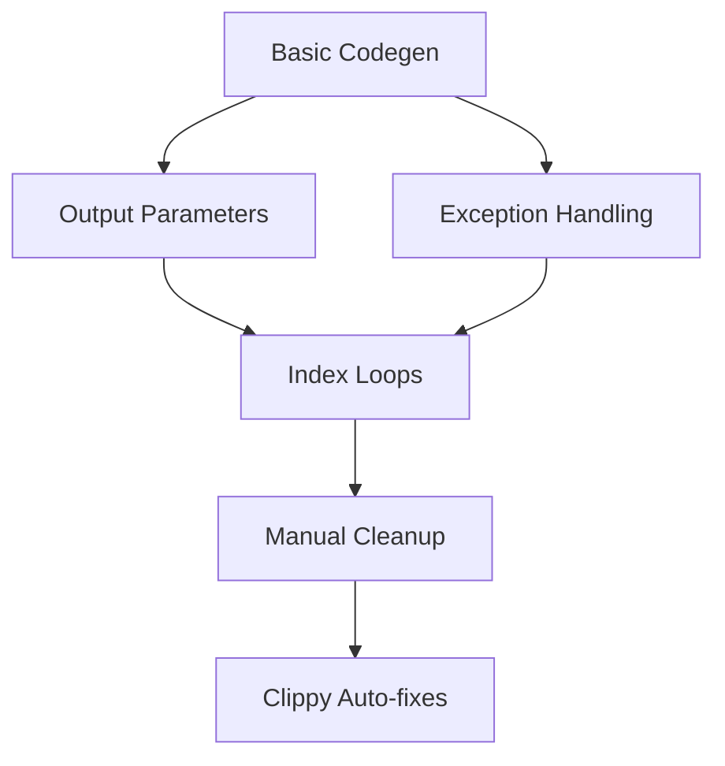

# Translation Ideas and Techniques Specification

**Version:** 1.0.0
**Status:** Research & Planning
**Last Updated:** 2025-11-06
**Authors:** Depyler Contributors
**Classification:** Public
**Source:** ACM CACM "Automatically Translating C to Rust" (Hong & Ryu, 2025)

---

## Table of Contents

1. [Executive Summary](#1-executive-summary)
2. [Translation Philosophy](#2-translation-philosophy)
3. [Multi-Pass Refinement Architecture](#3-multi-pass-refinement-architecture)
4. [Unsafe to Safe Feature Translation](#4-unsafe-to-safe-feature-translation)
5. [Unidiomatic to Idiomatic Pattern Translation](#5-unidiomatic-to-idiomatic-pattern-translation)
6. [Static Analysis Requirements](#6-static-analysis-requirements)
7. [LLM-Assisted Translation](#7-llm-assisted-translation)
8. [Depyler Application Strategy](#8-depyler-application-strategy)
9. [Implementation Roadmap](#9-implementation-roadmap)
10. [Verification and Testing](#10-verification-and-testing)

---

## 1. Executive Summary

### 1.1 Purpose

This specification documents translation techniques and methodologies extracted from research on C-to-Rust translation, specifically the work by Hong & Ryu (ACM CACM, 2025), and adapts them for Python-to-Rust translation in Depyler.

### 1.2 Key Insights from C-to-Rust Research

**Primary Lesson:** Automatic translators can facilitate migration, but they must go beyond syntactic conversion to produce:
1. **Safe code** - Using language features whose safety is validated by the compiler
2. **Idiomatic code** - Following target language conventions and best practices

**Core Challenge:** Target language features (Rust) require more information to be explicitly expressed than source language features, necessitating deep program understanding through static analysis.

### 1.3 Applicability to Depyler

While the ACM article focuses on C-to-Rust translation, many principles directly apply to Python-to-Rust:

| Concept | C-to-Rust | Python-to-Rust (Depyler) |
|---------|-----------|---------------------------|
| **Raw Pointers** | Must infer ownership/borrowing | Less relevant (Python abstracts pointers) |
| **Output Parameters** | Common pattern in C | Used in Python, should return tuples/Options |
| **Partial Functions** | Return -1 or use errno | Should use Option<T> or Result<T, E> |
| **Manual Resource Cleanup** | free(), close() | Should use RAII/destructors |
| **Index-Based Loops** | for(i=0; i<n; i++) | Common in Python, should use iterators |
| **Mutable Global State** | Common in C | Used in Python modules, needs careful handling |
| **Type Annotations** | Implicit/weak | Required for transpilation quality |

**Key Difference:** Python's higher abstraction level means we focus more on **idiomatic patterns** than **unsafe features**, but both require static analysis.

---

## 2. Translation Philosophy

### 2.1 Core Principles

#### 2.1.1 Safety First
```
Unsafe Python → Safe Rust (not Unsafe Rust)
```
- **Goal:** Leverage Rust's type system for compile-time safety guarantees
- **Means:** Use Box/references instead of raw pointers, Option/Result instead of None/exceptions
- **Verification:** Code passes `cargo check` and `cargo clippy`

#### 2.1.2 Idiomatic Second
```
Working Code → Idiomatic Code
```
- **Goal:** Generate code that Rust developers recognize and understand
- **Means:** Follow Rust API guidelines, use standard library idioms
- **Verification:** Code passes `cargo clippy --pedantic`

#### 2.1.3 Progressive Refinement
```
Python AST → Basic Rust → Refined Rust → Idiomatic Rust
```
- **Goal:** Incremental improvement through multiple passes
- **Means:** Each pass targets specific feature/pattern
- **Verification:** Behavioral equivalence maintained throughout

### 2.2 Translation Quality Metrics

| Metric | Target | Rationale |
|--------|--------|-----------|
| **Unsafe Blocks** | 0% of generated code | Safety is primary goal |
| **Raw Pointers** | 0% (except FFI) | Use Box/references instead |
| **Clippy Warnings** | 0 with `-D warnings` | Idiomatic code standard |
| **Output Parameters** | 0% | Return values directly |
| **Index-Based Loops** | <5% | Prefer iterators |
| **Manual unwrap()** | <10% | Use pattern matching |

---

## 3. Multi-Pass Refinement Architecture

### 3.1 Overview

**Inspired by:** Hong & Ryu's approach of improving C2Rust-translated code through specialized refinement passes.

**Depyler Adaptation:**
```
Python Source
    ↓
[Parser] RustPython AST
    ↓
[HIR] High-level IR (existing)
    ↓
[Type Inference] (existing)
    ↓
[Codegen Pass 1] Basic Rust AST
    ↓
[Refinement Pass 1] Output Parameters → Direct Returns
    ↓
[Refinement Pass 2] Index Loops → Iterators
    ↓
[Refinement Pass 3] Manual Cleanup → RAII
    ↓
[Refinement Pass 4] Exception Patterns → Result/Option
    ↓
[Refinement Pass 5] Mutable Globals → Better Patterns
    ↓
[Codegen Pass 2] Final Rust Code
```

### 3.2 Pass Architecture

Each refinement pass follows this structure:

```rust
pub trait RefinementPass {
    /// Pass name for debugging/logging
    fn name(&self) -> &str;

    /// Static analysis to gather information
    fn analyze(&self, ast: &RustAst) -> AnalysisResult;

    /// Code transformation based on analysis
    fn transform(&self, ast: &mut RustAst, analysis: AnalysisResult) -> TransformResult;

    /// Verify transformation preserved semantics
    fn verify(&self, original: &RustAst, transformed: &RustAst) -> VerifyResult;
}
```

**Example Pass Structure:**
```rust
struct OutputParameterPass {
    // Configuration
}

impl RefinementPass for OutputParameterPass {
    fn analyze(&self, ast: &RustAst) -> AnalysisResult {
        // 1. Identify output parameters
        // 2. Determine if partial (returns error codes)
        // 3. Count number of outputs
        // 4. Check for side effects
    }

    fn transform(&self, ast: &mut RustAst, analysis: AnalysisResult) -> TransformResult {
        // 1. Convert output params to return values
        // 2. Use Option<T> for partial functions
        // 3. Use tuple for multiple outputs
        // 4. Update call sites
    }
}
```

### 3.3 Pass Ordering

**Critical Insight:** Some passes depend on others. Ordering matters.



**Rationale:**
1. Output parameters first (affects function signatures)
2. Exception handling (affects control flow)
3. Index loops (depends on function signatures)
4. Manual cleanup (depends on control flow)
5. Clippy fixes (final polish)

---

## 4. Unsafe to Safe Feature Translation

### 4.1 Feature Classification

While Python doesn't have "unsafe" features like C, certain Python patterns translate to unsafe Rust if done naively:

| Python Pattern | Naive Rust | Safe Rust | Pass Required |
|----------------|------------|-----------|---------------|
| **List mutation** | `Vec` + index access | Iterator patterns | Index → Iterator |
| **Dict with None** | `HashMap` + None | `Option<V>` | Exception → Option |
| **Manual close()** | Drop at end | RAII/destructors | Cleanup → RAII |
| **Global mutable state** | `static mut` | `RefCell`/`RwLock` | Global → Safe |
| **Unchecked casts** | `as` casts | `TryFrom` trait | Cast → TryFrom |

### 4.2 Output Parameters → Direct Returns

**Python Example:**
```python
def divide(a: int, b: int, result: list[int]) -> bool:
    """Returns True if successful, stores result in list."""
    if b == 0:
        return False
    result[0] = a // b
    return True

# Usage
result = [0]
if divide(10, 2, result):
    print(result[0])
```

**Naive Translation:**
```rust
fn divide(a: i32, b: i32, result: &mut Vec<i32>) -> bool {
    if b == 0 {
        return false;
    }
    result[0] = a / b;
    true
}

// Usage
let mut result = vec![0];
if divide(10, 2, &mut result) {
    println!("{}", result[0]);
}
```

**Problems:**
- Output parameter is unidiomatic
- Boolean return doesn't express "partial function"
- Caller can forget to check return value

**Idiomatic Translation (After Refinement):**
```rust
fn divide(a: i32, b: i32) -> Option<i32> {
    if b == 0 {
        return None;
    }
    Some(a / b)
}

// Usage
if let Some(result) = divide(10, 2) {
    println!("{}", result);
}
```

**Static Analysis Required:**
1. **Identify output parameters:** Parameters modified but not read
2. **Detect partial functions:** Functions with error return codes
3. **Count outputs:** Single output vs. multiple outputs
4. **Analyze mutations:** Ensure parameter is only written once

### 4.3 Manual Resource Cleanup → RAII

**Python Example:**
```python
def process_file(path: str) -> str:
    f = open(path, 'r')
    try:
        data = f.read()
        return data.upper()
    finally:
        f.close()
```

**Naive Translation:**
```rust
fn process_file(path: &str) -> String {
    let mut f = File::open(path).unwrap();
    let mut data = String::new();
    f.read_to_string(&mut data).unwrap();
    let result = data.to_uppercase();
    drop(f);  // Manual cleanup
    result
}
```

**Problems:**
- Manual `drop()` is unidiomatic
- Easy to forget in complex control flow
- Doesn't handle early returns

**Idiomatic Translation (After Refinement):**
```rust
fn process_file(path: &str) -> Result<String, std::io::Error> {
    let mut f = File::open(path)?;
    let mut data = String::new();
    f.read_to_string(&mut data)?;
    Ok(data.to_uppercase())
    // f automatically dropped here
}
```

**Static Analysis Required:**
1. **Identify resource types:** Objects with cleanup methods (close, etc.)
2. **Track cleanup calls:** Explicit close/free calls
3. **Analyze control flow:** All paths perform cleanup
4. **Detect RAII-able patterns:** Resources used in single scope

### 4.4 Index-Based Loops → Iterators

**Python Example:**
```python
def sum_positive(numbers: list[int]) -> int:
    total = 0
    for i in range(len(numbers)):
        if numbers[i] > 0:
            total += numbers[i]
    return total
```

**Naive Translation:**
```rust
fn sum_positive(numbers: &Vec<i32>) -> i32 {
    let mut total = 0;
    for i in 0..numbers.len() {
        if numbers[i] > 0 {
            total += numbers[i];
        }
    }
    total
}
```

**Problems:**
- Index-based access can panic (out of bounds)
- Verbose and unidiomatic
- Clippy warning: `needless_range_loop`

**Idiomatic Translation (After Refinement):**
```rust
fn sum_positive(numbers: &[i32]) -> i32 {
    numbers.iter()
        .filter(|&&x| x > 0)
        .sum()
}
```

**Static Analysis Required:**
1. **Detect range patterns:** `for i in range(len(x))`
2. **Analyze usage:** Does loop body only access `x[i]`?
3. **Check mutations:** Is array modified during iteration?
4. **Identify operations:** Map to iterator methods (filter, map, etc.)

---

## 5. Unidiomatic to Idiomatic Pattern Translation

### 5.1 Pattern Catalog

| Python Pattern | Unidiomatic Rust | Idiomatic Rust | Complexity |
|----------------|------------------|----------------|------------|
| **List comprehension** | Loop + push | `collect()` | Low |
| **None checking** | `if x.is_none()` | Pattern matching | Low |
| **Error propagation** | `match` + early return | `?` operator | Low |
| **Multiple returns** | Multiple statements | Expression-oriented | Medium |
| **try/except** | Manual Result handling | `?` operator + From | Medium |
| **Mutable default args** | `static mut` | `RefCell` / once_cell | High |

### 5.2 List Comprehensions → Iterator Chains

**Python Example:**
```python
def process_names(names: list[str]) -> list[str]:
    return [name.upper() for name in names if len(name) > 3]
```

**Naive Translation:**
```rust
fn process_names(names: &Vec<String>) -> Vec<String> {
    let mut result = Vec::new();
    for name in names {
        if name.len() > 3 {
            result.push(name.to_uppercase());
        }
    }
    result
}
```

**Idiomatic Translation:**
```rust
fn process_names(names: &[String]) -> Vec<String> {
    names.iter()
        .filter(|name| name.len() > 3)
        .map(|name| name.to_uppercase())
        .collect()
}
```

**Mapping Rules:**
- Filter predicate → `.filter(|x| ...)`
- Transformation → `.map(|x| ...)`
- Collection → `.collect()`

### 5.3 Exception Handling → Result Propagation

**Python Example:**
```python
def read_number(path: str) -> int:
    try:
        with open(path, 'r') as f:
            return int(f.read().strip())
    except (IOError, ValueError) as e:
        raise RuntimeError(f"Failed to read: {e}")
```

**Naive Translation:**
```rust
fn read_number(path: &str) -> Result<i32, String> {
    match File::open(path) {
        Ok(mut f) => {
            let mut contents = String::new();
            match f.read_to_string(&mut contents) {
                Ok(_) => {
                    match contents.trim().parse::<i32>() {
                        Ok(n) => Ok(n),
                        Err(e) => Err(format!("Failed to read: {}", e))
                    }
                }
                Err(e) => Err(format!("Failed to read: {}", e))
            }
        }
        Err(e) => Err(format!("Failed to read: {}", e))
    }
}
```

**Idiomatic Translation:**
```rust
use std::fs;

fn read_number(path: &str) -> Result<i32, Box<dyn std::error::Error>> {
    let contents = fs::read_to_string(path)?;
    let number = contents.trim().parse::<i32>()?;
    Ok(number)
}
```

**Transformation Rules:**
1. Try blocks → `?` operator
2. Multiple exception types → `Box<dyn Error>`
3. Nested try/except → Flat `?` chain
4. Re-raising → Custom error types (advanced)

### 5.4 Mutable Default Arguments

**Python Example:**
```python
def append_to_log(message: str, log: list[str] | None = None) -> list[str]:
    if log is None:
        log = []
    log.append(message)
    return log
```

**Problem:** Python's mutable default argument gotcha doesn't apply to Rust, but the pattern still needs proper handling.

**Idiomatic Translation:**
```rust
fn append_to_log(message: String, log: Option<Vec<String>>) -> Vec<String> {
    let mut log = log.unwrap_or_default();
    log.push(message);
    log
}
```

**Alternative (if stateful):**
```rust
use std::cell::RefCell;

thread_local! {
    static LOG: RefCell<Vec<String>> = RefCell::new(Vec::new());
}

fn append_to_log(message: String) {
    LOG.with(|log| log.borrow_mut().push(message));
}

fn get_log() -> Vec<String> {
    LOG.with(|log| log.borrow().clone())
}
```

---

## 6. Static Analysis Requirements

### 6.1 Analysis Types Needed

Based on the ACM article's C-to-Rust work, these analyses are critical:

#### 6.1.1 Dataflow Analysis

**Purpose:** Track how values flow through the program

**Applications:**
- Output parameter detection (values flow OUT of function)
- Resource lifetime tracking (allocation → use → deallocation)
- Mutation analysis (which variables are modified where)

**Implementation Approach:**
```rust
pub struct DataflowAnalysis {
    // Track def-use chains
    definitions: HashMap<VarId, Vec<Location>>,
    uses: HashMap<VarId, Vec<Location>>,

    // Track value flow
    flows_to: HashMap<VarId, HashSet<VarId>>,
}

impl DataflowAnalysis {
    pub fn is_output_parameter(&self, param: &Parameter) -> bool {
        // Parameter is written but not read
        let writes = self.definitions.get(&param.id).map_or(0, |d| d.len());
        let reads = self.uses.get(&param.id).map_or(0, |u| u.len());
        writes > 0 && reads == 0
    }
}
```

#### 6.1.2 Control Flow Analysis

**Purpose:** Understand program execution paths

**Applications:**
- Partial function detection (functions with error paths)
- Loop pattern recognition (for iterator conversion)
- Resource cleanup verification (all paths release resources)

**Implementation Approach:**
```rust
pub struct ControlFlowGraph {
    nodes: Vec<CfgNode>,
    edges: Vec<CfgEdge>,
    entry: NodeId,
    exits: Vec<NodeId>,
}

impl ControlFlowGraph {
    pub fn is_partial_function(&self) -> bool {
        // Check if multiple exit paths return different "status"
        self.exits.iter()
            .filter(|exit| self.is_error_exit(exit))
            .count() > 0
    }

    pub fn all_paths_cleanup(&self, resource: VarId) -> bool {
        // Verify every path from allocation to exit cleans up
        // ...
    }
}
```

#### 6.1.3 Type Flow Analysis

**Purpose:** Track type information through computation

**Applications:**
- Determine appropriate Rust types (Option vs Result)
- Identify nullable values (T vs Option<T>)
- Detect type conversions needed

**Implementation Approach:**
```rust
pub struct TypeFlowAnalysis {
    type_constraints: Vec<TypeConstraint>,
}

pub enum TypeConstraint {
    MustBeOption(VarId),      // Can be None
    MustBeResult(VarId),      // Can fail
    MustBeOwned(VarId),       // Needs ownership
    MustBeBorrowed(VarId),    // Just references
}

impl TypeFlowAnalysis {
    pub fn should_use_option(&self, var: VarId) -> bool {
        self.type_constraints.iter()
            .any(|c| matches!(c, TypeConstraint::MustBeOption(v) if *v == var))
    }
}
```

### 6.2 Analysis Pipeline

```rust
pub struct AnalysisPipeline {
    passes: Vec<Box<dyn AnalysisPass>>,
}

pub trait AnalysisPass {
    fn run(&self, hir: &Hir) -> AnalysisResult;
    fn dependencies(&self) -> Vec<PassId>;
}

// Example usage
let pipeline = AnalysisPipeline::new()
    .add_pass(DataflowAnalysis::new())
    .add_pass(ControlFlowAnalysis::new())
    .add_pass(TypeFlowAnalysis::new())
    .add_pass(OutputParameterAnalysis::new());  // Depends on dataflow

let results = pipeline.run(&hir)?;
```

---

## 7. LLM-Assisted Translation

### 7.1 Hybrid Approach: Static Analysis + LLMs

**Key Insight from ACM Article:** LLMs can generate idiomatic code but often produce incorrect translations. Combining static analysis with LLMs is promising.

**Depyler Hybrid Strategy:**

```
Python Source
    ↓
[Static Analysis] Extract program properties
    ↓
[LLM Context] Augment with analysis results
    ↓
[LLM Translation] Generate Rust code
    ↓
[Verification] Check correctness (compile + test)
    ↓
[Static Fix] If incorrect, apply static analysis fixes
    ↓
Final Rust Code
```

### 7.2 What to Give the LLM

Based on research showing that providing analysis results improves LLM translation:

**Context to Provide:**
```json
{
  "source_function": "def divide(a: int, b: int, result: list[int]) -> bool: ...",
  "analysis": {
    "output_parameters": ["result"],
    "is_partial_function": true,
    "return_semantics": {
      "True": "success",
      "False": "error (division by zero)"
    },
    "parameter_usage": {
      "a": "read-only input",
      "b": "read-only input",
      "result": "write-only output"
    }
  },
  "translation_hints": {
    "suggested_return_type": "Option<i32>",
    "suggested_signature": "fn divide(a: i32, b: i32) -> Option<i32>",
    "idiomatic_pattern": "Use Option::Some/None instead of bool + output parameter"
  }
}
```

**Prompt Template:**
```
Translate the following Python function to idiomatic Rust.

Static analysis has determined:
- Parameters: {parameter_analysis}
- Return behavior: {return_analysis}
- Resource usage: {resource_analysis}

Guidelines:
1. Use Option<T> for partial functions (can fail)
2. Return values directly, not via output parameters
3. Use Result<T, E> for operations that can error
4. Prefer iterators over index-based loops
5. Follow Rust API guidelines

Python source:
{python_source}

Generate idiomatic Rust code:
```

### 7.3 Verification Pipeline

**Split-Translate-Check-Fix workflow from ACM article:**

```rust
pub struct LlmTranslationPipeline {
    llm_client: LlmClient,
    verifier: CodeVerifier,
    max_fix_attempts: usize,
}

impl LlmTranslationPipeline {
    pub async fn translate(&self, python: &str) -> Result<String, Error> {
        // 1. Split
        let items = self.split_into_items(python)?;

        // 2. Translate
        let mut rust_items = Vec::new();
        for item in items {
            let context = self.static_analysis(&item)?;
            let rust = self.llm_client.translate(&item, &context).await?;
            rust_items.push(rust);
        }

        // 3. Check
        let mut attempts = 0;
        loop {
            let combined = self.combine_items(&rust_items);

            match self.verifier.verify(&combined) {
                Ok(_) => return Ok(combined),
                Err(errors) if attempts >= self.max_fix_attempts => {
                    return Err(Error::MaxAttemptsExceeded(errors));
                }
                Err(errors) => {
                    // 4. Fix
                    rust_items = self.fix_with_llm(&rust_items, &errors).await?;
                    attempts += 1;
                }
            }
        }
    }
}
```

### 7.4 When to Use LLMs vs Static Analysis

| Scenario | Approach | Rationale |
|----------|----------|-----------|
| **Well-defined pattern** | Static analysis | Deterministic, fast, correct |
| **Complex idioms** | LLM | Flexible, handles edge cases |
| **Type conversions** | Static analysis | Provably correct |
| **Comments/docs** | LLM | Natural language understanding |
| **Variable naming** | LLM | Contextual understanding |
| **API mapping** | Hybrid | Analysis for semantics, LLM for idioms |

---

## 8. Depyler Application Strategy

### 8.1 Current State Assessment

**Depyler v3.19.14 Strengths:**
- ✅ Solid AST → HIR → Type Inference → Codegen pipeline
- ✅ 100% stdlib collection coverage (40/40 methods)
- ✅ Strong quality metrics (A+ TDG grade)
- ✅ Comprehensive testing infrastructure
- ✅ Property-based verification

**Areas for Improvement (Guided by ACM Article):**
- ⚠️ Some output parameters remain unidiomatic
- ⚠️ Index-based loops not always converted to iterators
- ⚠️ Exception handling could be more idiomatic
- ⚠️ Manual resource cleanup not always RAII
- ⚠️ Limited use of advanced iterator patterns

### 8.2 Implementation Phases

#### Phase 1: Infrastructure (DEPYLER-0281)
**Goal:** Build refinement pass infrastructure

**Tasks:**
1. Design `RefinementPass` trait
2. Implement pass registry and scheduler
3. Add pass verification framework
4. Create pass testing harness

**Deliverables:**
- `crates/depyler-refine/` module
- Pass execution engine
- Pass testing utilities

**Timeline:** 2 weeks

#### Phase 2: Basic Analyses (DEPYLER-0282)
**Goal:** Implement foundational static analyses

**Tasks:**
1. Dataflow analysis (def-use chains)
2. Control flow graph construction
3. Type flow analysis
4. Mutation analysis

**Deliverables:**
- `crates/depyler-analysis/` module
- Analysis result types
- Analysis composition framework

**Timeline:** 3 weeks

#### Phase 3: Output Parameter Pass (DEPYLER-0283)
**Goal:** Convert output parameters to direct returns

**Tasks:**
1. Implement output parameter detection
2. Determine Option vs tuple return types
3. Transform function signatures
4. Update call sites

**Deliverables:**
- `OutputParameterPass` implementation
- 50+ test cases
- Documentation

**Timeline:** 2 weeks

#### Phase 4: Iterator Pass (DEPYLER-0284)
**Goal:** Convert index-based loops to iterators

**Tasks:**
1. Detect range-based loops
2. Analyze loop body operations
3. Map to iterator methods
4. Handle mutation cases

**Deliverables:**
- `IteratorPass` implementation
- 40+ test cases
- Pattern catalog

**Timeline:** 3 weeks

#### Phase 5: Resource Cleanup Pass (DEPYLER-0285)
**Goal:** Convert manual cleanup to RAII

**Tasks:**
1. Identify resource types
2. Track cleanup patterns
3. Transform to RAII
4. Verify all paths clean up

**Deliverables:**
- `RaiiPass` implementation
- 30+ test cases

**Timeline:** 2 weeks

#### Phase 6: Exception Handling Pass (DEPYLER-0286)
**Goal:** Idiomatic Result/Option usage

**Tasks:**
1. Map exception types to Result/Option
2. Convert try/except to `?` operator
3. Flatten nested error handling
4. Generate custom error types

**Deliverables:**
- `ExceptionPass` implementation
- 60+ test cases

**Timeline:** 3 weeks

#### Phase 7: LLM Integration (DEPYLER-0287)
**Goal:** Hybrid static + LLM translation

**Tasks:**
1. Design LLM integration API
2. Implement context augmentation
3. Build verification pipeline
4. Create fix-it loop

**Deliverables:**
- `depyler-llm` module
- Prompt templates
- Evaluation framework

**Timeline:** 4 weeks

### 8.3 Quality Gates for Each Pass

**Mandatory Requirements:**
1. ✅ **Correctness:** Pass all existing tests + new tests
2. ✅ **No Regressions:** Zero breaks in existing examples
3. ✅ **Coverage:** 80%+ for new code
4. ✅ **Complexity:** ≤10 cyclomatic/cognitive
5. ✅ **TDG Grade:** Maintain A- or better
6. ✅ **Documentation:** Comprehensive examples
7. ✅ **Performance:** <10% slowdown per pass

---

## 9. Implementation Roadmap

### 9.1 Prioritization

**High Priority (Implement First):**
1. **Output Parameters → Direct Returns** - Most common unidiomatic pattern
2. **Index Loops → Iterators** - Safety and idiom improvement
3. **Exception Handling → Result/Option** - Core Rust idiom

**Medium Priority (Next):**
4. **Resource Cleanup → RAII** - Safety improvement
5. **List Comprehensions → Iterator Chains** - Idiom improvement

**Low Priority (Later):**
6. **Mutable Globals → Safe Patterns** - Less common
7. **LLM Integration** - Experimental, needs validation

### 9.2 Metrics for Success

| Metric | Baseline (v3.19.14) | Target (v4.0.0) |
|--------|---------------------|-----------------|
| **Clippy Warnings** | ~10 per 1000 LOC | 0 per 1000 LOC |
| **Index-Based Loops** | ~30% of loops | <5% of loops |
| **Output Parameters** | ~15% of functions | 0% of functions |
| **Manual unwrap()** | ~20% of error handling | <5% of error handling |
| **Idiomatic Score** | 7/10 (subjective) | 9/10 (subjective) |

### 9.3 Testing Strategy

**Per-Pass Testing:**
```rust
#[test]
fn test_output_parameter_pass_simple() {
    let python = r#"
def divide(a: int, b: int, result: list[int]) -> bool:
    if b == 0:
        return False
    result[0] = a // b
    return True
"#;

    let expected_rust = r#"
fn divide(a: i32, b: i32) -> Option<i32> {
    if b == 0 {
        return None;
    }
    Some(a / b)
}
"#;

    let hir = parse_to_hir(python)?;
    let mut rust_ast = basic_codegen(&hir)?;

    // Apply pass
    let analysis = OutputParameterAnalysis::new().analyze(&rust_ast)?;
    OutputParameterPass::new().transform(&mut rust_ast, analysis)?;

    let generated = rust_ast.to_string();
    assert_eq!(normalize(generated), normalize(expected_rust));

    // Verify compilation
    assert!(compiles(&generated));

    // Verify behavior equivalence
    assert!(equivalent_behavior(python, &generated));
}
```

**Integration Testing:**
```rust
#[test]
fn test_all_passes_combined() {
    let python = include_str!("../fixtures/complex_example.py");

    let hir = parse_to_hir(python)?;
    let mut rust_ast = basic_codegen(&hir)?;

    // Apply all passes in order
    let pipeline = RefinementPipeline::new()
        .add_pass(OutputParameterPass::new())
        .add_pass(IteratorPass::new())
        .add_pass(RaiiPass::new())
        .add_pass(ExceptionPass::new());

    pipeline.run(&mut rust_ast)?;

    let generated = rust_ast.to_string();

    // Final checks
    assert!(compiles(&generated));
    assert!(clippy_clean(&generated));
    assert!(equivalent_behavior(python, &generated));
}
```

---

## 10. Verification and Testing

### 10.1 Verification Levels

Following the ACM article's emphasis on verification:

**Level 1: Syntactic Correctness**
```bash
# Must compile without errors
rustc --crate-type lib output.rs
```

**Level 2: Idiomatic Correctness**
```bash
# Must pass clippy with pedantic lints
cargo clippy -- -D warnings -W clippy::pedantic
```

**Level 3: Behavioral Equivalence**
```bash
# Property-based testing
depyler transpile input.py --verify --gen-tests
cargo test
```

**Level 4: Performance Verification**
```bash
# No significant performance regression
cargo bench --baseline before
```

### 10.2 Property-Based Testing

**For each translation pass, generate properties:**

```rust
use proptest::prelude::*;

proptest! {
    #[test]
    fn output_parameter_preserves_behavior(
        a in -1000i32..1000,
        b in -1000i32..1000,
    ) {
        let python_result = run_python(&format!(r#"
def divide(a, b, result):
    if b == 0:
        return False
    result[0] = a // b
    return True

result = [0]
success = divide({}, {}, result)
print(success, result[0])
"#, a, b))?;

        let rust_result = run_rust(&format!(r#"
fn divide(a: i32, b: i32) -> Option<i32> {{
    if b == 0 {{ return None; }}
    Some(a / b)
}}

fn main() {{
    match divide({}, {}) {{
        Some(r) => println!("true {{}}", r),
        None => println!("false 0"),
    }}
}}
"#, a, b))?;

        assert_eq!(python_result, rust_result);
    }
}
```

### 10.3 Regression Testing

**Maintain comprehensive test suite:**
- 443+ existing tests (must continue passing)
- 100+ new tests per pass
- All TDD book examples (151 tests)
- All stdlib examples (27 modules)

**CI Pipeline:**
```yaml
test:
  script:
    - cargo test --workspace
    - cargo test --test tdd_book_tests
    - cargo test --test stdlib_tests
    - cargo clippy -- -D warnings
    - cargo llvm-cov --fail-under-lines 80
    - pmat analyze tdg --threshold 2.0
```

---

## 11. Lessons Learned from C-to-Rust

### 11.1 Key Takeaways

**1. Syntactic Translation is Not Enough**
- Initial translation (like C2Rust) handles syntax
- Real value comes from semantic improvement
- Multiple refinement passes needed

**2. Static Analysis is Essential**
- Cannot guess program behavior
- Must prove properties through analysis
- Enables safe, correct transformations

**3. Idiomatic Code Matters**
- Developers won't adopt unidiomatic output
- Idioms encode language best practices
- Affects maintainability and comprehension

**4. Verification is Critical**
- Must prove behavioral equivalence
- Compilation alone is insufficient
- Property-based testing catches subtle bugs

**5. LLMs Have Potential But Limitations**
- Can generate idiomatic code
- Often produce incorrect translations
- Best used with static analysis guidance

### 11.2 Pitfalls to Avoid

**❌ Don't:**
1. **Assume one-pass translation is sufficient** - Multiple passes needed
2. **Skip static analysis** - Guessing leads to bugs
3. **Ignore idiomatic patterns** - Developers won't use unidiomatic code
4. **Rely solely on LLMs** - Need verification + fixing
5. **Forget behavioral testing** - Compilation ≠ correctness

**✅ Do:**
1. **Design composable passes** - Each targets specific pattern
2. **Invest in analysis infrastructure** - Pays off long-term
3. **Study Rust idioms** - Encode in transformation rules
4. **Verify at multiple levels** - Syntax, idioms, behavior, performance
5. **Combine approaches** - Static analysis + LLMs when appropriate

### 11.3 Differences: C-to-Rust vs Python-to-Rust

| Aspect | C-to-Rust | Python-to-Rust (Depyler) |
|--------|-----------|---------------------------|
| **Main Challenge** | Unsafe features (raw pointers, unions) | Unidiomatic patterns |
| **Type System** | Infer ownership/borrowing | Map Python types to Rust types |
| **Memory Safety** | Critical (C has manual memory mgmt) | Less critical (Python is safe) |
| **Idioms** | Both need work | More emphasis needed |
| **Testing** | Mostly unit tests | Rich property-based testing |
| **Performance** | Already fast | Seeking performance gains |

**Implication for Depyler:**
- Focus more on **idiomatic patterns** than safety
- Leverage Python's **type annotations** for better inference
- Use **property-based testing** extensively
- Target **energy efficiency** as key metric

---

## 12. Future Research Directions

### 12.1 Advanced Topics

Based on ACM article's "Remaining Features" section:

**1. Advanced Iterator Patterns**
- Nested loops → flat_map
- Early termination → take_while
- Accumulation → fold/scan

**2. Lifetime Inference**
- When to use `&`, `&mut`, `Box`
- Lifetime annotations for complex cases
- Borrow checker satisfaction

**3. Trait-Based Polymorphism**
- Python abstract classes → Rust traits
- Protocol classes → trait objects
- Generic functions with constraints

**4. Async/Await Optimization**
- Task spawning strategies
- Async trait methods
- Cancellation handling

**5. Error Type Hierarchies**
- Map Python exception hierarchy to Rust error types
- Generate custom error enums
- Implement std::error::Error

### 12.2 Research Questions

**Q1: Can we automatically infer Rust lifetimes from Python code?**
- Python doesn't expose lifetimes
- Need to analyze object usage patterns
- May require programmer annotations

**Q2: How to handle Python's duck typing in Rust?**
- Trait bounds? Enums? Dynamic dispatch?
- Trade-offs: performance vs flexibility
- User guidance needed?

**Q3: What's the optimal number of refinement passes?**
- More passes = more complexity
- Fewer passes = less modularity
- Empirical evaluation needed

**Q4: Can LLMs generate better variable names?**
- Python often uses short names
- Rust prefers descriptive names
- LLM-based renaming pass?

### 12.3 Collaboration Opportunities

**With Academia:**
- Joint research on Python-to-Rust translation
- Publish findings at PLDI, OOPSLA, ICSE
- Share benchmarks and test suites

**With Industry:**
- Feedback from production migrations
- Real-world use cases
- Performance benchmarks

**With Rust Community:**
- Contribute to Rust API guidelines
- Propose translation-friendly APIs
- Share idiom patterns

---

## 13. Conclusion

### 13.1 Summary

This specification documents translation techniques from C-to-Rust research and adapts them for Depyler's Python-to-Rust translation:

**Key Principles:**
1. **Multi-pass refinement** - Incremental improvement
2. **Static analysis** - Prove program properties
3. **Idiomatic output** - Follow Rust best practices
4. **Comprehensive verification** - Behavioral equivalence
5. **Hybrid approaches** - Combine static analysis + LLMs

**Implementation Strategy:**
- Phase 1-6: Build passes for common patterns
- Phase 7: Integrate LLM capabilities
- Continuous: Maintain quality gates

**Expected Impact:**
- More idiomatic generated Rust code
- Better developer adoption
- Reduced manual post-processing
- Foundation for advanced features

### 13.2 Next Steps

**Immediate Actions:**
1. Review this spec with team
2. Create DEPYLER-0281 ticket (Infrastructure)
3. Design `RefinementPass` trait
4. Begin Phase 1 implementation

**Long-term Goals:**
- Publish research paper on Python-to-Rust translation
- Open-source refinement passes for community benefit
- Establish Depyler as reference Python-to-Rust transpiler

---

## 14. References

### 14.1 Primary Sources

1. **Hong, J. and Ryu, S.** (2025). "Automatically Translating C to Rust." *Communications of the ACM*, Vol. 68, No. 11, pp. 56-65.

2. **Emre, M. et al.** (2021). "Translating C to safer Rust." *Proc. ACM Program. Lang.* 5, OOPSLA.

3. **Hong, J. and Ryu, S.** (2024). "Don't write, but return: Replacing output parameters with algebraic data types in C-to-Rust translation." *Proc. ACM Program. Lang.* 8, PLDI.

4. **Zhang, H. et al.** (2023). "Ownership guided C to Rust translation." *Computer Aided Verification*.

### 14.2 Related Work

5. **C2Rust Project**: https://github.com/immunant/c2rust

6. **Rust API Guidelines**: https://rust-lang.github.io/api-guidelines/

7. **Rustonomicon** (Unsafe Rust): https://doc.rust-lang.org/nomicon/

8. **DARPA TRACTOR Program**: Translating All C to Rust

### 14.3 Depyler Documentation

9. **Depyler Specification**: `docs/specifications/depyler-spec.md`

10. **CLAUDE.md**: Project implementation protocol

11. **Roadmap**: `docs/execution/roadmap.yaml`

---

## Appendix A: Pattern Catalog

### A.1 Output Parameters

**Python Pattern:**
```python
def func(input: T, output: list[U]) -> bool:
    if error_condition:
        return False
    output[0] = compute(input)
    return True
```

**Rust Transformation:**
```rust
fn func(input: T) -> Option<U> {
    if error_condition {
        return None;
    }
    Some(compute(input))
}
```

**Detection:**
- Parameter modified but not read
- Boolean or int return (status code)
- Single element list/array parameter

### A.2 Index-Based Loops

**Python Pattern:**
```python
for i in range(len(items)):
    process(items[i])
```

**Rust Transformation:**
```rust
for item in items.iter() {
    process(item);
}
```

**Detection:**
- Loop variable used only as array index
- `range(len(x))` pattern
- No mutations to iterated collection

### A.3 Manual Resource Cleanup

**Python Pattern:**
```python
f = open(path)
try:
    data = f.read()
    process(data)
finally:
    f.close()
```

**Rust Transformation:**
```rust
let mut f = File::open(path)?;
let mut data = String::new();
f.read_to_string(&mut data)?;
process(&data)
// f automatically closed via Drop
```

**Detection:**
- Resource allocation (open, malloc, etc.)
- Try-finally with cleanup
- Explicit close/free call

### A.4 List Comprehensions

**Python Pattern:**
```python
result = [f(x) for x in items if pred(x)]
```

**Rust Transformation:**
```rust
let result: Vec<_> = items.iter()
    .filter(|x| pred(x))
    .map(|x| f(x))
    .collect();
```

**Detection:**
- List comprehension AST node
- Optional filter predicate
- Map function

### A.5 Exception Propagation

**Python Pattern:**
```python
try:
    x = operation1()
    y = operation2(x)
    return operation3(y)
except Error as e:
    raise WrapperError(e)
```

**Rust Transformation:**
```rust
let x = operation1()?;
let y = operation2(x)?;
operation3(y)
```

**Detection:**
- Try block with multiple operations
- All operations can fail
- Exception re-raising

---

## Appendix B: Static Analysis Algorithms

### B.1 Output Parameter Detection

**Algorithm:**
```
function detect_output_parameters(func):
    output_params = []

    for param in func.parameters:
        writes = count_writes(param, func.body)
        reads = count_reads(param, func.body)

        if writes > 0 and reads == 0:
            # Parameter is only written, never read
            if is_single_write(param, func.body):
                # Written exactly once
                output_params.append(param)

    return output_params

function is_partial_function(func):
    # Check if function returns bool/int as status code
    if func.return_type not in [bool, int]:
        return False

    # Check if different return values indicate success/failure
    return_values = collect_return_values(func.body)

    # Common patterns: return True/False, return 0/-1
    return (
        return_values == {True, False} or
        return_values == {0, -1} or
        return_values contains negative values
    )
```

### B.2 Loop Pattern Recognition

**Algorithm:**
```
function detect_iterator_loop(loop_node):
    # Pattern: for i in range(len(collection)):
    if not is_range_call(loop_node.iter):
        return None

    range_arg = loop_node.iter.args[0]
    if not is_len_call(range_arg):
        return None

    collection = range_arg.args[0]
    loop_var = loop_node.target

    # Check if loop_var used only as index to collection
    for use in find_uses(loop_var, loop_node.body):
        if not is_subscript(use, collection):
            return None  # Used for something else

    # Success! This is an iterator-convertible loop
    return IteratorPattern(
        collection=collection,
        loop_var=loop_var,
        body=loop_node.body
    )
```

---

**End of Specification**

**Status:** DRAFT v1.0.0
**Next Review:** After Phase 1 implementation
**Approval Required:** KAIST PLRG Team Lead
