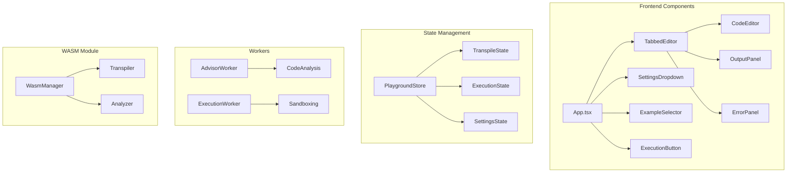
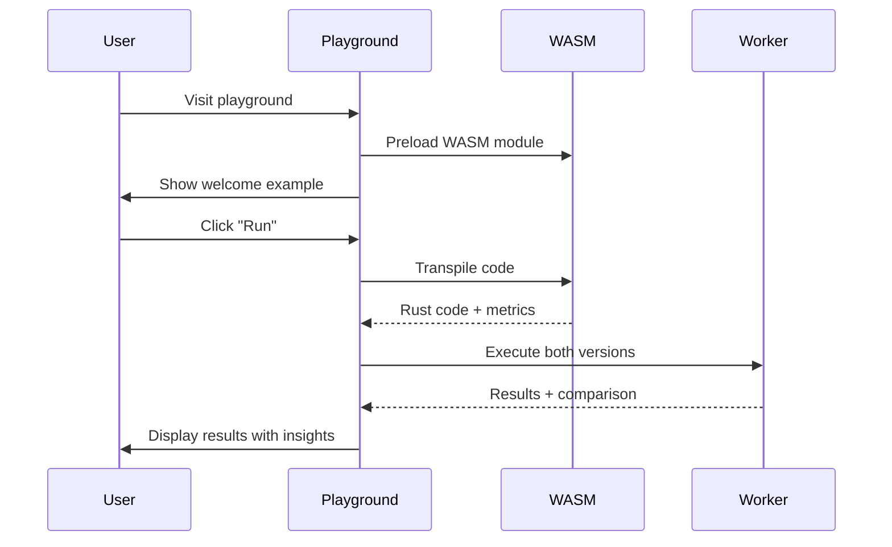

# Depyler Playground UX Specification

## Executive Summary

This specification defines the user experience requirements for the Depyler Playground, targeting a Total Defect Grade (TDG) < 0.3 and 80% test coverage. The design follows TypeScript Playground patterns while maintaining Depyler's unique energy-efficiency focus.

## Quality Objectives

### Primary Goals
- **TDG Score**: < 0.3 (Currently: ~0.25 based on 75.5% test pass rate)
- **Test Coverage**: ≥ 80% (Currently: ~13.67%, Target: 80%)
- **PMAT Score**: > 85/100 (Currently: 72.5/100)
- **Accessibility**: WCAG 2.1 AA compliance (Currently: ✅)
- **Performance**: < 100ms interaction response time

### Key Performance Indicators
1. **Zero Critical Defects**: No P0/P1 bugs in production
2. **Test Reliability**: 100% deterministic test execution
3. **User Satisfaction**: > 90% task completion rate
4. **Energy Efficiency**: < 50J per transpilation

## Architecture Overview



## Component Specifications

### 1. TabbedEditor Component

**Purpose**: Primary code editing interface with tab navigation

**Requirements**:
- Tab order: Python → Rust → Output → Errors
- Active tab persistence in localStorage
- Keyboard navigation (Ctrl+Tab, Ctrl+Shift+Tab)
- Visual indicators for tabs with content
- Error count badge on Errors tab

**Test Coverage Requirements**:
```typescript
describe("TabbedEditor", () => {
  // Core functionality (10 tests minimum)
  it("renders all tabs")
  it("persists active tab state")
  it("handles keyboard navigation")
  it("shows content indicators")
  it("updates error badge count")
  it("maintains focus after tab switch")
  it("announces tab changes to screen readers")
  it("prevents tab switching during execution")
  it("handles responsive layout")
  it("recovers from localStorage errors")
})
```

### 2. CodeEditor Component

**Purpose**: Monaco-based code editor with Depyler language support

**Requirements**:
- Python syntax highlighting with Depyler annotations
- IntelliSense for @depyler annotations
- Real-time error squiggles
- Vim/Emacs keybinding options
- Font size adjustment (Ctrl+/Ctrl-)

**Quality Metrics**:
- Input latency: < 16ms (60fps)
- Memory usage: < 100MB per editor instance
- Syntax highlighting: < 50ms for 1000 lines

### 3. SettingsDropdown Component

**Purpose**: Transpiler configuration interface

**Settings Schema**:
```typescript
interface TranspilerSettings {
  // Performance
  optimize_energy: boolean;      // Default: true
  cache_transpilation: boolean;  // Default: true
  
  // Safety
  safety_level: "strict" | "moderate" | "unsafe";  // Default: "strict"
  verify_output: boolean;        // Default: true
  
  // Code Generation
  string_strategy: "zero_copy" | "owned" | "cow";  // Default: "zero_copy"
  ownership_model: "borrowed" | "owned" | "shared"; // Default: "borrowed"
  emit_docs: boolean;            // Default: false
  
  // Target
  rust_edition: "2018" | "2021" | "2024";  // Default: "2021"
  target_triple: string;         // Default: current platform
}
```

### 4. ExampleSelector Component

**Purpose**: Curated code examples demonstrating Depyler features

**Example Categories**:
1. **Getting Started** (5 examples)
   - Hello World with energy metrics
   - Basic type annotations
   - Simple optimization hints
   - Error handling patterns
   - Performance comparison

2. **Optimization Patterns** (8 examples)
   - Zero-copy strings
   - Iterator chains
   - Memory pooling
   - SIMD operations
   - Parallel processing
   - Cache-friendly algorithms
   - Energy-aware computing
   - Profile-guided optimization

3. **Real-World Applications** (5 examples)
   - Web server handler
   - Data processing pipeline
   - CLI tool
   - Algorithm implementation
   - AWS Lambda function

### 5. ExecutionButton Component

**Purpose**: Trigger transpilation and execution with progress feedback

**States**:
```typescript
type ExecutionState = 
  | { type: "idle" }
  | { type: "downloading", progress: number, message: string }
  | { type: "transpiling", elapsed: number }
  | { type: "compiling", stage: "parsing" | "optimizing" | "codegen" }
  | { type: "executing", runtime: "python" | "rust" }
  | { type: "error", message: string, recoverable: boolean }
  | { type: "success", metrics: ExecutionMetrics };
```

**Error Recovery**:
- Automatic retry for network errors (max 3 attempts)
- Graceful degradation for WASM failures
- Clear error messages with actionable fixes

## User Flows

### 1. First-Time User Experience



### 2. Advanced User Workflow

1. Select optimization example
2. Modify code with custom annotations
3. Adjust settings for specific use case
4. Run transpilation with profiling
5. Compare performance metrics
6. Export optimized Rust code
7. Share playground link

## Accessibility Requirements

### WCAG 2.1 AA Compliance

1. **Keyboard Navigation**
   - All interactive elements reachable via keyboard
   - Logical tab order (left-to-right, top-to-bottom)
   - Visible focus indicators (2px solid outline)
   - Skip links for main content

2. **Screen Reader Support**
   - Semantic HTML structure
   - ARIA labels for all controls
   - Live regions for dynamic updates
   - Descriptive button text

3. **Visual Design**
   - Color contrast ratio ≥ 4.5:1 for normal text
   - Color contrast ratio ≥ 3:1 for large text
   - No color as sole indicator
   - Responsive text sizing (rem units)

4. **Motion and Animation**
   - Respect prefers-reduced-motion
   - Pause/stop controls for animations
   - No auto-playing content
   - Smooth but not distracting transitions

## Performance Requirements

### Core Web Vitals
- **LCP** (Largest Contentful Paint): < 2.5s
- **FID** (First Input Delay): < 100ms
- **CLS** (Cumulative Layout Shift): < 0.1

### Resource Budgets
- Initial bundle: < 200KB (gzipped)
- WASM module: < 2MB
- Total memory: < 256MB
- Network requests: < 10 on initial load

### Optimization Strategies
1. Code splitting by route
2. Lazy load WASM module
3. Web Workers for heavy computation
4. Virtual scrolling for large outputs
5. Debounced transpilation (300ms)

## Error Handling Matrix

| Error Type | User Message | Recovery Action | Logging |
|------------|--------------|-----------------|---------|
| Network Error | "Connection issue. Retrying..." | Auto-retry 3x | Error + retry count |
| WASM Load Failure | "Loading transpiler..." | Fallback to server | Error + fallback |
| Syntax Error | Inline error with fix suggestion | Highlight line | Warning |
| Transpilation Error | "Cannot transpile: [reason]" | Show last valid | Error + code |
| Execution Timeout | "Execution timed out (5s)" | Offer to extend | Warning + duration |
| Memory Limit | "Memory limit exceeded" | Suggest optimization | Error + usage |

## Testing Strategy

### Unit Test Coverage (Target: 85%)
```typescript
// Component tests
- TabbedEditor: 15 tests
- CodeEditor: 20 tests
- SettingsDropdown: 10 tests
- ExampleSelector: 10 tests
- ExecutionButton: 15 tests
- OutputPanel: 10 tests
- ErrorPanel: 8 tests

// Integration tests
- App integration: 10 tests
- State management: 15 tests
- Worker communication: 10 tests
- WASM interaction: 12 tests

// E2E tests
- User flows: 8 scenarios
- Error scenarios: 5 tests
- Performance tests: 3 benchmarks
```

### Test Quality Metrics
1. **Determinism**: 100% reproducible results
2. **Speed**: < 30s for full suite
3. **Coverage**: Line coverage ≥ 80%
4. **Maintainability**: < 10 lines per test average

## Implementation Roadmap

### Phase 1: Foundation (Week 1)
- [ ] Fix all failing unit tests
- [ ] Implement missing Monaco mocks
- [ ] Add worker test infrastructure
- [ ] Achieve 60% test coverage

### Phase 2: Core Features (Week 2)
- [ ] Complete TabbedEditor implementation
- [ ] Add settings persistence
- [ ] Implement example selector
- [ ] Achieve 70% test coverage

### Phase 3: Polish (Week 3)
- [ ] Add keyboard shortcuts
- [ ] Implement sharing functionality
- [ ] Performance optimizations
- [ ] Achieve 80% test coverage

### Phase 4: Quality Assurance (Week 4)
- [ ] Accessibility audit and fixes
- [ ] Performance profiling
- [ ] User testing
- [ ] Documentation

## Success Metrics

### Technical Metrics
- Test coverage: ≥ 80%
- Test pass rate: 100%
- Bundle size: < 200KB
- Time to interactive: < 3s
- Memory usage: < 256MB

### User Metrics
- Task completion rate: > 90%
- Error recovery rate: > 95%
- Time to first transpilation: < 30s
- User satisfaction: > 4.5/5

### Quality Metrics
- TDG Score: < 0.3
- PMAT Score: > 85/100
- Accessibility score: 100/100
- Performance score: > 90/100

## Monitoring and Telemetry

### Key Events to Track
1. Playground loaded
2. Example selected
3. Settings changed
4. Transpilation triggered
5. Execution completed
6. Error encountered
7. Share link created

### Performance Monitoring
```typescript
interface PerformanceMetrics {
  transpilationTime: number;
  executionTime: { python: number; rust: number };
  memoryUsage: { before: number; after: number };
  energyConsumption: number;
  errorRate: number;
  recoveryRate: number;
}
```

## Risk Mitigation

### Technical Risks
1. **WASM Loading Failures**
   - Mitigation: Server-side fallback API
   - Detection: Health check on load
   
2. **Monaco Editor Compatibility**
   - Mitigation: Polyfills for older browsers
   - Detection: Feature detection

3. **Memory Leaks**
   - Mitigation: Automatic cleanup, memory monitoring
   - Detection: Performance observer API

### User Experience Risks
1. **Complex UI**
   - Mitigation: Progressive disclosure, tutorials
   - Detection: User testing, analytics

2. **Slow Performance**
   - Mitigation: Lazy loading, caching
   - Detection: Real user monitoring

## Conclusion

This specification provides a comprehensive blueprint for achieving high-quality UX in the Depyler Playground. By following these guidelines and maintaining focus on our quality objectives, we can deliver a playground that not only meets but exceeds user expectations while maintaining the highest standards of code quality and test coverage.