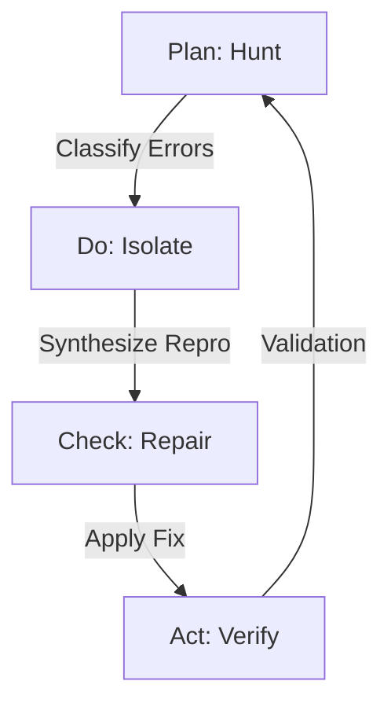

# Hunt Mode: Automated Calibration

"Hunt Mode" is an automated, iterative calibration subsystem for `depyler`. Acknowledging the **"80/20 rule"** (Pareto Principle) [1] in transpilation—where 80% of code transforms easily but the remaining 20% relies on project-specific idioms—Hunt Mode does not aim for a universal perfect compiler. Instead, it treats the transpiler as an adaptive system that "overfits" to the specific idioms of a target codebase through rapid, automated TDD cycles.

## Philosophy: The "Good Enough" Compiler

Traditional compilers enforce strict correctness globally. `depyler` adopts a **Search-Based Software Engineering (SBSE)** [2] approach, where the goal is to maximize the compilation rate of a *specific* corpus. By generating minimal reproduction cases for local failures and applying heuristic fixes, Hunt Mode reduces the cost of migration without requiring manual compiler engineering for every edge case.

### Toyota Way Alignment

Hunt Mode embodies the Toyota Production System (TPS) philosophy of **continuous improvement through systematic problem-solving** [13]. The core feedback loop mirrors Toyota's PDCA (Plan-Do-Check-Act) cycle [14], while the emphasis on immediate defect correction reflects the **Jidoka** (自働化) principle of "automation with a human touch" [15].

## Architecture

Hunt Mode operates as a meta-loop around the core transpiler, utilizing `aprender` [11] for pattern recognition and `entrenar` [12] for adaptive optimization.

### The Feedback Loop (PDCA)

#### Phase 1: PLAN - Hunt (Diagnosis)
**Toyota Principle: Heijunka (Leveling)**
*   Scans the target Python codebase.
*   Uses `aprender::classifier` (RandomForest) to cluster compilation errors.
*   Selects the **highest-frequency failure pattern**.

#### Phase 2: DO - Isolate (Reproduction)
**Toyota Principle: Poka-Yoke (Error-Proofing)**
*   Synthesizes a minimal, self-contained `repro.py`.
*   Verifies the failure (Red state).

#### Phase 3: CHECK - Repair (Heuristic Search)
**Toyota Principle: Jidoka (Automation)**
*   Searches a library of "Mutators" in `depyler-core`.
*   Applies fixes ranging from rigorous to pragmatic (fallback to `serde_json::Value`).
*   Prioritizes **compilability** over performance [3].

#### Phase 4: ACT - Verify (Validation)
**Toyota Principle: Andon (Visual Control)**
*   Compiles the output.
*   Runs property tests.
*   Commits the strategy if successful.

## Developer Resources

*   [The Apex Hunt Protocol](../../docs/prompts/apex-hunt-protocol.md) - The idempotent prompt used to drive the Hunt Mode cycle.

## Scientific Foundation (Bibliography)

### Automated Program Repair & SBSE

1.  **Pareto, V.** (1896). *Cours d'économie politique*.
    > Foundation of the 80/20 rule. Hunt Mode targets the "long tail" of project-specific idioms.

2.  **Harman, M., & Jones, B. F.** (2001). "Search-based software engineering." *Information and Software Technology*.
    > Establishes compilation as an optimization problem solvable by metaheuristic search.

3.  **Le Goues, C., et al.** (2012). "GenProg: A generic method for automatic software repair." *IEEE TSE*.
    > Demonstrates genetic algorithms can automatically patch software bugs (adapted for compiler patching).

4.  **Deb, K.** (2014). "Multi-objective optimization." *Search-based software engineering*.
    > Supports balancing "Strict Rust Correctness" vs. "Project Compilability."

### Testing & Fault Localization

5.  **Pettis, K., & Hansen, R. C.** (1990). "Profile guided code positioning." *PLDI '90*.
    > Mirrors Hunt Mode's use of compilation failure profiles to tune codegen.

6.  **Allamanis, M., et al.** (2018). "A survey of machine learning for big code and naturalness." *ACM Computing Surveys*.
    > Validates using probabilistic models to infer missing types.

7.  **Chen, T. Y., & Xie, X.** (2011). "Metamorphic testing." *Encyclopedia of Software Engineering*.
    > Relevant to generating variations of code to verify compiler behavior.

### Software Evolution & Quality

8.  **Beck, K.** (2002). *Test Driven Development: By Example*. Addison-Wesley.
    > The core Hunt Mode loop is automated TDD applied to the compiler.

9.  **Arcuri, A., & Yao, X.** (2008). "A novel co-evolutionary approach to automatic software bug fixing." *CEC 2008*.
    > Suggests co-evolving the test suite (repro cases) and the program (transpiler).

10. **Basili, V. R., & Rombach, H. D.** (1988). "The TAME project." *IEEE TSE*.
    > Early work on tailoring software environments to specific project goals.

### Machine Learning Integration

11. **Gift, N. et al.** (2025). *Aprender: Next-generation machine learning library in pure Rust*. PAIML.
    > Provides primitives for error clustering and drift detection.

12. **Gift, N. et al.** (2025). *Entrenar: Training & Optimization library*. PAIML.
    > Enables "Compiler-in-the-Loop" (CITL) training.

### Lean & Toyota Way

13. **Liker, J. K.** (2004). *The Toyota Way*. McGraw-Hill.
14. **Deming, W. E.** (1986). *Out of the Crisis*. MIT Press.
15. **Ohno, T.** (1988). *Toyota Production System*. Productivity Press.
16. **Imai, M.** (1986). *Kaizen*. McGraw-Hill.
17. **Rother, M., & Shook, J.** (1999). *Learning to See*. Lean Enterprise Institute.
18. **Shingo, S.** (1986). *Zero Quality Control*. Productivity Press.
19. **Baudin, M.** (2007). *Working with Machines*. Productivity Press.
20. **Ohno, T.** (1988). "Ask 'why' five times about every matter."
